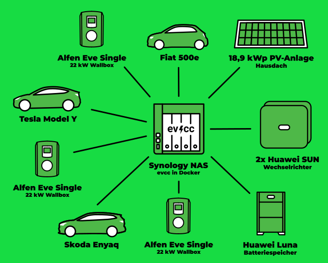

In our series of community portraits, photographer [Detlef](https://hee.se) visited Olaf in North Rhine-Westphalia.

{/* truncate */}

## We Knew There Was No Turning Back

**Michael:** Hi Olaf, thanks for taking the time to join this format.
Tell us a bit about yourself and how you got into electric cars and PV surplus charging.

**Olaf:** Hi Michael, my pleasure.
I'm 52, married, and have two daughters.
I co-founded my first company in 1998 in the e-commerce sector, where I led the SysAdmin team.
I'm still active as a co-founder and consultant in various companies.

I got into electric cars about four or five years ago.
Before that, I hadn't seriously considered them and was influenced by the strange media coverage.
I thought e-cars would easily catch fire and have limited range.
I can't recall exactly what prompted me to look into it again—perhaps a blog post or a friend's suggestion about tackling climate change.
By early 2020, I was watching YouTube channels about upcoming e-cars in Germany.

It quickly became clear that an Enyaq or a Model Y would suit our needs best.
Unfortunately, it took a while for these cars to become available, so I had the wall boxes installed before our first e-car.
After a relaxed 5,500 km summer vacation in Spain with the Enyaq, it was clear to my family and me that there was no turning back.
We sold the other combustion car immediately.
Once you're into e-mobility, installing a PV system for surplus charging is the next logical step.

**Michael:** Impressive, so you got into it due to climate change and delved deeper.
I'm curious: What's your home tech setup like?

**Olaf:** The PV system is 18.92 kWp, with 6 panels on a slightly flatter dormer facing north-northwest.
We have two Huawei inverters and a Huawei LUNA2000 home storage with 15 kWh capacity.
We use three Alfen Eve Single Pro-line 22 kW wall boxes, and evcc runs on my Synology in Docker.
Our three cars regularly charge with solar power.
Besides the Enyaq, we have a Model Y and a Fiat 500e.

## That's When It Got Me

**Michael:** How did you discover evcc and why do you use it?

**Olaf:** Initially, the solar installer and I tried to get the Alfen wall boxes to charge with surplus using an Elgris Smartmeter.
We managed to display the current values but couldn't adjust the charging power.
When Alfen's support said the feature was still in beta, I looked for other PV surplus charging options and found evcc.
I liked its modular approach, allowing devices from different manufacturers to work together.
It's open source and constantly developed, which intrigued me enough to try installing it.
After overcoming the yaml file intricacies and seeing evcc adjust the charging power to the PV surplus, I was hooked.

**Michael:** I can see why.
Watching the software regulate is fascinating, especially for optimizing self-produced electricity.
What's your favorite feature?

**Olaf:** My favorite is the PV mode, which adjusts my wall boxes to the current surplus from the roof.
I also appreciate other benefits, like charging the Fiat 500e only up to 80%, which it can't do on its own.
I get more up-to-date PV yield displays than in Huawei's app, which updates every 5 minutes.
I adjust the "residual power" parameter in the UI to set a buffer, ensuring no grid power is drawn when a cloud passes or a large appliance is turned on.
The inverter regulates this with the home battery in seconds.
Unfortunately, evcc is slowed down by Huawei's dongle, requiring a 45-second interval.
But evcc's settings offer workarounds for almost every problem.

**Michael:** It's great to see evcc compensating for the manufacturer's weaknesses.
Do you use integrations with other systems like Home Assistant or Grafana?

**Olaf:** Not yet.
It's new territory for me, and I currently lack the time to explore it.
I'm quite satisfied with evcc's built-in functions.

| Component        | Description                                     |
| ---------------- | ----------------------------------------------- |
| **PV System**    | 18.9 kWp, partially north-northwest orientation |
| **Inverter**     | 2x Huawei SUN2000                               |
| **Home Storage** | Huawei LUNA2000 with 15 kWh                     |
| **Chargers**     | 3x Alfen Eve Single Pro-line 22 kW              |
| **Vehicles**     | Skoda Enyaq, Tesla Model Y, Fiat 500e           |
| **Control**      | evcc on Synology in Docker                      |

**Michael:** Christmas is almost here.
If you could wish for something for evcc's future development, what would it be?

**Olaf:** Transitioning the installation from a yaml file to a UI would be a huge step forward.
It would simplify many things.
Also, intelligent control of heat pumps would be great, as we're replacing our old heating with a Lambda heat pump.
It would be nice to use evcc to heat the large buffer storage with surplus electricity, avoiding expensive grid power at night.

**Michael:** That's timely.
Our last release added initial heat pump integrations and an SG-ready template.
Much more will happen next year.
Thank you again, Olaf, for sharing your setup and personal journey into "e-mobility & efficient charging."
I wish you and your family a Merry Christmas and continued enjoyment with your setup.
