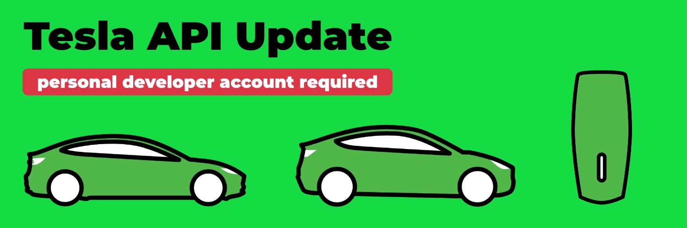
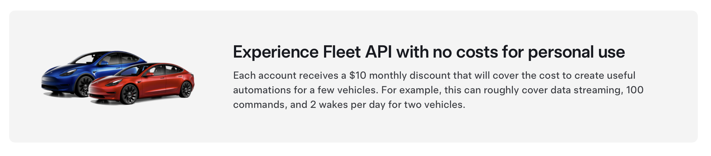

Starting with evcc v0.133, a [Tesla Developer Account](https://developer.tesla.com/) is required.
The usage remains free of charge, but requires an additional setup step.

[](/blog/2025/01/20/tesla-api-update)

{/* truncate */}

:::note Update
This post has been revised.

**8.2.2025:** More detailed instructions for the Tesla Fleet API and myteslamate.com configuration.<br/>
**27.3.2025:** Update to the new setup process of myteslamate.com.
:::

## Paid Tesla Fleet API starting February

Last year we integrated the [Tesla Fleet API](/blog/2024/02/01/v0.124-new-tesla-api) into evcc.
Tesla was the first manufacturer to provide an official and above all open API for communication with their vehicles.

Tesla had already announced that this API would not stay free of charge.
The prices are now known and will come into effect starting February 1, 2025.
The billing is based on usage, with costs varying depending on the type of request.

With [tesla.evcc.io](https://tesla.evcc.io) we have provided a service that allows evcc users to generate access tokens for API usage.
The API communication of these tokens would be billed to us starting February 2025.
The costs per user depend on the number of vehicles, charging behavior, and the specific configuration of the update interval.
For most users, these costs exceed our "$2 per month" sponsoring model and would not be sustainable for us, even if we would require sponsorship for Tesla integration.

## Free API credit for private users

Tesla offers private users a monthly API credit of $10, which should be sufficient for most evcc users.

[](https://developer.tesla.com/)

With the version 0.133, we have adapted the API communication to Tesla so that you can use your own Tesla Developer Account.
Old tokens generated with [tesla.evcc.io](https://tesla.evcc.io) will no longer work.
We have considered extending our existing token generation process so that you can use your own Tesla Developer Account.
Fortunately, [myteslamate.com](https://app.myteslamate.com) has already implemented this function.
There you can generate **Access- and Refresh-Tokens** with your Developer Account.
So we decided not to reinvend the wheel.

## What to do?

### For Tesla drivers {#vehicle}

For the setup in evcc you need three pieces of information:

- **Client ID:** from the [Tesla Developer Portal](https://developer.tesla.com/)
- **Access Token:** via the script from [myteslamate.com](https://www.myteslamate.com/tesla-api-application-registration/)
- **Refresh Token:** via the script from [myteslamate.com](https://www.myteslamate.com/tesla-api-application-registration/)

Follow the instructions on [myteslamate.com](https://www.myteslamate.com/tesla-api-application-registration/) to generate this information.

Since you'll be working on myteslamate.com and developer.tesla.com in parallel, we recommend doing these steps in two browser windows simultaneously.
At the end of the process, a script must be downloaded and executed on your computer in the terminal/console.

During the login process, a permissions dialog will appear.
For operation with a normal wallbox (not Tesla Wall Connector), evcc requires the following **Tesla API permissions**:

- Profile information _(region, list of vehicles)_
- Vehicle information _(charge level, vehicle status, etc.)_
- Vehicle location _(for vehicle detection, not implemented yet)_
- Vehicle commands _(for wakeup)_

Once you have successfully completed the process, enter the information in the evcc configuration:

Example:

```yaml {5-7}
vehicles:
  - type: template
    template: tesla
    title: Tesla Model 3
    clientId: aaaaaa-11111-...     # from developer.tesla.com
    accessToken: ey1234567890...   # from myteslamate.com
    refreshToken: EU_1234567890... # from myteslamate.com
```

You can track your used API credit in the [Overview of the Tesla Developer Portal](https://developer.tesla.com/dashboard/).
    
:::note
The evcc project is in no way connected to myteslamate.com.
We are in contact with [jlestel](https://github.com/jlestel), the developer of myteslamate.com.
The free use of the service for evcc users is explicitly allowed by him.
Please refer to the [Terms of Service](https://www.myteslamate.com/terms-of-service) and [Privacy Policy](https://www.myteslamate.com/privacy-policy) before using the service.
:::

### For Tesla Wall Connector users {#charger}

If you use a Tesla Wall Connector, additional steps are required, as the charging commands require signed communication and must be handled through a publicly accessible server.
myteslamate.com provides such a proxy.
Billing is done on a usage basis directly through myteslamate.com.
These commands do not use your Tesla API credit.

We assume you've already completed the [steps described above](#vehicle).
Log into myteslamate.com again and follow the instructions to set up the paid command proxy.
Copy the **Proxy-Token** from the **Use MyTeslamate API** section.
Insert this token into your evcc configuration:

```yaml {8}
vehicles:
  - type: template
    template: tesla
    title: Tesla Model 3
    clientId: aaaaaa-11111-...     # from developer.tesla.com
    accessToken: ey1234567890...   # from myteslamate.com
    refreshToken: EU_1234567890... # from myteslamate.com
    proxyToken: aaaaa-bbbbb-...    # from myteslamate.com
```

With this setup, evcc will send charging commands to the myteslamate.com proxy, which will sign it with your Tesla application and forward it to the original Tesla API.

:::warning
The proxy token is very powerful.
It is recommended to limit the permissions at myteslamate.com to the necessary functions.
For evcc, only the functions **Charge Start**, **Charge Stop** and **Set Charging Amps** are necessary.
:::

## tesla.evcc.io will be discontinued

tesla.evcc.io will be discontinued in February.
All tokens generated with it will lose their validity.
For further use of the Tesla API, an update to evcc version 0.133 is required.

## Other alternatives

The Tesla API communication in evcc is not specific to myteslamate.com.
You can generate the tokens with the corresponding infrastructure (public callback URL necessary) yourself and enter them into the evcc configuration mentioned above.

Alternative integrations via services such as [TeslaLogger](https://docs.evcc.io/docs/devices/vehicles#teslalogger), [TeslaMate](https://docs.evcc.io/docs/devices/vehicles#teslamate), [TeslaBleHttpProxy](https://docs.evcc.io/docs/devices/vehicles#tesla-ble), [TeslaMate](https://docs.evcc.io/docs/devices/vehicles#teslamate), [Tessie](https://docs.evcc.io/docs/devices/vehicles#tessie) or [Tronity](https://docs.evcc.io/docs/devices/vehicles#tronity) is also possible.

Tesla Wall Connector owners can also still use [TeslaBleHttpProxy](https://github.com/wimaha/TeslaBleHttpProxy) as a local "Command Proxy".

## Conclusion

We have discussed several alternatives for the Tesla integration.
Special services and price levels for Tesla users were also on the table.
We believe that our current solution from a user's perspective is the best.
On the one hand, it does not cause additional costs for most private users.
The implementation remains sponsor-free.
The API communication does not require third-party services.
Users with larger fleets can also use evcc, where the API usage fees directly accrue at Tesla when the monthly free allowance is exceeded.

**Best regards**<br/>
The evcc team<br/>
Michael, Andi & Uli