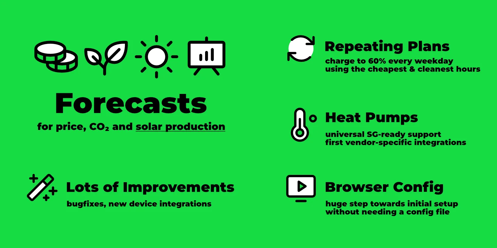
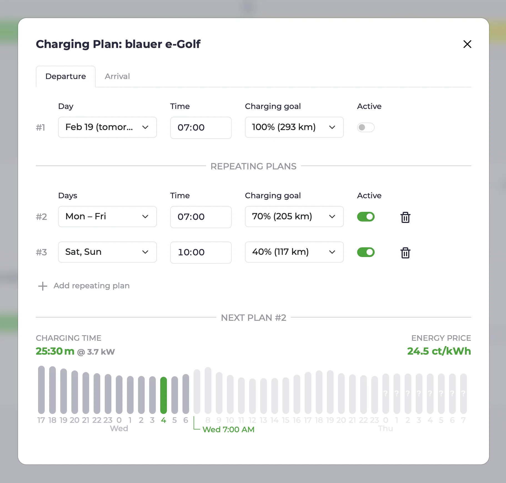

import Video from "/src/components/Video";
import forecastsVideo from "./forecasts.mp4";
import forecastsPoster from "./forecasts.webp";
import configUiVideo from "./config-ui.mp4";
import configUiPoster from "./config-ui.webp";
import SgreadySvg from "/i18n/en/docusaurus-plugin-content-docs/current/devices/heating/sgready.svg";

With the [release of v0.200](https://github.com/evcc-io/evcc/releases), we've taken a major step towards stability and user-friendliness.
In this blog post, we'll provide some background on the version jump.
For dramatic effect, we'll save that for the end of the article ;)

We'll also introduce some new features that have been added since the [blog post in November](/blog/2024/11/22/highlights-charts-stats).

{/* truncate */}

## Forecasts

We've had [CO₂-optimized](/docs/features/co2) and [price-optimized](/docs/features/dynamic-prices) charging for a while.
Now, with [Forecast.solar](https://forecast.solar) and [Solcast](https://solcast.com/free-rooftop-solar-forecasting), we've integrated our first two PV production forecast providers.
For this, there's a new `solar` field in the [tariff configuration](/docs/tariffs).

When a PV forecast source is configured, you'll see the expected PV production for today in kWh in the energy overview.
Clicking on this number or the new **Forecast** menu item takes you to a new view that visualizes the expected PV production for the next 48 hours.
This visualization also shows price and CO₂ forecasts.

<Video src={forecastsVideo} poster={forecastsPoster} />

Currently, only one PV forecast (corresponding to one roof surface) can be configured.
With the next release, we'll add the ability to combine forecasts.

PV forecast data doesn't yet influence charging planning but forms the foundation for future features and optimizations.

## Repeating Charging Plans

When evcc knows the vehicle's state of charge, several useful charging features become available.
The ability to establish a [minimum charge level](/docs/features/limits#minimum-charge) immediately after plugging in, or to charge the vehicle efficiently and cleanly using a [charging plan](/docs/features/plans) (departure time and target charge level), has been around for a while.

Almost as old is the desire for repeating charging plans.
That is, the ability to create weekday-dependent plans that don't require constant attention.
A big thank you goes to [@Maschga](https://github.com/Maschga), who tackled this major feature.
The result turned out really nice.

Plans can be deactivated when needed (e.g., during vacation).
Time zones, daylight saving time, and standard time are handled correctly 🤯.
Multiple repeating plans are possible, and for closely scheduled plans, the most relevant plan is selected with the planner's decision transparently visualized.

Learn more about this under [Charging Plans](/docs/features/plans#repeating-plans).

## Heat Pumps & SG-ready

The demand for heat pump support has come up regularly in recent months.
Until now, we deliberately focused on the electric vehicle use case to keep evcc focused and manageable.
Integration of heat generators was possible through methods like [relays, smart plugs](/docs/devices/smartswitches#heating) and the plugin interface ([example](https://github.com/naltatis/aton-ctrl)), and was being used.

Since January, we've offer an explicit model for heat pump control.
Many heat pumps support the SG-Ready model.
Using a switchable relay (e.g., Shelly), the heat pump can be instructed to increase operation during surplus or low-cost grid power.

<SgreadySvg alt="Diagram showing heat pump control via SG-Ready relay" style={{ maxWidth: '700px' }} />

Some heat pumps also support direct communication, e.g., over the network.
The list of these devices is still relatively short.
If you have such a heat pump and know how to control it, please open a [GitHub Issue](https://github.com/evcc-io/evcc/issues).

You can find more information about [heat pumps & electic heaters](/docs/devices/heating) in the documentation.

The integration of heat generators in the UI is functional but not yet perfect.
Topics like time-based metrics and better representation of the heat pump in the main overview are on our to-do list.

## Config UI: Setup via Browser

During evcc's development, keeping the interface as simple and clean as possible has always been important to us.
We regularly receive feedback that other household members (often non-nerds) quickly find their way around the interface.
This is a quality that's not always a given, especially in "classic" open-source projects, and something we're quite proud of.

An important factor is the strong unification and the underlying data model.
Once an inverter, vehicle, or wallbox is configured, the peculiarities of the devices are no longer relevant in the UI.

However, the biggest pain point for many users is actually reaching this "everything is set up" state.
Until now, this required using the command line and editing a YAML file.

We've been working for a long time to enable initial setup through the UI.
Over the past years and months, we've gradually added individual functions like creating vehicles, meters, inverters, tariffs, and more.
Necessary features like a log view and authentication system are now also on board.

With v0.200, we've added the "last big piece" towards setup via UI.
**Now charging points and wallboxes, the central components of evcc, can be created and modified through the UI.**
This brings us noticeably closer to a stable 1.0 release.

<Video src={configUiVideo} poster={configUiPoster} />

The configuration interface is still marked as an experimental feature 🧪.
Not all fields are in the right place, carry the correct descriptions, and are thoroughly tested.
We therefore very much look forward to your feedback, suggestions, and bug reports.

Advanced features, like creating custom devices and better diagnostic tools, are still on the agenda.
You can find more about the status and progress around this topic in the [Epic Issue](https://github.com/evcc-io/evcc/issues/6029).

### Try Config UI

If you want to try out the pure UI setup, you can **start evcc with an empty `evcc.yaml`**.
You'll get a welcome screen and can proceed with your configuration through the UI from there.
Experimental features must be activated in the UI for this.

## And Much More...

As usual in the highlights blog posts, this is just a small selection of all the topics being worked on.
Since the last post in November, [over 250 Pull Requests](https://github.com/evcc-io/evcc/pulls?q=is%3Apr+is%3Amerged) 🤯 have been developed, reviewed, and successfully merged.

You can find the complete list of topics in the [Release Notes](https://github.com/evcc-io/evcc/releases) on GitHub.

**Best regards** 
The evcc Team 
Michael, Andi & Uli