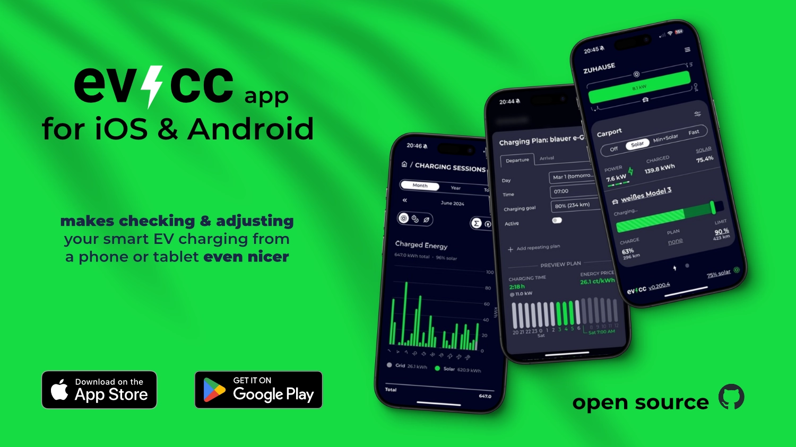

We did it!
The first version of the evcc app for iOS and Android is ready.
It can now be downloaded from the [Apple App Store](https://apps.apple.com/de/app/evcc-io/id6478510176) and [Google Play Store](https://play.google.com/store/apps/details?id=io.evcc.android).

{/* truncate */}

## What does the app do?

The evcc app is a native wrapper for the evcc user interface, providing you with an optimized user experience on your smartphone or tablet.
It comes with several practical features that make using your evcc installation much more comfortable:

### Easy Onboarding

- **Automatic Detection**: The app automatically finds evcc instances in your local network via mDNS.
- **Manual Setup**: You can also add your evcc instance manually via URL.
- **Demo Mode**: Curious? Just try out the app with our demo instance.

### Optimized User Interface

- **Full-Screen View**: Use the evcc UI in full-screen mode without distracting browser elements.
- **Adapted Design**: The user interface respects the peculiarities of your device (notch, rounded corners, etc.).
- **Improved Gesture Control**: Swipe and navigate intuitively through the app without browser zoom or overscroll effects getting in the way.

### Reliable Connection

- **Online/Offline Detection**: The app shows a loading screen when your evcc instance is not reachable.
- **Automatic Reconnection**: As soon as your instance is available again, the app automatically reconnects.
- **No Misoperations**: Avoids misleading situations where the user interface is displayed but not functional, e.g., due to network issues.

### Flexibility

- **Change Server**: You can change the configured URL at any time - either in offline mode or via the "Change server" menu item.
- **Light and Dark Design**: The native user interface automatically adapts to your device's system settings.

The app is another step towards making evcc even easier and more intuitive to use.
You can now keep an even better eye on your charging station, PV system, and energy flow in your home - directly from your smartphone.

P.S.: Do you have a Mac with Apple Silicon? Then you can use the iOS app directly there as well.

## The Technology Behind It

We relied on proven technologies when developing the app.
At its core, the app is a native wrapper around our existing web view.
We chose React Native in combination with Expo, which allows us to develop the app for iOS and Android with a shared codebase.
This significantly reduces development effort and ensures that new features are quickly available on both platforms.

The native components are written in TypeScript and kept to a minimum.
For the design system, we use UI Kitten / Eva, which helps us create a consistent and appealing user interface.

Like all our projects, the app is also open source.
The source code is available on [GitHub](https://github.com/evcc-io/app).
Bug reports, suggestions for improvements, and pull requests are welcome!

## Where are we headed?

The first version of the app is an important milestone, but we still have some exciting ideas for the future:

### Simplifying Remote Access

Currently, the app only works on the same network as your evcc installation.
For remote access, you need to establish a secure connection yourself.
This is already possible today with VPN solutions like Wireguard (in combination with a FritzBox) or Tailscale (with on-demand connections and Magic DNS), but it requires additional configuration.
We don't have concrete plans for direct integration into the app yet, but it's definitely a topic we want to address in the medium term.

### Platform-Specific Features

The native app forms the foundation for additional platform-specific features that wouldn't be possible with a pure web application.
These include push notifications to inform you about important events, and widgets for the home screen that give you a quick overview of the current status of your charging station and PV system.

💚 A big thank you to everyone who supports this project financially or through active participation.

🌟 One last thing: Please leave a rating in the [App Store](https://apps.apple.com/de/app/evcc-io/id6478510176) or [Play Store](https://play.google.com/store/apps/details?id=io.evcc.android) if you like the app!

**Best regards** 
The evcc Team 
Michael, Andi & Uli
