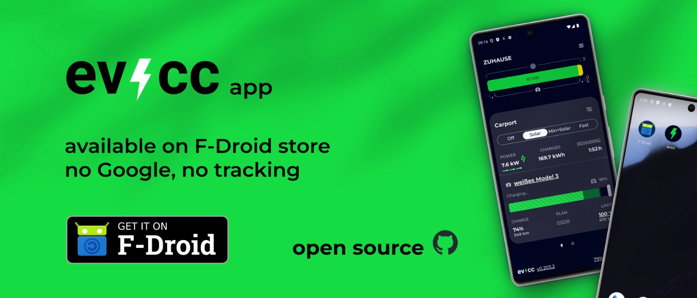

The [evcc App](/docs/features/app) is now also available on F-Droid.
F-Droid is an alternative Android app store that only provides free software without proprietary dependencies.

{/* truncate */}

In addition to the Google Play Store, Android users could alternatively download the evcc App as [APK from GitHub](https://github.com/evcc-io/app/releases/latest).
Now it is also available on F-Droid.
You can use it independently of Google account and Google infrastructure and update it conveniently.

The evcc App is Open Source and contains no tracking.
With the distribution via F-Droid, the potential tracking of the traditional app store operators also disappears.

To ensure that the App you install contains only what you see in the GitHub repository, F-Droid offers the possibility to **build reproducibly**.
This required some adjustments to our Expo-based build process.
Thank you [Maschga](https://github.com/Maschga) and [linsui](https://gitlab.com/linsui) for the help!

Here is the link to the store: [evcc App in F-Droid](https://f-droid.org/en/packages/io.evcc.android/)

The new version 1.0.3 contains smaller bug fixes and improvements for iOS users.
All details can be found in the [Release Notes](https://github.com/evcc-io/app/releases/tag/1.0.3).

**Best regards** 
The evcc Team 
Michael, Andi & Uli

