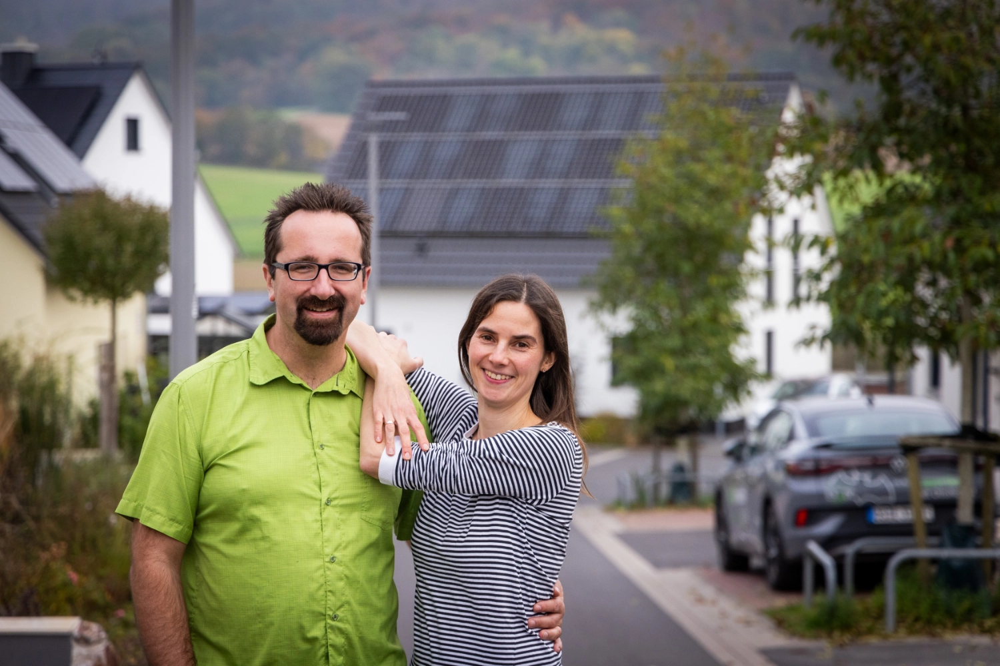
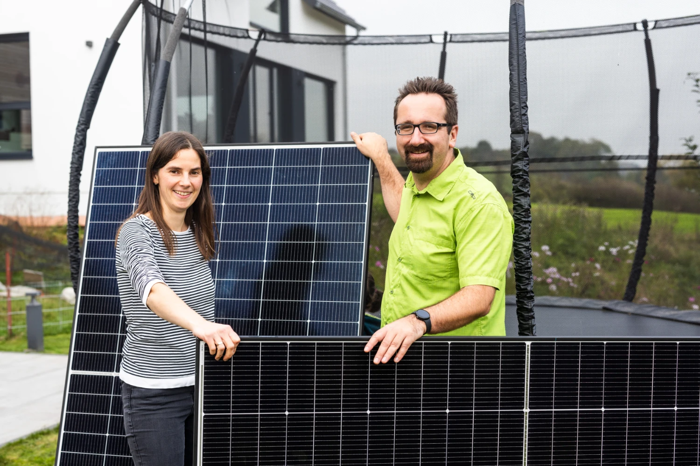
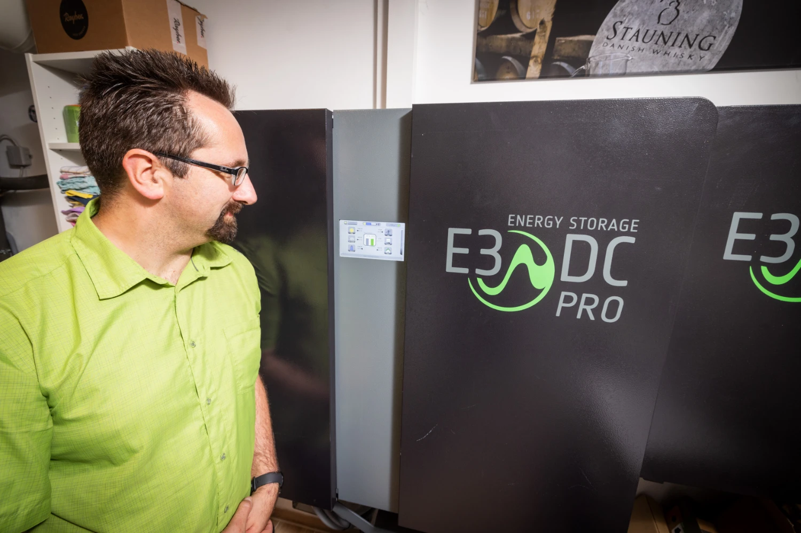
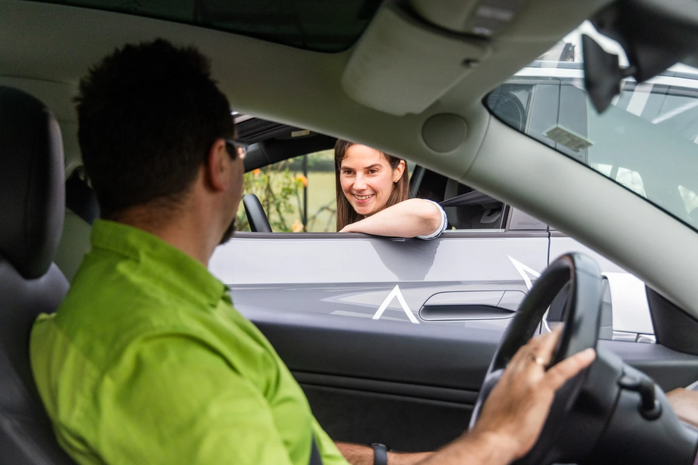
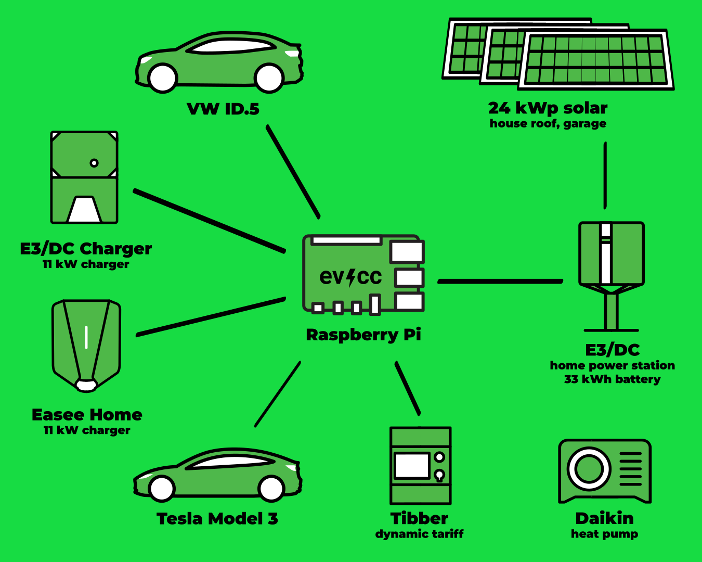
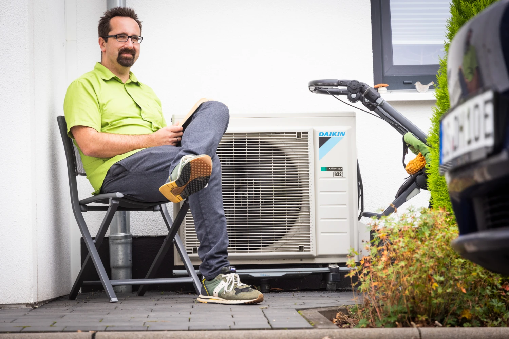
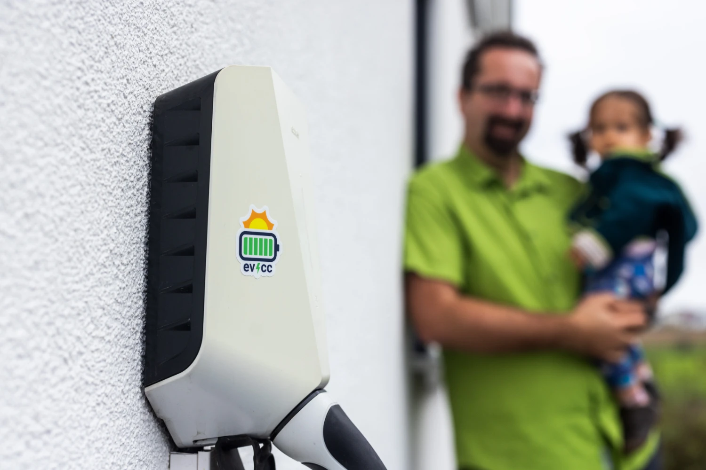

The days are getting warmer.
A good time for a new community portrait.
This time, photographer [Detlef](https://hee.se) visited Ulrike and Gunther in the beautiful town of Alzenau in Bavaria, Germany.

{/* truncate */}

## Maximal insulation or maximal PV?

**Michael:** Hi you two, great that you are willing to participate in a community portrait.
Let's dive right into the topic: How did your journey into electric mobility begin?

**Ulrike:** Our entry point into electric mobility was in 2018 with a Nissan Leaf, followed by a Model 3.
We were still living in a rented apartment at that time.
It was already quite adventurous, because we didn't have our own parking space and there was a limited number of charging points.
We had experimented with solar power on our camping trips.
There, of course, on a smaller scale, to charge phones, for example.

When we moved into our new house, both topics came together: electric mobility and photovoltaics.
This makes our life much easier today.
It's a great feeling to start the day with a fully charged car.

**Gunther:** Exactly, I especially enjoy the quiet and the comfortable driving experience.
As Ulrike already said, it was clear to us from the beginning: we need cheap electricity for the car.
At the beginning, we still wondered whether we should focus on maximum insulation or better on maximum solar power.
In the end, it was cheaper to install more PV modules on the east-west roof, than to insulate the house extensively.
Now we have a new building with a lot of solar power, which allows us to heat our home and our cars even during bad weather.

It's a great feeling to be independent of the grid for nine months a year thanks to our own solar power.
Our energy costs for two EVs, a heat pump and our house are minimal and even drop negativ thanks to the extra solar panels on the garage.

## All Electric Household!

**Michael:** Wow, that sounds like a very consistent implementation.
What is your exact tech setup?

**Gunther:** On the house roof we have 10.5 kWp after west-north-west and 8.4 kWp after east-south-east.
The north garage has about 5.1 kWp flat on the east-west roof, so we end up with 24 kWp in total.
Since we drive two EVs to work, we have a large battery with 33 kWh of usable capacity (E3DC home power station).
So the cars can be charged with up to 12 kW from the battery in the evening after work, which gives flexibility during bad weather.

**Ulrike:** We have consistently implemented "all electric" in the consumers in and around the house, so we don't have additional consumers with other, fossil energy forms. 
This means a high electricity demand, but we can cover it well with the maximum utilization of all roof areas.
It also helps to not be afraid of putting solar panels on the north side.
Our large battery rounds off the system.

**Gunther:** Thanks to the many modules and the battery, the system is very economical and we can easily cover bad weather periods.
From the beginning of November to the middle of February we draw grid power, otherwise we are self-sufficient.
In 2024 our self-sufficiency was 75 %.
This year we aim for 80 %!

In addition to the PV systems and the usual household consumers, we have an E3DC-charger that is controlled by the home power station, and an Easee Home charger at the second parking space. 
This was later added for the second EV and is a simple, uncontrolled charger.
Here evcc comes into play: It gives the Easee charger the necessary intelligence to optimally charge the second EV with surplus power and optimized for the dynamic Tibber tariff.

| Component | Details |
|------------|---------|
| **solar system** | 24 kWp (10,5 kWp WNW, 8,4 kWp ESE, 5,1 kWp O/W on garage) |
| **battery** | 33 kWh (E3DC home power station) |
| **vehicles** | Tesla Model 3, VW ID.5 |
| **chargers** | E3DC charger (garage), Easee Home (parting space, via evcc) |
| **heat pump** | Daikin |
| **dynamic tariff** | Tibber |

## More conscious in winter, more relaxed in summer

**Michael:** How did this setup affect your daily routines?

**Ulrike:** In winter and the transition period we are more conscious of energy consumption and plan ahead: when should we do the laundry, when should we charge the car?
Expecially for the second wallbox evcc removes the mental load.
We plug in and the system takes care of the rest.
Very relaxing!

In summer we have so much surplus energy that we don't need to plan much.
Our electrictiy consumtion even increased compared to before.

## Energie Stammtisch: Sharing knowledge locally

**Michael:** Gunther, you are involved in the [Energie-Stammtisch Freigericht](https://www.energie-stammtisch-freigericht.de)
That sounds interesting.
How did it start?

**Gunther:** We are a group of mostly tech-savvy people who are involved in renewable energy projects in the region.
We support the planning of solar systems, batteries, heat pumps and charging solutions at home and share our experiences.
We organize balcony solar workshops and are active for the local wind energy expansion.
The work is very motivating and benefits the people in the region.
I myself came to the association through the topic of EVs and am now part of the executive committee there.
Our [Facebook page](https://www.facebook.com/share/1RU91S4CHT/) gives deeper insights into our work.

## evcc: Nice, Real-Time and Practical

**Michael:** That sounds like good tips and experiences.
A really good tool to advance the energy transition in your own region and to involve your neighbors.
Let's talk about the software again.
Do you have a favorite feature in evcc?
Do you have any suggestions for improvement?

**Ulrike:** The second-by-second resolution of evcc is great.
We have an old phone stuck to the wall in our living room that displays the energy balance in real time.
So we can see the energy balance in real time at second resolution.
And the user interface is really nice.
The surplus charging also works great with evcc.

**Gunther:** I see improvement potential in the setup, which I did with the help of my neighbor at the time.
The new web-based setup, on which you are working, is exactly the right direction.
Regarding stability, i.e. when external interfaces do not work, evcc could react better.

**Ulrike:** I especially appreciate that I don't have to worry about anything: just plug in the car, and evcc takes care of the rest.
This is a real relief in everyday life.

**Gunther:** Otherwise, evcc meets our needs in automation and visualization.
We are happy to have such a well-designed energy management tool.

**Michael:** That's great, thank you for the feedback.
Thank you for the insights into your energy world.
It's simply inspiring!

---

**How does your evcc setup look like?**
If you are interested in sharing your experiences, your path and your technology in the form of a community portrait, then please sign up [here in the form](https://airtable.com/appDI3xIiev1DOpMY/shrW1zGH26KElfZOK).
We are especially looking for advanced installations or from users outside of Germany.

