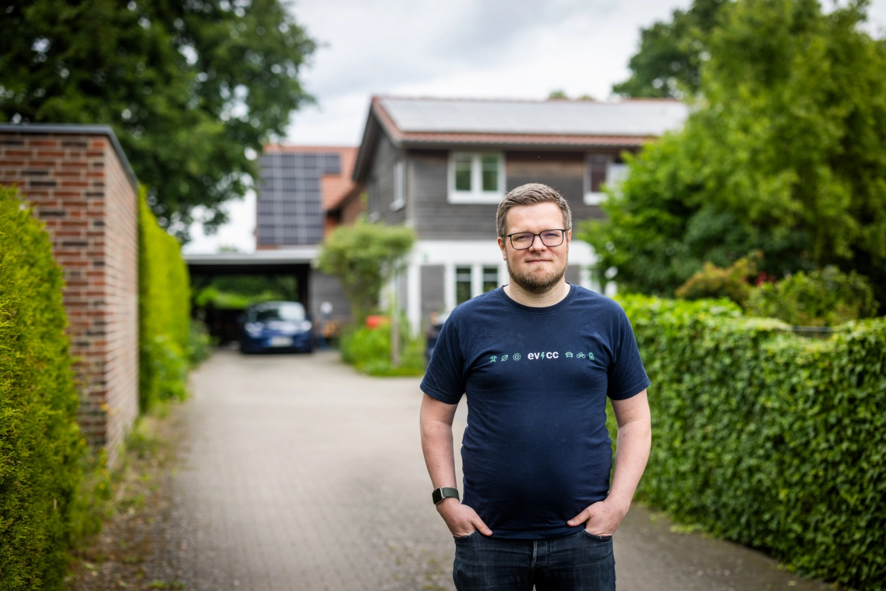
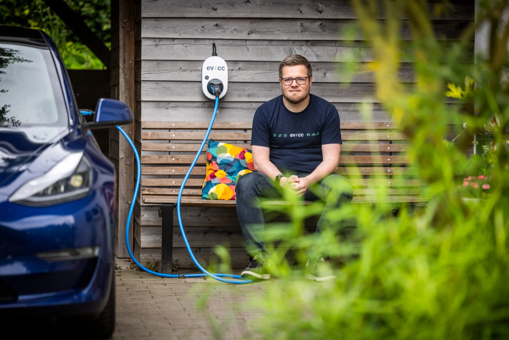
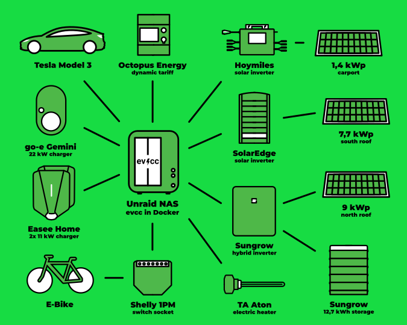
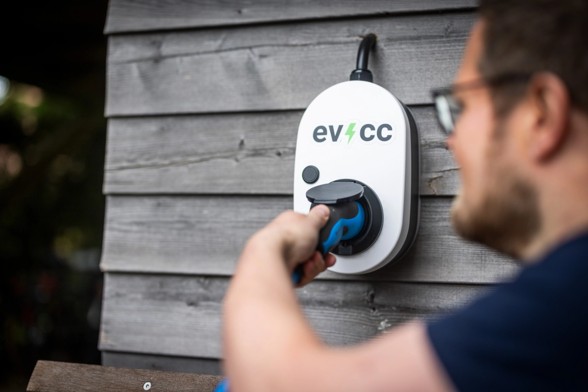
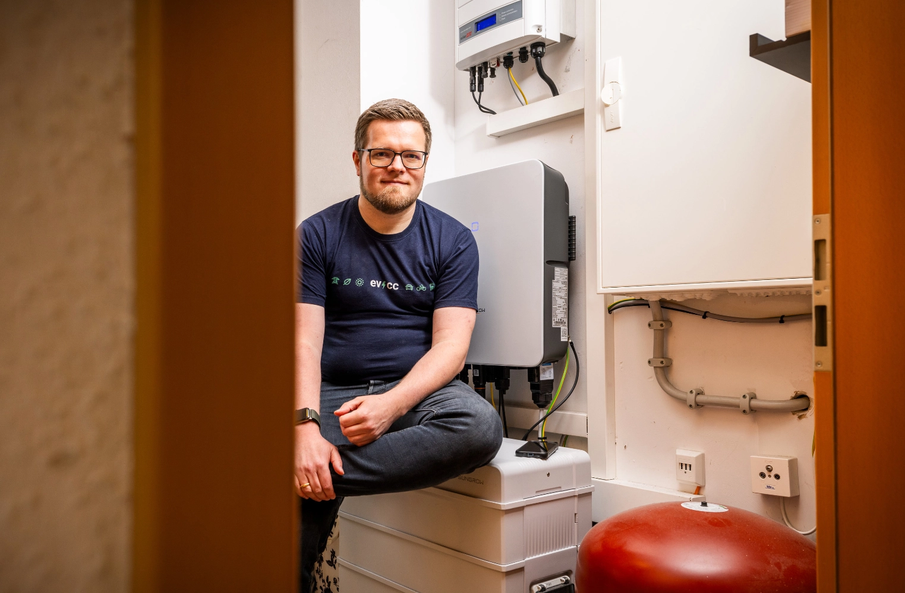

We've gotten to know many users from the community over the past few months.
Today's portrait is a bit different: Photographer [Detlef](https://hee.se) takes on the interviewer role and talks with Michael from the evcc Core Team.

{/* truncate */}

## "The best software is useless if nobody knows about it"

**Detlef:** Today we're switching roles and it's your turn to answer questions.
I got to know you and the project through one of your talks.
Are you something like the "Head of evcc"?

**Michael:** No, I wouldn't describe myself like that.
I'm part of the three-person core team together with [Andi](https://github.com/andig) and [Uli](https://github.com/premultiply).
Together we work on this project and share the various tasks that come with an open-source project of this size.

Besides my focus on UI development, I also take care of our visibility in public.
That includes things like the website, blog articles, [stickers](https://github.com/evcc-io/evcc/discussions/4446), documentation, some social media, and
the occasional appearance at conferences or in YouTube videos.
I do this because I think that the best software is useless if nobody knows about it.

## From Naive Idea to Core Team Member

**Detlef:** What was your first contact with evcc?

**Michael:** My first contact with evcc was probably like that of most users.
We had ordered an electric car in 2020 and I was looking for a solution to charge it with excess solar energy.
Quite naively, I thought I'd just buy a smart EV charger and that would be it.
The reality was sobering: manufacturer-bound isolated solutions, cloud services, proprietary solutions - none of it was what I wanted.

Then I came across evcc.
The software was minimalistic, modular, and had an exciting tech stack with Go and Vue.js.
The project was only a few months old at the time.
I made my first contributions and quickly became part of the core team.
Almost five years later, the software has come incredibly far.

## Eat Your Own Dog Food

**Detlef:** I assume you have your own evcc installation running.
What does it look like?

**Michael:** Our journey began in 2017 with a 9.8 kWp south-facing solar system.
Back then it was important to stay under the 10 kWp limit here in Germany.
In 2023 we also filled the remaining north roof and carport with solar panels.
In total, it's now 18 kWp plus a 12.8 kWh home storage system.
These additions have increased our self-sufficiency level.

Of course, we use evcc to charge our electric car with solar energy.
But I also try to use all the other features we've built into the software so far.
From March to October, an [evcc-controlled 3 kW electric heating element](https://github.com/naltatis/aton-ctrl) takes over hot water heating.
It only uses solar surplus or very cheap grid electricity.
Even our e-bike is connected to an outlet that only delivers power when the sun is shining.

This isn't really economically driven.
Our pellet heating would heat the water a bit cheaper, the e-bike consumption is negligible compared to the car.
But my point is to use the new functions myself in everyday life.
True to the software development motto: [Eat your own dog food.](https://en.wikipedia.org/wiki/Eating_your_own_dog_food)

| Component              | Details                                                                                                     |
| ---------------------- | ----------------------------------------------------------------------------------------------------------- |
| **PV System**          | 18.1 kWp total 7.7 kWp south SolarEdge 9.0 kWp north Sungrow 1.4 kWp carport Hoymiles & AhoyDTU |
| **Storage**            | 12.8 kWh Sungrow                                                                                            |
| **Vehicles**           | Tesla Model 3                                                                                               |
| **Wallboxes**          | Easee Home, Go-e Gemini                                                                                     |
| **Heating Element**    | 3 kW TA Aton via PWM                                                                                        |
| **E-Bike**             | Shelly 1PM                                                                                                  |
| **Electricity Tariff** | Octopus Energy                                                                                              |

## Community Power Instead of Expert Knowledge

**Detlef:** evcc now supports hundreds of devices and services.
Do you know them all?

**Michael:** The feature scope, yes, but the details of individual integrations definitely not.
Uli and Andi are the experts for device compatibility.
New device integrations almost always come from community members who own the respective device.
Sometimes these users are also developers who can provide pull requests.
In most cases, we work together with users to come up with a solution.

The beautiful thing about our system architecture is that for feature development, device-specific characteristics don't matter.
Our unified data model ensures that working with e.g. home batteries always works the same, independent of brand and model.
If a device offers additional functions like phase switching or controllability, additional options automatically appear in the user interface.

## Open-Source vs. Commercial Solutions

**Detlef:** Let's talk about Open-Source. Does this still excite you after all these years?

**Michael:** Absolutely.
Open-Source is unbeatable: We create a kind of database that uniformly processes interfaces to almost all EV chargers, inverters, and other devices.
This idea of _free knowledge_ is fascinating and an incredibly valuable resource - also for other projects.

**Detlef:** Many manufacturers offer proprietary systems, some inverters are opening up.
What does this mean for your project?

**Michael:** You're right.
Many manufacturers now integrate intelligent charging functions.
In an ideal world, intelligent energy management should be as simple as possible.
Tesla does this relatively well with their Powerwall, charger and vehicle combination.
But as soon as you leave the ecosystem - different vehicle, integrate heat pump - it gets complicated.
This is where solutions like evcc are needed.

**Detlef:** Do you believe that evcc will find users beyond IT enthusiasts?

**Michael:** I think so.
Today you still need some technical background or at least some love for tinkering.
But we're working on making the initial setup as comfortable as a home router setup.
This makes the software accessible to less technically-savvy users as well.

Of course, cloud services are even easier to use: sign up, enter credentials, done.
But then you depend on the cloud provider and have to trust in privacy and stability.
A local solution in your own four walls gives you full control.
Independence, stability, and data sovereignty are important criteria.

## No Magic, No Checkbox Flood

**Detlef:** With the feature requests on GitHub, you can't satisfy everyone.
Who decides what goes into the next version?

**Michael:** Various factors play a role.
Our guideline is not to overload the UI with settings that need explanation, but also not to implement "magical behaviour" that could surprise users.
These goals sometimes contradict each other.
When in doubt, we reject feature requests - but thanks to open interfaces, many features can also be implemented externally first with custom scripts or Home Assistant.

Demand naturally also plays a role.
We supported heat generators only as plugins for a long time to focus on our core functions, charging electric cars.
Since the beginning of the year, however, we've integrated heat pumps from over 20 manufacturers - simply because so many users wanted it and most of the necessary mechanisms already existed in evcc.

## No Roadmap, No World Domination

**Detlef:** evcc was always a project for vendor-independent charging solutions for me - today it's virtually a universal EMS.
How do you see the future?

**Michael:** Interesting question.
There's no official roadmap.
The community financing model gives us freedom: no external constraints, no milestones or world domination goals with fixed deadlines.

Our only motivation is to optimally adapt the software to user wishes.
The community keeps the project alive and sets the direction.
Whether we call ourselves "Universal EMS" and can check all product comparison checkboxes - that's not important for us.
What's important is that we deliver solutions for users' real needs.

Regarding the future: A frequently requested feature is visualizations and statistics that go beyond charging sessions.
So a kind of "dashboard" like you know from inverter manufacturer apps.
We already have a lot of ideas for this.

Another big topic is improvements to intelligent control.
We're planning to incorporate production and consumption forecasts into our algorithms.
Good integration for external optimization systems and AI-based services are also important.
We're always looking for committed contributors here too.
If you're interested, feel free to contact us on Slack.

**Detlef:** From me and on behalf of all evcc users: Thank you very much for driving the project forward like this.
It delights me over and over again to charge my car with self-generated energy.

**Michael:** Thanks for the questions and the opportunity to experience the interview format from the other side.

---

**Community portraits wanted!**
Have you already contributed code to evcc?
Then feel free to get in touch [here](https://airtable.com/appDI3xIiev1DOpMY/shrW1zGH26KElfZOK).
We're currently looking for portraits of active community members.
