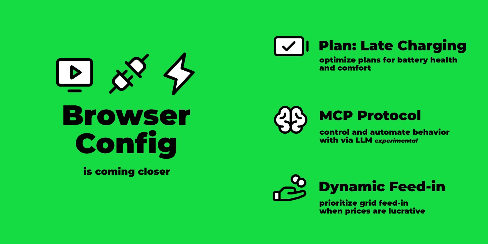

import Video from "@site/src/components/Video";
import configUiVideo from "./config-ui.mp4";
import configUiPoster from "./config-ui.webp";
import mcpVideo from "./mcp-integration.mp4";
import mcpPoster from "./mcp-integration.webp";

Time for a new feature roundup! I've selected a handful of interesting topics.

[](/blog/2025/07/30/highlights-config-ui-feedin-ai)

{/* truncate */}

Before we get to the features, an important announcement for all REST API users.

## Breaking change: REST API

With release v0.207, there's a change to the REST API.
The endpoints remain unchanged, but the response format will be streamlined.
Specifically, the outer `result` level is being removed.

Here's an example for the endpoint `GET /api/state`:

Current JSON response:

```json
{
  "result": {
    "loadpoints": [...],
    ...
  }
}
```

Future JSON response:

```json
{
  "loadpoints": [...],
  ...
}
```

The maintainers of popular evcc integrations have been informed and have already made the necessary adjustments.

Users with their own scripts or automations that directly access the REST API must adapt these themselves.
More details are available in the corresponding [GitHub Issue.](https://github.com/evcc-io/evcc/pull/22299)

:::note Migration notes
To ease the transition, we've released two versions: **v0.206 and v0.207 are feature-identical**.
The API changes are **included from v0.207** onwards.
If the new response format causes problems, you can downgrade to v0.206.
This gives you all the new features described here and allows you to prepare your scripts and integrations for the breaking change at your own pace.
:::

## Plans: Late charging

Charge plans have received a new feature: _Late Charging_.
By default, the planning algorithm optimizes charging to occur during the cheapest or cleanest hours.
However, it can also make sense to charge the vehicle late, i.e., to match the set target time.

Use cases include:

- **Preconditioning**: Especially in winter, it can be beneficial to warm the vehicle battery by charging at departure time. This saves energy because less active climate control is needed during the drive.
- **Climate control**: If you have climate control activated in the car at departure time, this setting ensures that the required energy is drawn from the EV charger and not from the car battery.
- **Battery care**: When charging to 100% before long trips, the battery shouldn't sit fully charged for extended periods.


In addition to the checkbox for activating late charging, you can also set the duration that should be charged directly beforehand.
This allows you to, for example, continue charging the majority at price-optimized times, but only fully charge the car in the last hour, as shown in the screenshot above.

More details can be found in the [documentation](/docs/features/plans#late-charging).

## Configuration via browser {#config-ui}

A lot of progress is being made on the topic of initial setup via browser.
For a few weeks now, it's been possible to set up without `evcc.yaml`, although previously this always started in [demo mode](https://demo.evcc.io/).

Now the setup starts with a selection dialog:
- Classic configuration with `evcc.yaml`
- Browser-based configuration _🧪 experimental_

In the following video, you can see the configuration process with multiple vehicles, meters, solar/battery systems, EV chargers, and heat pumps:

<Video src={configUiVideo} poster={configUiPoster} />

### Demo mode

To test the interface without configuration, the demo mode is still available.
This can be started with the [CLI flag](https://docs.evcc.io/docs/reference/cli/evcc) `--demo`.

In this mode solar, battery and EV chargers use simulated data.
Additionally, the authentication system is disabled, and thus all protected functions (configuration, logs, ...) are deactivated.

### User-defined Devices (Plugins)

Through the configuration interface, vehicles, meters, PV/battery systems, EV chargers, tariffs, smart switches, and heat pumps could already be created.
This is based on our large library of device templates for now over 550 products.

Another strength of evcc is the [flexible plugin system](/docs/devices/plugins).
This allows even exotic devices and integrations to be connected using HTTP, Modbus, Script, MQTT, etc.
These user-defined devices (`type: custom`) previously had to be configured via `evcc.yaml`.
Now this is also possible via the UI – conveniently with syntax highlighting, validation, and test function.


### Charging & heating

The origin of evcc is intelligent charging of electric cars.
Meanwhile, the system also supports a growing list of heat pumps and heating rods.
The basic optimization goals like efficient use of own energy or cost-optimized charging from the grid are identical in both areas.
However, the control behavior, visualization requirements, and setting options differ in detail.

In the configuration interface, the _Charging Points_ section has therefore been renamed to _Charging & Heating_.
The setup flow has also been revised to show the settings relevant to the respective use case.

In the [video above](#config-ui) (from 2:10) you can see the different workflows for charging and heating.
Here's a screenshot of the first setup dialog:


In upcoming releases, there will be further steps to make _heating_ a first-class citizen in evcc.
More details can be found in this [GitHub Issue](https://github.com/evcc-io/evcc/issues/19753).

### Backup & restore

Now that more and more functions are moving to the UI, new questions arise:

- How can I back up my configuration?
- How do I migrate my installation to a new system?
- Can I reset the configuration and start from scratch?

To answer these questions, we've implemented a backup & restore function.
This allows you to back up the evcc database on your computer, restore a saved state, or delete the configuration while, for example, keeping the charging history.


A big shoutout to [@maschga](https://github.com/maschga) for support in the implementation.

### More to come

The number of open todos regarding setup via browser is becoming increasingly smaller.
There are still some devices that cannot be created, and the topic of debug information for GitHub issues still needs improvement.
And of course, there's always room for improvement in existing functions.

However, it's now foreseeable that configuration via web interface will soon become the new standard.
Version 1.0.0 is getting closer.

Note: Configuration via `evcc.yaml` will continue to be possible in the future.

## Dynamic feed-in

With [dynamic electricity tariffs](/docs/features/dynamic-prices), you can adapt charging and heating behavior to the current price situation.
This feature is now also available for feed-in.

If you have a tariff with [dynamic feed-in prices](/docs/features/dynamic-feedin) (e.g., direct marketing, dynamic grid fees, Netherlands, Australia, ...), the [prioritize feed-in](/docs/features/dynamic-feedin#feed-in-priority) function appears in the settings dialog at the charging point.


This allows you to pause charging or heating during times when it's more lucrative to feed energy into the grid.
You can set a fixed price limit for this.
Automation via external scripts or systems via API is of course also possible.

In upcoming releases, we will implement more features related to dynamic feed-in.
We're experimenting with pausing feed-in during times with negative prices and reducing production.
More about this [here](https://github.com/evcc-io/evcc/issues/21747).

## AI Integration via MCP 🧪

With the [Model Context Protocol](https://en.wikipedia.org/wiki/Model_Context_Protocol) (MCP for short), it's possible to give LLMs like Claude, Gemini, and ChatGPT structured access to external systems, such as evcc.

With the [CLI flag](https://docs.evcc.io/docs/reference/cli/evcc) `--mcp`, you can activate an experimental MCP server when starting evcc.
You can include the new endpoint (e.g., `http://evcc.local:7070/mcp`) in your LLM's configuration.

The topic of MCP and the available tools are still very young and constantly changing.
However, we see great potential and exciting new possibilities here – especially in the area of optimization and automation with local models.

The following video shows an example of evcc working with Claude Code (Sonnet 4):

<Video src={mcpVideo} poster={mcpPoster} />

Request: _"The user wants to drive to Hamburg tomorrow at 8 AM with his Tesla."_

The LLM ...

- ... identifies the correct charging point: "white Model 3"
- ... calculates the distance: Bremen (Title) -> Hamburg (Request)
- ... calculates the required charge level: 90%
- ... creates a charging plan: 90% at 8 AM for the Tesla Model 3
- ... switches the charging mode from "Off" to "Solar" since plans are only active in (Min+)Solar mode

Finally, it queries the charging plan calculated by evcc and returns it to the user.

This relatively simple example shows quite well where the journey could go in the future.
We're excited to see how the topic of MCP develops.
Feel free to try it out yourself and share your experiences in the [GitHub Discussions](https://github.com/evcc-io/evcc/discussions).

More details on using MCP with e.g., Claude Code can be found in the [documentation](/docs/integrations/mcp).

## Production, battery and charging points expandable

If you have multiple solar/battery systems or charging points configured, you can now expand them in the energy flow view to see more details.
Devices created via the configuration interface can be given a name for this purpose.

:::hint
Naming solar, battery and other meters is not possible via `evcc.yaml` for technical reasons.
:::

## New device support

Since February, we've added several new device manufacturers:

- **EV chargers:** Ampure, Autoaid, Charge Amps, Elecq, eledio, EN+, enercab, EntraTek, Free2Move, Free2move eSolutions, Hardy Barth, Huawei, Kathrein, NRGkick, Plugchoice, Volt Time, ZJ Beny
- **Smart switches:** Home Assistant
- **Heat pumps & electric heaters:** alpha innotec, Bosch, Buderus, Bösch, CTA All-In-One, Daikin, Elco, IDM, Junkers, Kermi, Lambda, my-PV, Nibe, Novelan, Roth, Stiebel Eltron, Tecalor, Vaillant, Viessmann, Wolf, Zewotherm
- **Meters:** Axitec, Bosch, IAMMETER, IOmeter, ORNO, Saia-Burgess Controls (SBC), Sigenergy, Wago  
- **PV/Battery Systems:** Axitec, Bosch, IAMMETER, Marstek, Sigenergy
- **Vehicles:** Toyota

Of course, bug fixes and improvements to existing implementations were also made.

## Much More ...

This is just an excerpt.
The full list of new features can be found as usual in the [GitHub Release Notes](https://github.com/evcc-io/evcc/releases).
Big thanks to everyone actively participating in the development of evcc.
You rock 🤘.

**Best regards**<br />
The evcc Team<br />
Michael, Andi & Uli


