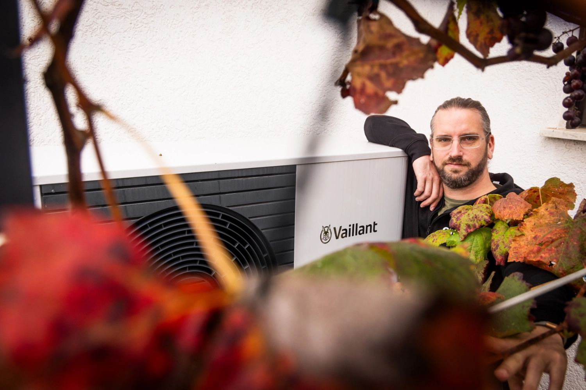
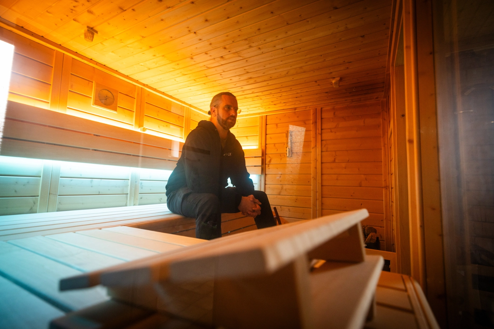

Tobias transformed his house in Trebur in southern Hesse step by step from a gas heating household into a largely energy-independent smart home.
Photographer [Detlef](https://hee.se) visited and took photos.

{/* truncate */}

## Energy Independence Instead of Gas Heating

**Michael:** Hi Tobias, it's great that you're taking the time to show us your home and the technical setup.
Perhaps you'd like to introduce yourself briefly?

**Tobias:** Hi Michael, great that we're doing this.
So, my name is Tobias and I'm 41 years old.
Like some of my portrait predecessors, I have a background in computer science and am a passionate tinkerer when it comes to energy efficiency and smart home technology.
My family and I inherited a detached house a few years ago and have been gradually improving everything since moving in over 10 years ago.
We always looked for ways to reduce our utility costs.
It was basically a step-by-step transformation from a gas heating household to a largely energy-independent smart home.

**Michael:** Okay, that sounds like a lot of work, but also like you end up with customised solutions that fit your habits and living needs perfectly.
Did you still have time to take care of other things?

**Tobias:** Of course!
One of the bigger challenges was replacing our gas heating with a heat pump.
We commissioned a nationwide operating contractor for the complete system.
Unfortunately, the installation was chaotic: three planned days turned into a week, they had forgotten the electrical connection, and afterwards various technical problems occurred – from incorrect buffer tank connections to an oversized circulation pump.
After several corrections, our own research and the contractor's insolvency, we had to make the final adjustments ourselves.
Today the heat pump runs stably and efficiently with renewable electricity from our own roof – the journey was rocky, but it was worth it.

## From Hybrid to Fully Electric

**Michael:** That sounds like a real test of patience.
But good that everything works in the end.
How did you get into electric mobility?

**Tobias:** A few years ago we got a plug-in hybrid, a VW Passat.
The solar system followed somewhat later.
The aim back then was to achieve about 10 kWp of power without having to give up the solar thermal system.

Setting up the solar system was initially a bit like a puzzle because the supplier delivered two extra modules and we had to figure out how to install them as well.
Well, if they're already there, we wanted to use them too.
After the solar system was up, came the first proper EV, a Tesla Model Y, and shortly afterwards the second, an Ora Funky Cat.
Initially we had a KEBA P-30 charger.
That didn't work so well and we replaced it with a WARP Charger 2 Pro.
With the arrival of the second EV we installed a second charger.
To optimally use the solar surplus, the WARP Energy Manager was added to enable 1-phase/3-phase switching.
Meanwhile, we upgraded both chargers to WARP Charger 3 with integrated phase switching to simplify the system.

## Load Management Instead of Power Upgrade

**Michael:** You're already hinting at it, now we're getting to where and why you use evcc...?

**Tobias:** That's right, now we're getting into the details.
Initially I used evcc as a Docker container on a Proxmox cluster.
Over time, I got more and more involved with Home Assistant and now only run a Home Assistant Yellow with PoE, CM4 with 8 GB RAM and a 1 TB SSD to save power here as well.
I used evcc as an add-on in Home Assistant.

**Michael:** What does your set-up look like?

**Tobias:** Our system currently consists of a 10.1 kWp solar system (27x Heckert Solar NeMo), a 16 kWh Sungrow battery, 2 WARP Charger 3 Pro, a Vaillant heat pump (Arotherm plus) and a sauna (9 kW).
Balancing the different consumers, storage and producers required some fine-tuning, but that's somehow fun.

We currently have direct metering for electricity consumption in our house distribution.
This means the meter can be permanently loaded with 44 A (30.4 kW).
So we had to decide: either carry out a power upgrade with current transformer metering or control the whole thing via dynamic load management.
For cost reasons, we initially opted for dynamic load management.

We don't actively measure the sauna's power, so we work with two areas in evcc.
The area (Main) has a current limit of 44 A and the area (Driveway) has a maximum of 32 A.
Both chargers share the 32 A from the area (Driveway), so theoretically one charger could always charge at 22 kW, even though hardly any vehicle currently supports this.
We assign the sauna and heat pump to the area (Main).
They always have priority over the two chargers.
This ensures that the main connection is never loaded with more than 44 A.
If the sauna and heat pump are running at full capacity while we're baking biscuits, evcc would temporarily reduce the charging power of our cars.

| Component        | Details                                                        |
| ---------------- | -------------------------------------------------------------- |
| **Solar System** | 10.1 kWp (27x Heckert Solar NeMo 3.0 120M)                     |
| **Inverter**     | Sungrow SH10.0RT Hybrid                                        |
| **Battery**      | Sungrow SBR 16 kWh                                             |
| **Chargers**     | 2x WARP Charger 3 Pro                                          |
| **Vehicles**     | Tesla Model Y, Ora Funky Cat                                   |
| **Heat Pump**    | Vaillant Arotherm plus vwl 125/6                               |
| **Sauna**        | 9 kW electric heater                                           |
| **Control**      | evcc as Home Assistant add-on (Home Assistant Yellow with PoE) |

## From PV Magazine to evcc

**Michael:** Great, you have two chargers, a sauna and the usual household consumers covered.
How did you come across evcc?

**Tobias:** Through an article in PV Magazine in 2022.
At that point we already knew we would install a solar system and wanted to use the surplus as efficiently as possible.
Back then there were only very expensive solutions or solutions that only worked well within the manufacturer's own ecosystem.

**Michael:** Yes, that was also a reason why I think the project is so cool: surplus charging.
What other features do you use, or is that actually the main use case?

**Tobias:** Well, until last year we also had Tibber, which meant evcc controlled cheap charging for the cars.
With the installation of the heat pump and the upcoming challenges, we switched back to a cheaper, fixed electricity tariff and needed load management.
That's where evcc could shine.
So we use it to control the chargers, integrate the vehicles and for load management.
I configured the heat pump control, but don't currently use it because it doesn't make sense with the solar thermal system.

## Wishes for the Future

**Michael:** What do you wish for from evcc?
Which area should we invest more energy in?

**Tobias:** I'd like to see direct integration of the Vaillant heat pump via EEBUS or EBUS.
I think there's still potential there.
Overall I can say that we've learnt a lot and achieved a lot.
I'm really proud of what we've accomplished: the house has an efficient (and more sustainable) heating system, the solar system produces what we need during the day, and together with the buffer tank gives us a high degree of independence.

**Michael:** Thanks, that's a good point.
And thank you very much for showing us how it works at your place.
I'm sure this will inspire one person or another to make changes to their set-up.

---

**What does your evcc set-up look like?**
If you're interested in sharing your experiences, your journey and your technology in the form of a community portrait, please register [here in the form](https://airtable.com/appDI3xIiev1DOpMY/shrW1zGH26KElfZOK).
We're particularly looking for portraits of exceptional installations or from users outside Germany.
