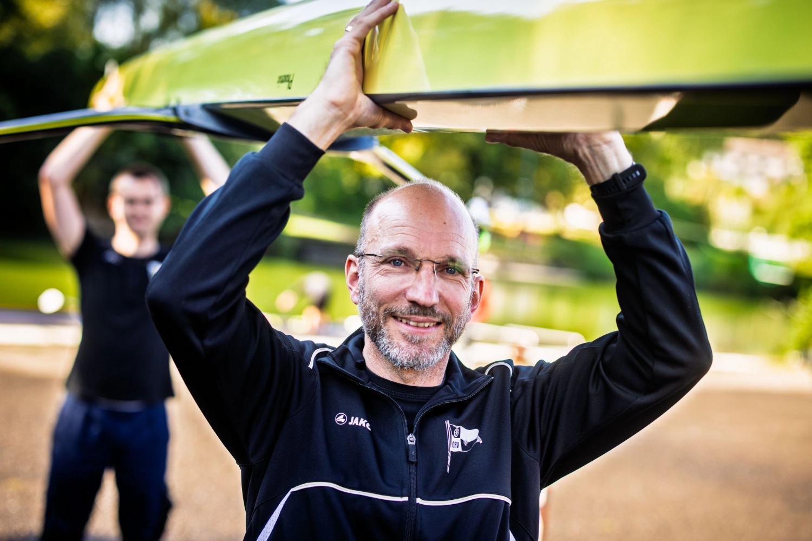
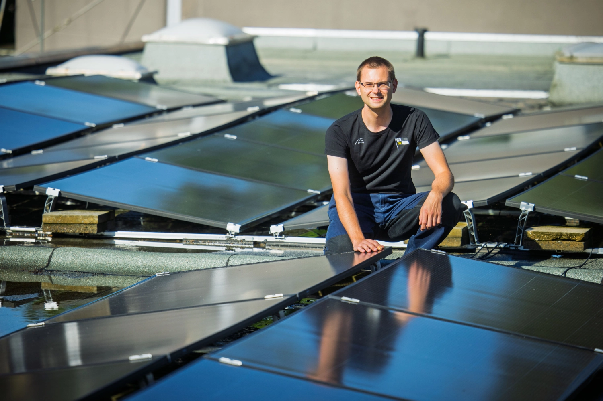
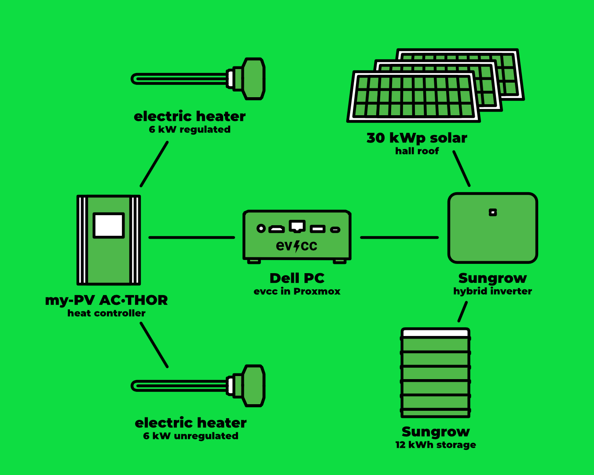
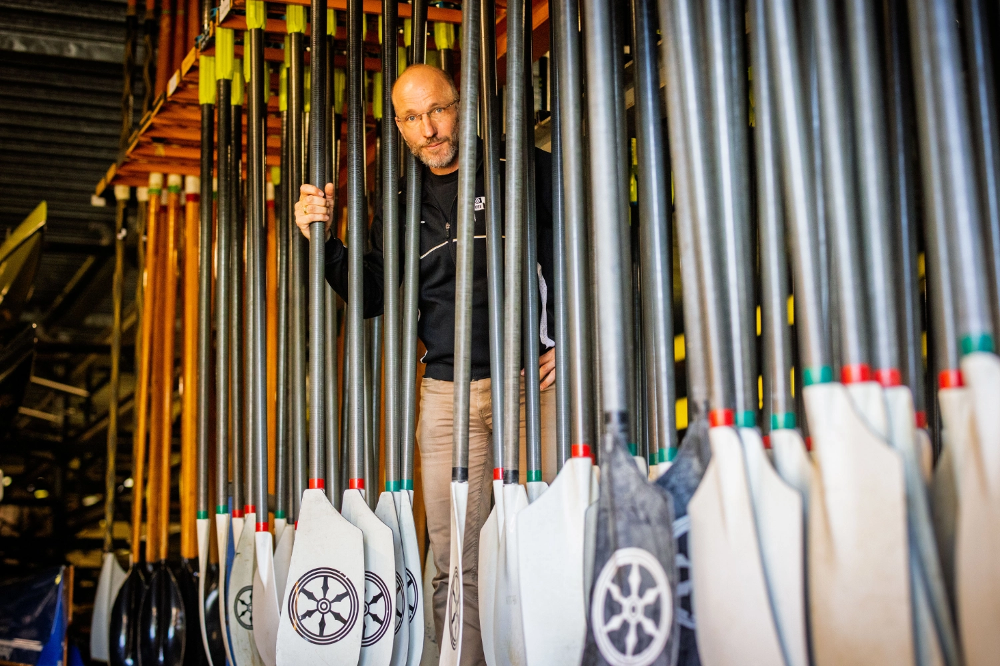

A large boathouse, showers for dozens of rowers and lots of roof space: the [Osnabrücker Ruderverein](https://www.orv.de) (ORV) has found a way to reduce energy consumption whilst becoming more independent from fossil fuels using solar power and evcc.
Photographer [Detlef](https://hee.se) paid them a visit.

{/* truncate */}

## From Solar Thermal to Solar PV

**Michael (evcc):** Hi Michael, hi Markus, great that you're taking the time.
A large boathouse roof: that's perfect for solar panels.
How did you convince the club to invest?

**Michael (ORV):** We had a solar thermal system on the roof until a few years ago, but it suffered total economic failure.
As part of an energy renovation, a solar system was naturally on the agenda.
The initial trigger was rising electricity prices, but also independence from gas.
Since we were able to complete many tasks through volunteer work from club members, the investment was significantly lower than initially estimated.
That convinced the members.

**Michael (evcc):** How much of the roof area have you been able to cover?

**Markus (ORV):** Currently only about a quarter of the roof area is covered with a 30 kWp system.
But we can't install more due to regulations, and we're already maxing out the grid connection.
If that changes, we'd like to expand the system ourselves through volunteer work.

## Hot Water for Dozens of Rowers

**Michael (evcc):** How did evcc come into play?
Were there alternative considerations?

**Michael (ORV):** Our first chairman was already using evcc at home for his solar system, and the experiences were positive.
It made sense to use it at the club too.

**Michael (evcc):** And what does your technical setup look like?

**Markus (ORV):** We have a Sungrow system with 29.92 kWp, a 12 kW battery, a My-PV AC-Thor 9s with one regulated 6 kW heating element and one unregulated 6 kW heating element on the relay.
Each installed in a hot water storage tank.
The software runs on a repurposed Dell PC that consumes a frugal 15 W.
Proxmox is installed on it, Home Assistant runs in a VM and evcc in a container.
We also upgraded our tech infrastructure last year for a stable and future-proof system.

**Michael (evcc):** How many people shower on a typical day with your solar heating element and has the water ever been too cold?

**Michael (ORV):** It's hard to say how many people shower per day.
Since we installed water-saving heads and timers, they definitely shower for less time.
That benefits our gas savings.
The water can't get too cold because we have a gas heater that warms the water as soon as it drops below 36°C.

## 5,742 kWh of Gas Saved

**Michael (evcc):** Can you already say how much gas has been saved through your heating elements?

**Markus (ORV):** We can analyse the consumption per heating element with Home Assistant.
By mid-September, we'd heated water with at least 5,742 kWh of solar electricity.
That should correspond roughly to the same amount of gas.
Since we're still in the testing phase, we don't have long-term experience yet.

**Michael (evcc):** Would you still have electricity left over for a members' wallbox or other consumers?

**Michael (ORV):** We currently feed the surplus into the grid.
Since the heating elements went live, there's not enough surplus left to make battery charging worthwhile.
But we're already planning to install EV chargers in the future.

| Component            | Details                                                                       |
| -------------------- | ----------------------------------------------------------------------------- |
| **Solar System**     | 29.92 kWp (approx. 1/4 of available roof area)                                |
| **Inverter**         | Sungrow                                                                       |
| **Battery**          | 12 kWh                                                                        |
| **Hot Water System** | My-PV AC-Thor 9s with 2x heating elements (6 kW regulated + 6 kW unregulated) |
| **Hot Water Tanks**  | 2 units                                                                       |
| **Control**          | evcc in container on Proxmox, Home Assistant in VM                            |
| **Hardware**         | Dell PC (15 W consumption)                                                    |

## From Treasurer Duties to the Water

**Michael (evcc):** Michael and Markus, you're the two technical souls of the Osnabrücker Ruderverein: how often do club members see you in a boat, or just in the technical room?

**Markus (ORV):** Since I handed over the treasurer position in spring, I've resolved to get on the water more often.

**Michael (ORV):** I took over the board position for facilities three years ago and yes, the proportion of work at and for the club has become much higher.
Nevertheless, I usually still manage to go rowing once at the weekend.

## Wishes for the Future

**Michael (evcc):** Do you have wishes for the future and further development of evcc?

**Markus (ORV):** Definitely: a function that ensures water is primarily heated during mornings and daytime, but the battery is 100% charged by nightfall would be our next wish.
To preserve the battery and for grid-friendly feed-in, throttling the charging power would also be nice.

**Michael (evcc):** Thanks for the great suggestions.
Since evcc started with EV charging, we still have a lot to improve when it comes to heating use-cases.
But there are things to come in the future.

Thanks for the insights into your energy world at the rowing club.
It nicely shows how evcc can work in larger community facilities too!

---

**What does your evcc setup look like?**
If you're interested in sharing your experience, journey and technology in the form of a community portrait, please sign up [here on the form](https://airtable.com/appDI3xIiev1DOpMY/shrW1zGH26KElfZOK).
We're especially looking for portraits of exceptional installations or users outside Germany.
