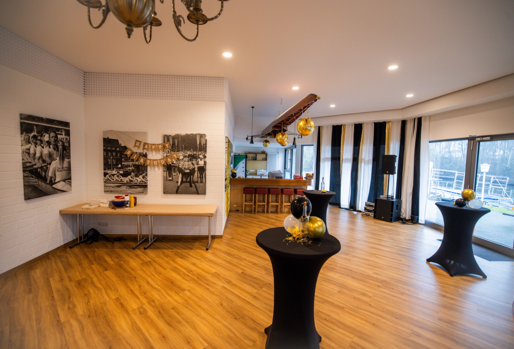

We invite you to the first evcc community meetup!
On **18 April 2026**, we'll meet in Osnabrück to get to know each other, exchange ideas, and have a barbecue together.
The [Osnabrück Rowing Club](https://www.orv.de) kindly provides us with their facilities.

{/* truncate */}

## What to Expect

The meetup takes place in the **afternoon** and has space for **100 participants**.
We've planned a relaxed programme:

- **Getting to know each other**: Put faces to GitHub usernames
- **Exchange**: Discussions about your evcc setups and experiences
- **Networking**: Connect with other evcc users and developers
- **Barbecue**: Wrap up the day with food and drinks

## Registration

Registration is handled through the rowing club's booking system.
There's a **contribution of €10**, which also covers the barbecue food.

**[Register now →](https://widgets.yolawo.de/w/0/bookables/692e18b1db6c17d85beacfd2?t=1764767521803)**

During registration, you can optionally add your city.
This helps us get an idea of where people are travelling from.

## Location

**[View on Google Maps →](https://maps.app.goo.gl/75RsYsPpeBuNLsWC6)**

**Osnabrücker Ruderverein e.V.** 
Glückaufstraße 16 
49090 Osnabrück

The rowing club is located directly at the Stichkanal and offers a great atmosphere for our meetup.
As you can read in the [community portrait](/blog/2025/11/29/osnabruecker-ruderverein), the club uses evcc for its own energy management.

We're incredibly excited to finally see some faces behind the GitHub usernames!
Whether you're a user or developer, whether you've been around for a while or just started with evcc: come along!

If you have any questions, feel free to reach out in the [GitHub Discussions thread](https://github.com/evcc-io/evcc/discussions/25787).

**See you in April in Osnabrück!** 
The evcc Team 
Michael, Andi & Uli
