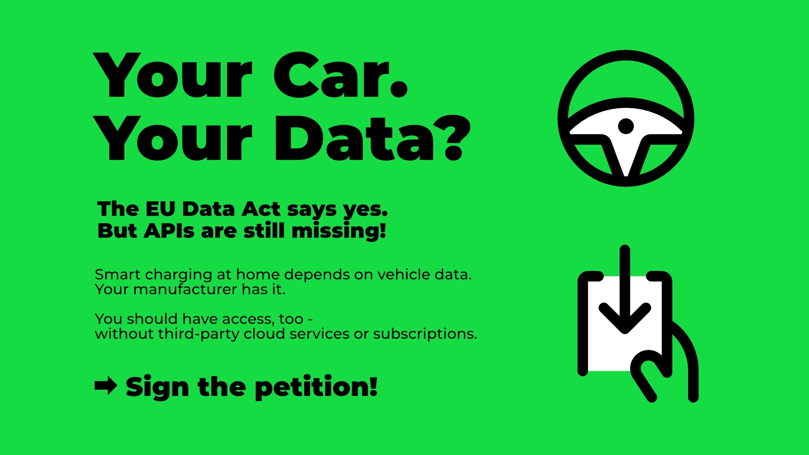

Your car constantly collects data – but you can't access it.
The EU Data Act, in effect since 12 September 2025, should change that.
Reality looks different: Most car manufacturers offer no or very limited access.

{/* truncate */}

## Why evcc Needs Vehicle Data

evcc optimises charging your electric vehicle with solar surplus.
For this, we need real-time data from your vehicle: state of charge, range, charging status.
Currently, we often rely on reverse-engineered APIs.
This works, but isn't a sustainable solution.

Official APIs would enable:
- **Reliable surplus charging** with current battery and charging data
- **Better battery management** through precise control
- **Energy cost optimisation** with dynamic tariffs
- **Grid stability** through intelligent load distribution

## Electric Mobility and Energy Transition

Open data access is important for the energy transition.
Vehicle-to-Grid (V2G) requires bidirectional data exchange.
Smart home integration only works with real-time data.
Optimised charging reduces CO₂ emissions and electricity costs.

## The Reality: Limited Access

The EU Data Act is law.
Implementation by manufacturers varies greatly.

**BMW** and **Tesla** offer API access.

**Many others tell a different story:**
Some manufacturers provide data upon request via email.
Others have web forms where you receive 15-minute-old data as a ZIP file.
These are not practical solutions for real-time applications like smart charging.

**Data APIs already exist:**
Vehicle data is already available in good quality and via API.
However, only for third-party companies who pay for access.
Data access is a business model for manufacturers in the B2B sector.
Vehicle owners often don't get this direct access.

In our [GitHub discussion](https://github.com/evcc-io/evcc/discussions/23684) we're collecting the current status per manufacturer.

## What Does the EU Say?

The [European Commission published clear guidelines in September 2025](https://digital-strategy.ec.europa.eu/en/library/guidance-vehicle-data-accompanying-data-act):

**Users have the right to:**
- Raw and pre-processed vehicle data
- Easy, free access to their own data
- Data in the same quality as the manufacturer uses
- Sharing with third parties of their choice

**Manufacturers must:**
- Make data easily and directly accessible
- Without additional costs for personal use
- In machine-readable format
- Including metadata for interpretation

The legal foundation exists.
Practical implementation is still lacking.

## The Petition

Maximilian Hauser from the evcc community has started a [petition](https://www.change.org/p/eu-data-act-durchsetzen-autohersteller-müssen-uns-zugang-zu-unseren-fahrzeugdaten-geben) to advance implementation of the Data Act.

**What's demanded:**
- German Federal Network Agency to enforce the Data Act
- Clear technical standards for APIs
- REST API with OAuth 2.0
- At least 12 requests per hour per vehicle
- Public API documentation
- 99% monthly availability

## What You Can Do Now

### 1. Sign the Petition

👉 **[Sign here](https://www.change.org/p/eu-data-act-durchsetzen-autohersteller-müssen-uns-zugang-zu-unseren-fahrzeugdaten-geben)** 👈

### 2. Contact Your Manufacturer

Ask your car manufacturer for API access according to the EU Data Act.
Reference the EU guidelines.
The more requests come in, the more likely things will move.

### 3. Spread the Word

Share the petition in your network: forums, Discord servers, Facebook groups, friends and family.
Reach out to your favourite YouTube channels covering e-mobility, smart home and renewable energy.

---

The Data Act is here.
Implementation needs pressure from users.
