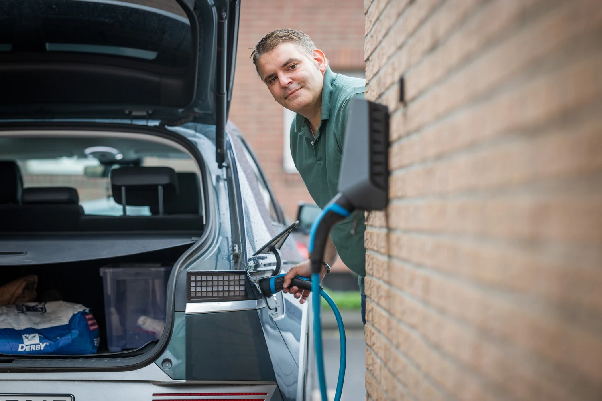
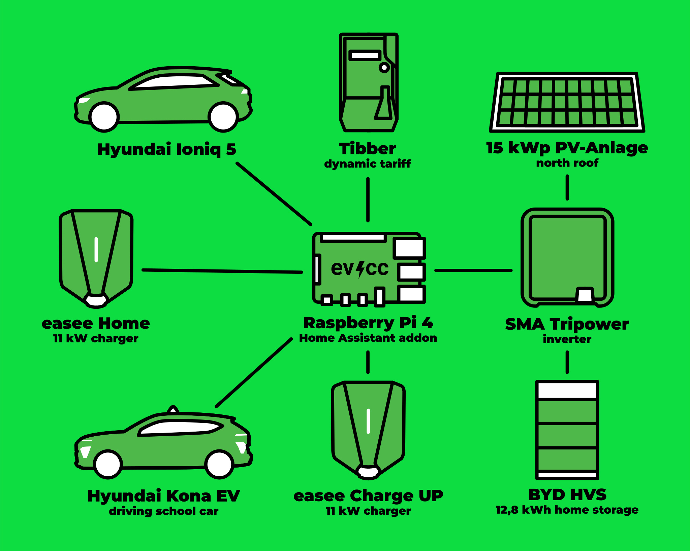
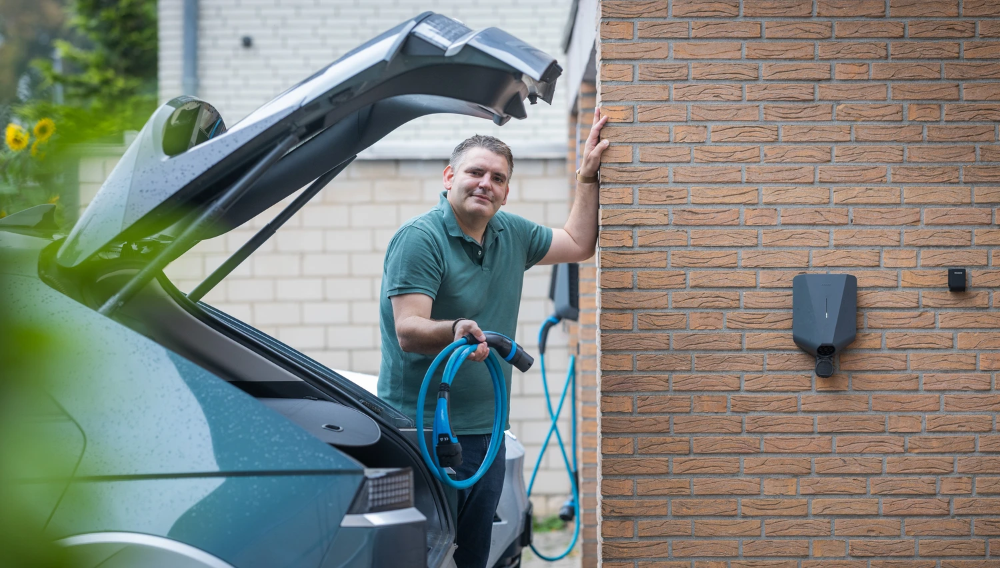

Alex is a driving instructor and has been using electric vehicles for driver training for years.
With evcc, he controls two wallboxes for his private and company vehicles and is planning to integrate a Wolf heat pump for his 5-unit building.
Photographer [Detlef](https://hee.se) paid him a visit.

{/* truncate */}

## From i3 Car Sharing to IONIQ 5

**Michael:** Hello Alex, great that you're taking the time.
You're a driving instructor and use electric cars professionally.
What was your first contact with electric mobility?

**Alex:** Hi Michael, happy to.
My first contact with e-mobility was in 2015 on short trips to Hamburg.
There I got to know the BMW i3 through DriveNow car sharing.
Technically exciting with the carbon fibre body and very nippy in city traffic.
That fascinated me.

In mid-2021, the first own electric car came along, a VW ID.3 on lease.
At that time, I also started using electric vehicles professionally for driver training - ID.3, ID.4, Hyundai Kona.
For about two years now, my wife and I have been driving a Hyundai IONIQ 5.

**Michael:** What was your motivation for switching?

**Alex:** Several reasons.
Environmental protection - fewer emissions, less noise.
Then the savings potential: solar power from my own roof into the home battery and then into the car.
And then the driving pleasure.
The elastic acceleration and quiet driving are pleasant.

## Electric Cars in Driving School

**Michael:** You've been a driving instructor in the Cologne/Bonn area for 17 years.
What's it like with e-mobility in your daily work?
Has anything changed in recent years?

**Alex:** Definitely.
E-mobility hasn't fully established itself in the driving school industry yet, but the advantages are increasingly being recognised.
I estimate 15-20% of driving school cars are now electric - similar to private vehicles.

There are also colleagues who are sceptical about the new mobility.
Some are guided by the usual myths: raw material extraction, battery durability, charging times, range.
But the scepticism among parents has noticeably decreased in recent years.

**Michael:** How do the students react?

**Alex:** Many parents now drive electric themselves and are open to the new type of training.
The keyword is B197: 10 driving lessons of 45 minutes each for manual transmission competence, the rest of the training and the exam on automatic.
The students like it because the exam is more relaxed.
Typical sources of error are eliminated: no stalling, no mis-shifting, no rolling back when starting on hills.
Word spreads among the students.

Only very rarely are there parents who insist on pure manual transmission training.

## Where's the Dipstick?

**Michael:** Are there any funny stories from everyday driving school life with electric cars?

**Alex:** (laughs) Oh yes.
One student was a bit nervous during the exam and went searching for the dipstick in the engine compartment together with the examiner.
You don't forget something like that.

**Michael:** What about range?
Is it enough for a normal driving school day?

**Alex:** Absolutely.
We rely on the large battery variants with 64-77 kWh.
Even in winter it works.
When we switch to the manual vehicle in between for B197 training, I can recharge for 90 minutes at 11 kW in front of the driving school during that time.
I've practically never had to use a DC charger.

At home I have a separate wallbox for the company car.
So I always start the day with a full battery.

## From Tibber Smart Charging to evcc

**Michael:** How did you come across evcc?

**Alex:** I looked into HEMS systems in spring 2023.
My initial goal was to combine the dynamic electricity tariff with time-optimised charging.
Tibber laid the foundation for this with Smart Charging.

After installing the solar system and battery storage, this control was no longer sufficient.
The flexibility of evcc impressed me: messaging, tariff integration, diverse support for wallboxes and vehicles.
I'm happy to support the continuous development.

**Michael:** Which functions do you specifically use?

**Alex:** I use automated charging plans for private and company vehicles to a specific charge level in the early morning.
My goal is for the system to be operational without major external intervention.
You naturally like to tinker with the final fine-tuning, but in everyday life it should just work.

## Two Systems, Two Raspberry Pis

**Michael:** Let's talk about your technical setup.
You have a somewhat unusual configuration.

**Alex:** True, I actually run two separate evcc instances.
The first system is for my flat.
I have a 14.85 kWp solar system on the north side of the roof, combined with a 12.8 kWh BYD storage unit.
Two Easee wallboxes are connected - one private, one for the company car.
The dynamic electricity tariff runs via Tibber.

The system runs on a Raspberry Pi 4 with Home Assistant and the evcc add-on.

| Component                 | Details                                 |
| ------------------------- | --------------------------------------- |
| **Solar System**          | 14.85 kWp (north orientation)           |
| **Inverter**              | SMA Sunny Tripower SE STP10.0-3SE-40   |
| **Storage**               | BYD HVS 12.8 kWh LFP                    |
| **Wallboxes**             | Easee Home (11 kW), Easee ChargeUp (11 kW) |
| **Vehicles**              | Hyundai IONIQ 5                         |
| **Dynamic Electricity Tariff** | Tibber                             |
| **Control**               | Raspberry Pi 4, Home Assistant, evcc add-on |

**Michael:** And the second system?

**Alex:** The second system is for the entire 5-unit building.
There I have a 10 kWp solar system on the south side of the roof and a Wolf CHA 20/24 monoblock air/water heat pump with SG-Ready interface.
The electricity tariff runs via Tado/Awattar.

It runs on a Raspberry Pi 5, also with Home Assistant and evcc add-on.
The heat pump isn't fully integrated into evcc yet, that's my next project.

| Component                 | Details                                     |
| ------------------------- | ------------------------------------------- |
| **Solar System**          | 10 kWp (south orientation)                  |
| **Inverter**              | SMA Sunny Tripower STP 10000TL-20           |
| **Heat Pump**             | Wolf CHA 20/24 monoblock, SG-Ready          |
| **Dynamic Electricity Tariff** | Tado/Awattar                           |
| **Control**               | Raspberry Pi 5, Home Assistant, evcc add-on |

## Planner and Battery Boost

**Michael:** What are your favourite features in evcc?

**Alex:** Clearly the planner for specific weekdays.
I can set different charging times for each vehicle.
It runs completely automatically.

And then the battery boost.
When the home battery is full and I shoot the solar power from the home battery directly into the car during the day, preferably in summer, during a break - that's brilliant.

**Michael:** What would you like from evcc?

**Alex:** My wish list is getting smaller with the continuous development.
Native integration of my heat pump would be nice.
Two Wolf systems are supported, but not the CHA yet.
The community on GitHub always provides good support with problems that arise.

The integration of household appliances like Miele@home or BSH Home Connect would also be a logical development, even if it's only about a few kWh here.
However, I also agree with the view not to lose focus too much and to concentrate on the core features.

**Michael:** Thanks for the good suggestions.
And thank you very much for giving us insights into your driving school everyday life and your evcc setup.
It shows nicely how diverse e-mobility and evcc can be used!

---

**What does your evcc setup look like?**
If you're interested in sharing your experiences, your journey and your technology in the form of a community portrait, feel free to sign up [here in the form](https://airtable.com/appDI3xIiev1DOpMY/shrW1zGH26KElfZOK).
We're particularly looking for portraits of extraordinary installations or users outside Germany.
