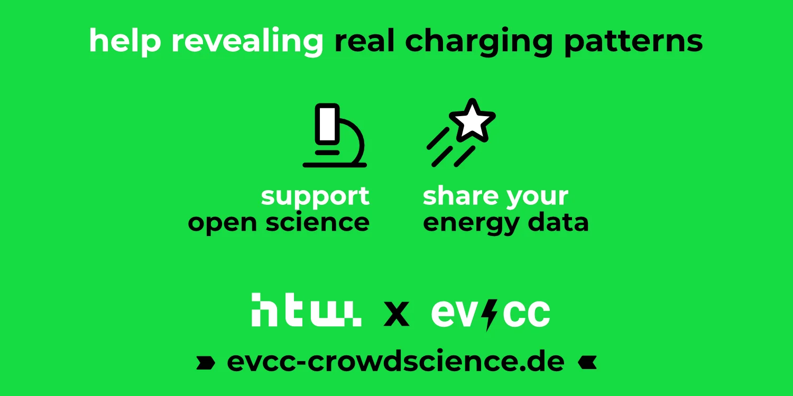
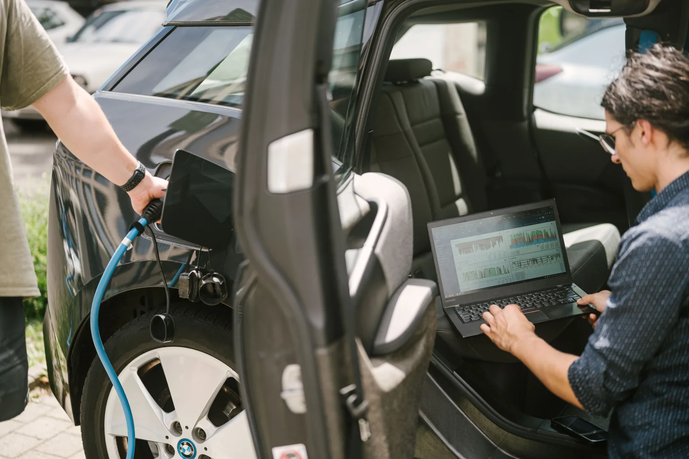

The Solar Storage Systems research group at [HTW Berlin](https://solar.htw-berlin.de/evcc-crowdscience/) has launched [evcc-Crowdscience](https://evcc-crowdscience.de) — a platform where evcc users can anonymously share their charging data for research purposes.

{/* truncate */}

## Why Real Charging Data?

Real-world EV charging profiles are important for research and the energy sector.
Existing models often rely on assumptions.
But actual charging patterns from households with solar systems and wallboxes can differ significantly from those assumptions.
evcc-Crowdscience aims to close exactly this gap.

## How Does It Work?

Data is transmitted via MQTT.
You generate a token on [evcc-crowdscience.de](https://evcc-crowdscience.de) and enter it in your evcc settings.
From then on, your charging data is automatically and anonymously sent to the researchers.
This works even if you're already using MQTT for other integrations.
No personally identifiable data is collected.
If you want to stop participating, just remove the token.
You can find all setup details on the [project page](https://evcc-crowdscience.de).

## What Is Being Researched?

Based on the collected data, the HTW Berlin team investigates:

- When and how long vehicles are charged
- How charging power varies in everyday use
- How effective solar surplus charging is in practice
- How charging behaviour differs between households

The data set and results will be published as open data later on, making them available to everyone.

_Photo: HTW Berlin/Alexander Rentsch_

## Contribute Your Data

We think this project is exciting and worth supporting.
The more households participate, the more meaningful the results.

**[Sign up at evcc-crowdscience.de →](https://evcc-crowdscience.de)**

You can find more background information on the [HTW Berlin project page](https://solar.htw-berlin.de/evcc-crowdscience/).
