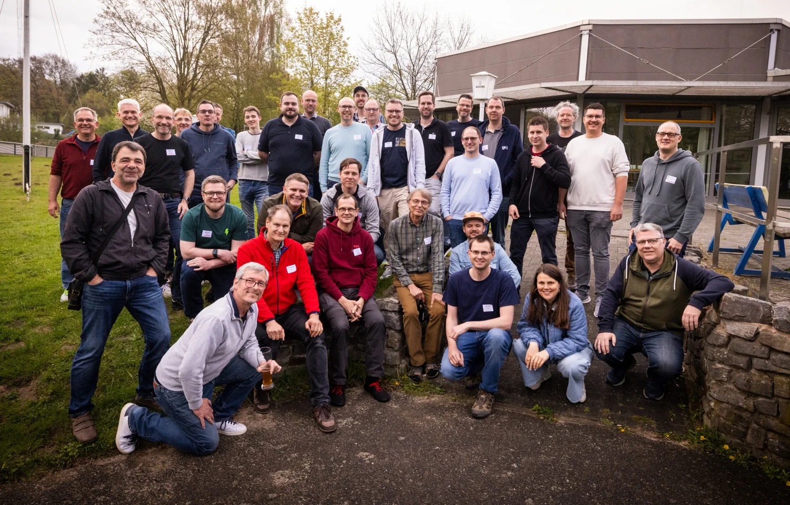
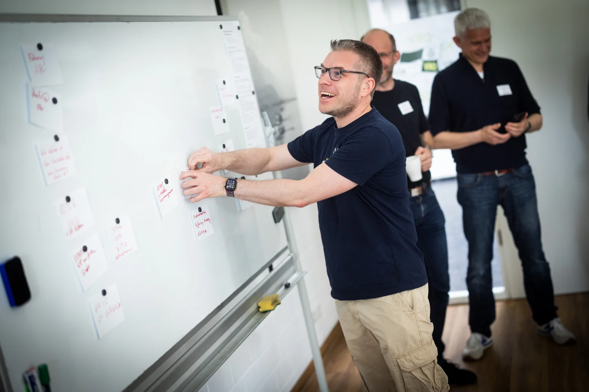
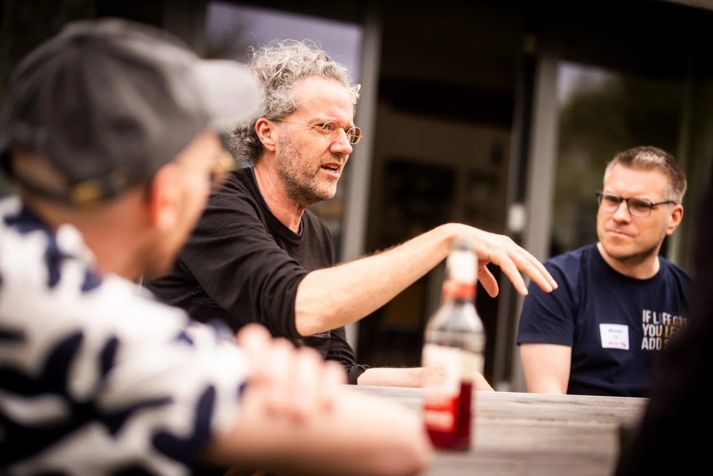

On April 18, 2026, we met for the first evcc community meetup at the [Osnabrücker Ruderverein](https://www.orv.de) rowing club. Around 40 participants joined us, coming from Germany, Belgium, and the Netherlands. Some traveled all the way from Bavaria and Baden-Württemberg.

{/* truncate */}

## A barcamp-style afternoon

The afternoon ran in barcamp style: participants bring the topics, and the rest takes shape on the spot. Three larger sessions emerged:

- **Bidirectional charging**: Jan Luca and Marcel shared how CUBOS is rolling out bidirectional charging in a corporate context.
- **Advanced optimization**: the interplay with [EOS](https://github.com/Akkudoktor-EOS/EOS) (a project by [Akkudoktor](https://akkudoktor.net)), [OpenEMS](https://openems.io), [Victron ESS](https://www.victronenergy.com/live/ess:start), [Home Assistant](https://www.home-assistant.io), the [evcc Optimizer](/docs/features/optimizer) currently in development, and direct marketing of power.
- **Load management, §14a, §9, and EEBus**: current German regulation and how evcc can implement these requirements in practice.

Alongside those, many smaller rounds formed: AI use in the evcc codebase, wallbox recommendations, next steps in the UI (think "mini loadpoints"), and plenty more.

## Professional evcc hardware

Dominik presented his [eHive](https://www.ehiv3.de) system, a DIN rail hardware specifically optimized for use with evcc. To wrap up the session, a device was raffled off among the participants: whoever guessed the weight of the hardware most accurately got to take it home.

## Tours through the club's energy setup

Markus and Michael from the Osnabrücker Ruderverein gave several tours through the club's energy tech and the boathouses. More on the club's setup in the [community portrait](/blog/2025/11/29/osnabruecker-ruderverein).

## Wrap-up

We wrapped up the day with a barbecue and drinks. Good conversations and new connections within the community.

And there was even an evcc cake:

## Photo gallery

[Detlef](https://hee.se) documented the meetup. You can find all photos in his [photo gallery](https://hee.se/portfolio/evcc/).

## Thanks

A big thank you to the [Osnabrücker Ruderverein](https://www.orv.de) for hosting us, to Markus and Michael for the tours, and to [Detlef](https://hee.se) for the photos. And to everyone who brought topics, ideas, and energy to make this meetup happen.

See you next time!
