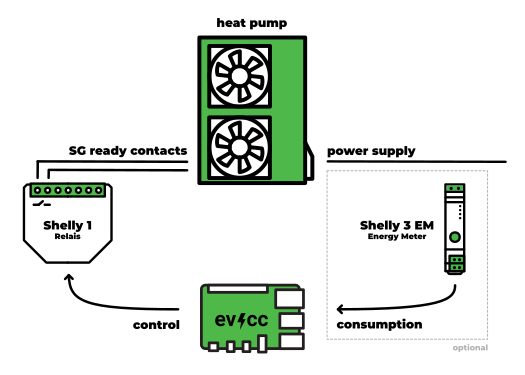

import Tabs from "@theme/Tabs";
import TabItem from "@theme/TabItem";
import SponsorshipRequired from "/docs/_sponsorship_required.mdx";
import PhaseSwitchSupported from "/docs/_phase_switch_supported.mdx";
import DeviceConfig from "/src/components/DeviceConfig";
import DeviceFeatures from "/src/components/DeviceFeatures";

# Heat Pumps, Electric Heaters

:::warning Under development
The topic of heating devices is still in the testing phase.<br/>
For the devices listed here, a [sponsorship](/docs/sponsorship) will be required in the future.
:::

evcc supports different types of heating devices.
Simple devices like heaters or fans can be switched on/off via [Smart Switches](./smartswitches).
On this page you will learn how to also **heat pumps** or **electric water heaters** can be regulated.

## Heat pumps

Many heat pumps support the SG-ready model, allowing their operation to be adapted to the local energy situation.
In addition to **normal operation**, an **enhanced operation (boost)** and a **blocking operation (dimming)** can be signaled from the outside.

  If [excess power is available](/docs/features/solar-charging) or the [grid power is particularly cheap](/docs/features/dynamic-prices) or [clean](/docs/features/co2), evcc can instruct the heat pump to increase the heating power and switch to **enhanced operation (boost)**.

The dimming function is currently not supported.
We plan to integrate this via [load management](/docs/features/loadmanagement).
This would also satisfy the requirements for §14e EnWG.

### direct communication

Many modern heat pumps offer API interfaces, through which not only the operating mode can be set, but also the state of the device (e.g. temperature) can be queried.
See [heating devices](#heating-devices) for a list of supported devices.

If your heat pump has an interface that we do not yet support, please create a [GitHub Issue](https://github.com/evcc-io/evcc/issues) with all necessary information.

### via relay contacts

Many older heat pumps have SG-ready relay contacts through which the operating state (normal, boost, dimming) can be signaled.
In our example, we focus on the switch between normal and boost operation.
Here, a controllable relay is used, e.g. a Shelly 1.

This relay is connected to the SG-ready contacts of the heat pump.
The exact wiring depends on the device and should be discussed with the installer.
If there is excess PV power or cheap energy, evcc switches the relay and gives the heat pump the signal for enhanced operation (boost).

The following diagram shows the setup:



If you want to monitor the power and energy consumption of the heat pump, you can optionally install a meter at the power supply of the device.
In the diagram, a Shelly 3EM is shown, but any [meter](./meters) can be used.

This example shows how to configure a heat pump using a Shelly 1 and a Shelly 3EM.
The special type `sgready` is used for this.

```yaml
loadpoints:
  - title: Meine Wärmepumpe
    charger: heatpump_control
    meter: heatpump_power
    integrateddevice: true # Disable vehicle selection
meters:
  - name: heatpump_power
    type: template
    template: shelly-3em # Power consumption of the heat pump
    host: 192.168.0.102

chargers:
  - name: heatpump_control
    type: sgready
    setmode:
      source: switch
      switch:
      - case: 1 # normal
        set:
          source: const
          value: false
          set:
            source: charger
            config:
              type: template
              template: shelly # Boost contact of the heat pump
              host: 192.168.0.101
      - case: 2 # boost
        set:
          source: const
          value: true
          set:
            source: charger
            config:
              type: template
              template: shelly # Boost contact of the heat pump
              host: 192.168.0.101
      - case: 3 # dimm (not supported, yet)
        set:
          source: error
          error: ErrNotAvailable
    getmode:
      source: calc
      add:
        - source: const
          value: 1
        - source: charger
          config:
            type: template
            template: shelly # Boost contact of the heat pump
            host: 192.168.0.101
#   temp:
#     source: http
#     uri: "http://192.168.0.103/temperature"

# [...]
```

:::note
This code example contains some redundancies.
We will later provide templates for easier configuration of common hardware constellations.
:::

In addition to `setmode` and `getmode`, you can optionally add the current temperature (`temp`) [via Plugin](/docs/reference/plugins).
This is only used for display.
evcc does not use this value for regulation.

## Electric water heaters

evcc forwards the currently available power to the device.
This available power is continuously adapted to the current situation, analogously to the charging process of a vehicle.

evcc offers adjustable limits, with which you can set your desired temperature.
This should not be understood as a safety feature.

:::danger
Your electric water heater must have its own temperature limit, which prevents overheating in case of a failure of evcc.
:::


---

<!-- AUTO-GENERATED CONTENT BELOW THIS LINE -->

<!-- AUTO-GENERATED FROM TEMPLATE - PLEASE EDIT HERE https://github.com/evcc-io/evcc/tree/master/templates/definition/heating  -->

## Heating devices

### my-PV AC ELWA 2

<DeviceConfig code={`chargers:
    - name: my_heating
      type: template
      template: ac-elwa-2
      
      # Modbus TCP
      modbus: tcpip
      id: 1
      host: 192.0.2.2 # Hostname
      port: 502 # Port`}  />


<SponsorshipRequired />

<!-- AUTO-GENERATED FROM TEMPLATE - PLEASE EDIT HERE https://github.com/evcc-io/evcc/tree/master/templates/definition/heating  -->

### Stiebel Eltron

#### LWA/LWZ (SG Ready)

<DeviceConfig code={`chargers:
    - name: my_heating
      type: template
      template: stiebel-lwa
      
      # Modbus TCP
      modbus: tcpip
      id: 1
      host: 192.0.2.2 # Hostname
      port: 502 # Port
      tempsource: # optional`}  />


<!-- AUTO-GENERATED FROM TEMPLATE - PLEASE EDIT HERE https://github.com/evcc-io/evcc/tree/master/templates/definition/heating  -->

#### WPM (SG Ready)

<DeviceConfig code={`chargers:
    - name: my_heating
      type: template
      template: stiebel-wpm
      
      # Modbus TCP
      modbus: tcpip
      id: 1
      host: 192.0.2.2 # Hostname
      port: 502 # Port
      tempsource: # optional`}  />


<!-- AUTO-GENERATED FROM TEMPLATE - PLEASE EDIT HERE https://github.com/evcc-io/evcc/tree/master/templates/definition/heating  -->

### Tecalor THZ (SG Ready)

<DeviceConfig code={`chargers:
    - name: my_heating
      type: template
      template: stiebel-lwa
      
      # Modbus TCP
      modbus: tcpip
      id: 1
      host: 192.0.2.2 # Hostname
      port: 502 # Port
      tempsource: # optional`}  />


<!-- AUTO-GENERATED FROM TEMPLATE - PLEASE EDIT HERE https://github.com/evcc-io/evcc/tree/master/templates/definition/heating  -->

### Vaillant SensoNET (SG Ready)

The boost function heats hot water and optionally a boost zone. The boost zone is identified by the ID. The boost temperature is specified in degrees Celsius.

<DeviceConfig code={`chargers:
    - name: my_heating
      type: template
      template: vaillant
      user: # User account (e.g. email address, user id, etc.) (optional)
      password: # Password of the user account (use single quotes in case of leading zeros) (optional)
      zone: # Boost zone id (in addition to hot water) (optional)
      setpoint: # Boost temperature setpoint (in addition to hot water) (optional)`} advanced={`chargers:
    - name: my_heating
      type: template
      template: vaillant
      user: # User account (e.g. email address, user id, etc.) (optional)
      password: # Password of the user account (use single quotes in case of leading zeros) (optional)
      zone: # Boost zone id (in addition to hot water) (optional)
      setpoint: # Boost temperature setpoint (in addition to hot water) (optional)
      phases: 3 # The maximum number of phases which can be used (optional)`} />


