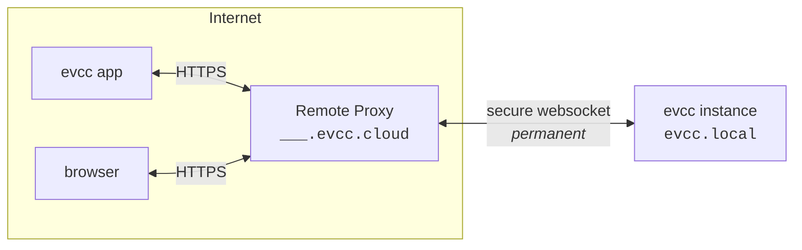

# Remote Access 🧪

:::warning Experimental
Remote Access is in an early stage of development and currently only available behind an environment variable.
Both behaviour and configuration may still change.
:::

Remote Access lets you reach your local evcc instance from anywhere.
Each instance gets its own domain on `evcc.cloud`.
You don't need dynamic DNS or a port forward in your router.



## How It Works {#how-it-works}

Your app or browser connects to your personal domain on `evcc.cloud`.
The Remote Proxy forwards the requests through a WebSocket tunnel to your local evcc instance.
Your local instance opens that tunnel outbound itself, so no open port in your network is required.

## Setup {#setup}

Remote Access requires an active [sponsorship](/docs/sponsorship).

1. On the host that runs evcc, set the environment variable:

   ```
   EVCC_REMOTE_ACCESS=api.evcc.cloud
   ```

   How you set environment variables persistently depends on your installation.
   On Linux, this is done via a systemd drop-in with `systemctl edit evcc`, see [Environment Variables & CLI Options](/docs/installation/linux#environment).

   Then restart evcc.

2. Enable the feature in the user interface:
   - **Configuration → Experimental** → enable
   - **Configuration → Remote Access 🧪** → enable

   

3. Your evcc instance registers with the Remote Proxy and receives its own domain, e.g. `swift-dark-crow.evcc.cloud`.

   

4. Create a separate client for every device that should have access.
   You receive a username, a password, and a QR code containing both.
   - **App:** Scan the QR code with your phone's camera.
     The [evcc app](/docs/features/app) opens and is connected straight away.
   - **Browser:** Open your personal domain and sign in with the username and password (basic auth over HTTPS).
   - **API clients:** Access the API programmatically with username and password.

     ```bash title="curl example"
     curl --user Macbook:7IIGKZGP-MV0PJKSE "https://swift-dark-crow.evcc.cloud/api/state?jq=.pvPower"
     ```

   

5. The same view shows which clients were active most recently and lets you revoke individual devices at any time.
   Access can optionally be limited to a fixed period.

## Security {#security}

**Transport.**
Requests to your domain go over HTTPS using the wildcard certificate for `*.evcc.cloud`.
The link between the Remote Proxy and your local instance runs through a WebSocket tunnel.

**What the Remote Proxy sees.**
The Remote Proxy only forwards requests.
Request content is neither stored nor inspected.
Per registration, only the domain, a hash of the connection token, the linked sponsor, and timestamps are persisted, so the tunnel can be reassigned when reconnecting.

**Local authorization.**
You create separate credentials for each device.
These are stored and checked exclusively on your evcc instance.
No credentials are stored on the Remote Proxy.
The password is shown only once, when the client is created.
Removing a device revokes only that device's access.
All others stay connected.
Repeated failed login attempts are throttled automatically.

**Scope of access.**
Remote access credentials sit alongside evcc's own security mechanisms.
They only grant network access to your instance, comparable to reaching it from your local network.
Changes to the configuration, backups, logs, or a restart still require the administrator password.

**Sponsor token binding.**
Registration is verified against `sponsor.evcc.io`.
Each sponsor receives exactly one domain, permanently bound to that sponsor and never reassigned.

## Technical Background {#technical}

On first activation, the local evcc instance registers with the Remote Proxy.
In exchange for the sponsor token, it receives a connection token and a randomly assigned domain.
Both are stored locally and reused on the next start to re-establish the tunnel without going through registration again.

On subsequent starts, the local evcc instance opens a persistent, TLS-encrypted WebSocket connection (WSS) to the Remote Proxy.
This connection serves as the tunnel for all subsequent traffic and is established outbound, so no port forward is required.

On top of this connection, [hashicorp/yamux](https://github.com/hashicorp/yamux) acts as the multiplexer.
Each incoming HTTP request at the Remote Proxy becomes its own yamux stream on top of the existing WebSocket connection.
Multiple parallel requests share one connection without a new TCP or TLS handshake per request.

WebSocket upgrades over the tunnel work as well.
This matters because the evcc UI itself receives live data over WebSocket.

If the tunnel drops, the local instance reconnects automatically.
While the connection is up, your domain is reachable; otherwise the Remote Proxy returns an error.

The source code of the Remote Proxy will be published at a later date.
For privacy details, see our [privacy policy](https://evcc.io/en/datenschutz/).
