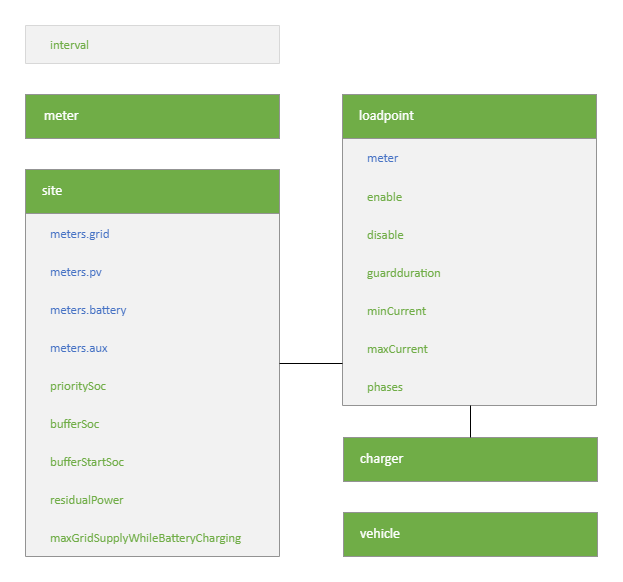
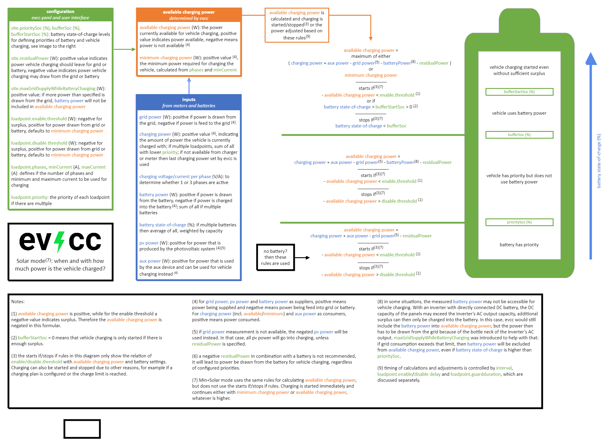
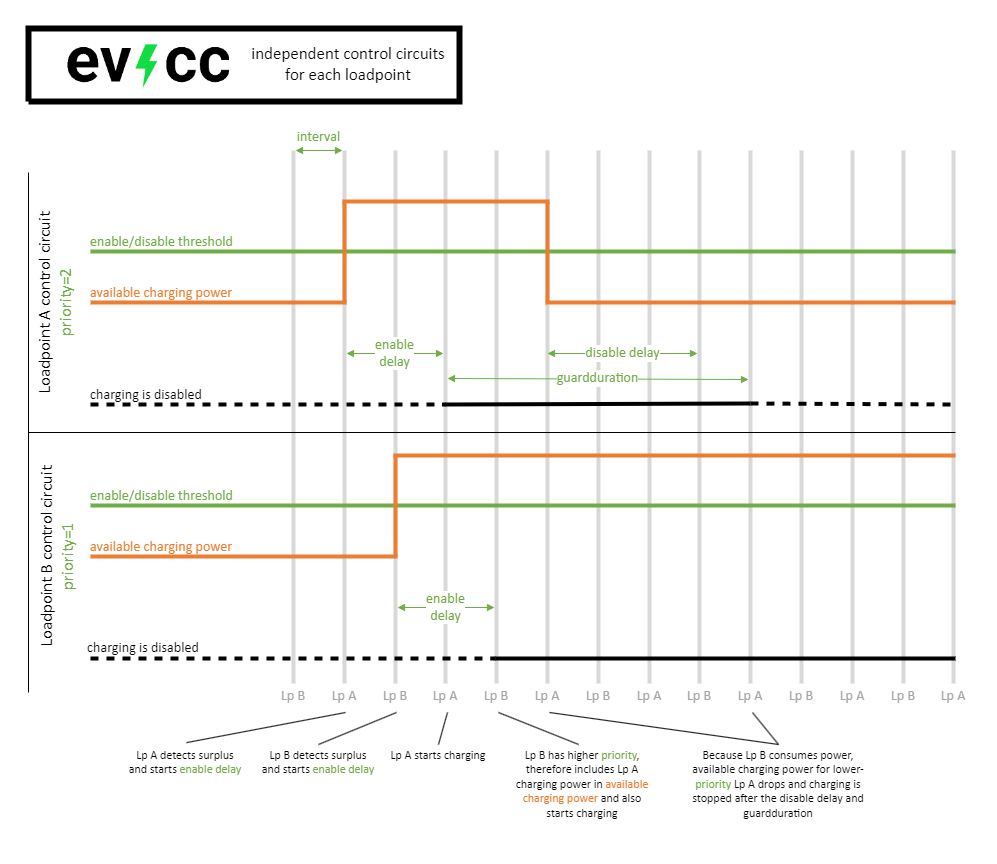

# A detailed look at the Solar mode

The magic of evcc happens in the `Solar` mode, where the vehicle is charged with surplus from your photovoltaic system. For calulating the `available charging power`, an electric meter measuring the power on your grid connection point (grid meter) is important. Power generated by the photovoltaic system can also be measured and displayed, but has no effect on the function, [except if no grid meter is available](./meters#i-have-a-solar-installation-but-i-dont-have-a-readable-grid-connection-meter---can-i-still-use-evcc). Evcc also considers power consumption by batteries and other devices, which may be diverted to vehicle charging depending on your priorities. 

The system constantly monitors the `available charging power` and starts the charging process if it exceeds the minimum power required for the vehicle (`minimum charging power`). If the `available charging power` changes, evcc adapts the charging power or stops charging accordingly.

The `Solar` mode is highly customizable, and can therefore adapt to many different setups and requirements. Before you read this page, make sure you are familiar with the [structure of the configuration](../reference/configuration/). On this page, we will leave aside the details of how devices are integrated with evcc but will focus on how different inputs and settings define the `Solar` mode' control of your vehicle’s charging. The following diagram shows these, with blue being settings that define inputs and green other configuration parameters:

Evcc is just in process of migrating from file-based to user-interface-based configuration. Most parameters still need to be set in `evcc.yaml`, but the battery settings can already be done on the user interface and will be saved in the evcc database. 

## Inputs and outputs

The inputs defined in `evcc.yaml` connect evcc to various other devices in your system, enabling the interactions shown in the next diagram:

## Calculation of `available charging power`

So, having laid the groundwork, let’s start talking about how the `Solar` mode works. When in `Solar` mode, evcc constantly calculates the `available charging power` (surplus) based on the metering inputs shown in the diagram above:

- The most important factor is [grid power](../reference/configuration/site/#metersgrid), which shows available surplus that is fed into the grid.
- With [data from battery systems](../reference/configuration/site/#metersbattery) that are also charged with surplus, evcc can depending on their charge level prioritize vehicle charging. It does that by increasing the charging power of the vehicle, practically forcing the battery to reduce or stop charging. See also the third use case described further below. 
- The same can be done for [other devices](../reference/configuration/site/#metersaux) operated with surplus (“aux” devices).
- The output of your [PV system](../reference/configuration/site/#meterspv) can also be measured, mostly for display purposes. Only if [grid power cannot be measured](./meters#i-have-a-solar-installation-but-i-dont-have-a-readable-grid-connection-meter---can-i-still-use-evcc), you can use PV power and a constant value for assumed house consumption to approximate surplus.
- The actual charging power consumed by the [charger](../devices/chargers) is also measured. If the charger itself does not provide this measurement, [a separate meter](../reference/configuration/loadpoints#meter) can be used. If that is not available as well, then instead the power last set by evcc will be used.

Also important is the integration with your [vehicle](../reference/configuration/vehicles/), which allows evcc to determine its state-of-charge and implement charge limits and charging plans.

And last but not least there are different configuration parameters available for customizing the `Solar` mode:

- The power level set for [`site.residualPower`](../reference/configuration/site/#residualpower) is incorporated into the available charging power.
- [`loadpoint.enable`](../reference/configuration/loadpoints#enable)/[`disable`](../reference/configuration/loadpoints#disable) thresholds control when charging is started and stopped.
- [`loadpoint.phases`](../reference/configuration/loadpoints#phases)/[`minCurrent`](../reference/configuration/loadpoints#mincurrent)/[`maxCurrent`](../reference/configuration/loadpoints#maxcurrent) define the minimum and maximum charging power.
- [`site.prioritySoc`](../reference/configuration/site/#prioritysoc)/[`bufferSoc`](../reference/configuration/site/#buffersoc)/[`bufferStartSoc`](../reference/configuration/site/#bufferstartsoc) define priorities between battery and vehicle charging.
- [`loadpoint.priority`](../reference/configuration/loadpoints/#priority) defines priorities between multiple chargers.
- [`site.maxGridSupplyWhileBatteryCharging`](../reference/configuration/site/#maxgridsupplywhilebatterycharging) deals with situations where vehicle charging is prioritized over battery charging but measured battery power cannot be fully diverted due to limits in the DC/AC interface of the inverter.

The following diagram shows in detail how all these variables are factored into the calculation of `available charging power` and starting and stopping the charging process. Its main focus lies on `Solar` mode in combination with a battery system, but it also covers how systems without battery work as well as the Min+Solar mode. The formulas are not necessarily those programmed into evcc, but rather provide a mathematical model that helps understanding how the software works: 

## Minimum charging power and phases

In the diagram above, you can see that the `minimum charging power` is calculated from `minCurrent` and the `phases` setting. If your charger supports automatic switching between 1-phase and 3-phase charging, you can have evcc manage that by setting `phases=0`. If `available charging power` allows it, the system will use three phases, otherwise only one.

Note that the `minCurrent` and `maxCurrent` settings apply to both 1-phase and 3-phase charging. Depending on the range of those settings in your system, you’ll likely have gap between 1-phase and 3-phase charging, were evcc needs to continue charging with the `maximum charging power` of one phase and additional surplus has to be fed into the grid or a battery. The following diagram shows the calculations and the resulting gap:

## Timing: `interval` and delays

The calculation of available charging power and resulting actions and adjustments are executed in the [`interval`](../reference/configuration/interval/) defined in the configuration file. Therefore evcc does not react to any change in the inputs but only to the state detected at each interval, as the next diagram illustrates:

The time in between the `intervals` gives the charger or other device represented by the loadpoint as well as other surplus-controlled devices chances to react before the state is checked again and further adjustments are made.

To avoid vehicle charging being started and stopped in the typically relatively short `intervals`, several delays are applied:

- [`loadpoint.enable:delay`](../reference/configuration/loadpoints/#delay) defines the time the enable threshold must be met before charging is started. Also applies to switching from 1-phase to 3-phase charging.
- [`loadpoint.disable:delay`](../reference/configuration/loadpoints/#delay-1) defines the time the disable threshold must be met before charging is stopped. Also applies to switching from 3-phase to 1-phase charging.
- [`loadpoint.guardduration`](../reference/configuration/loadpoints/#guardduration) defines the time that after starting charging must pass before charging can be stopped again, and vice versa the time that must pass after stopping before charging can start again.

The next diagram shows the application of those settings and their relationship with the control cycle `interval`:

## Timing: multiple `loadpoints`

If you have two or more `loadpoints`, at each `interval` only one will be calculated and adjusted. This way each `loadpoint` represents its own independent control circuit. The control circuit of each `loadpoint` only takes into account the measurement inputs from the devices represented by the other loadpoints, but is not aware of their ongoing adjustments or delay timers. The next diagram shows these independent control circuits for two `loadpoints`. As example, we have Loadpoint A with lower `priority` grabbing surplus first but then releasing it again, after Loadpoint B with higher `priority` also starts charging:

Note that this back-and-forth can be avoided by setting a longer `enable:delay` for the `loadpoint` with lower `priority`:

## Conclusion

We hope this page succeeded in providing you a comprehensible overview of the intricate but powerful `Solar` mode of evcc. While the dependencies between the different settings are not always easy to understand, they allow the system to adapt to many situations - the right setup is always a balance between many factors, among them: the output of your PV system, the consumption of your house and vehicle, the presence of batteries or other surplus controlled devices and the rates that apply to feeding power into the grid or drawing from it. With evcc you have a powerful tool at hand to accommodate these factors and optimize solar-charging of your vehicle based on your individual needs.
