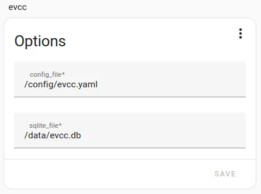

import Tabs from "@theme/Tabs";
import TabItem from "@theme/TabItem";

# Home Assistant Addon

:::info
The evcc Home Assistant addon is a community integration and is not officially supported by the evcc maintainers.
The reason for this is that important data cannot simply be made available in the event of an error (missing `evcc cli`).
:::

:::warning Datamigration
Please note that since February 16, 2025, with version 0.200.1, we have changed the paths in the addon to be consistent with the [guidelines](https://developers.home-assistant.io/blog/2023/11/06/public-addon-config/) of Home Assistant.

From now on, the following paths are mapped in the addon:

- `/homeassistant/` -> points to `/homeassistant/` or `/config/` in Home Assistant.
- `/config/` -> points to `/addon_configs/49686a9f_evcc/` in Home Assistant.

If you are updating from an older version, your configuration file will be automatically copied to the new directory.
We will only copy the database if it was also located in `/config/`. If you had it in `/data/`, it will remain there.
We will append `.migrated` to the old files. These can then be manually deleted by you.
:::

This guide describes the installation of evcc as a Home Assistant addon.
Unlike the [Linux installation](./linux) or [Docker installation](./docker), you don't need command line knowledge here.

## Prerequisites

You need a Home Assistant installation with the Addon Store enabled.
Depending on your installation type, this feature might not be available.
See [Home Assistant Documentation](https://www.home-assistant.io/installation/#advanced-installation-methods) for more information.

## Installation

<Tabs groupId="release-type">
  <TabItem value="Release" label="Release" default>
  The current stable version.

1. Automatically add repository: Click on the following button and then on **Open link**, then on **Add**.
   [](https://my.home-assistant.io/redirect/supervisor_add_addon_repository/?repository_url=https%3A%2F%2Fgithub.com%2Fevcc-io%2Fhassio-addon)
2. Manually add repository:
   1. Click on **Settings** → **Addons** → **Add-on Store**
   2. Click on the **three dots** → **Repositories**
   3. Add the repository URL and click **Add**
      ```
      https://github.com/evcc-io/hassio-addon
      ```
3. Reload the webpage
4. Find the **evcc** addon and click on it
5. Click on the **INSTALL** button

  </TabItem>
  <TabItem value="Nightly" label="Nightly">
  The current developer version. Updated daily. May be unstable.
  Although it can be installed alongside the release version, only one version can run at a time.
  If you use the nightly version, the paths and Docker container names mentioned in this guide will change, i.e., instead of `evcc`, you must use `evcc-nightly`.

1. Automatically add repository: Click on the following button and then on **Open link**, then on **Add**.
   [](https://my.home-assistant.io/redirect/supervisor_add_addon_repository/?repository_url=https%3A%2F%2Fgithub.com%2Fevcc-io%2Fhassio-addon)
2. Manually add repository:
   1. Click on **Settings** → **Addons** → **Add-on Store**
   2. Click on the **three dots** → **Repositories**
   3. Add the repository URL and click **Add**
      ```
      https://github.com/evcc-io/hassio-addon
      ```
3. Reload the webpage
4. Find the **evcc (nightly)** addon and click on it
5. Click on the **INSTALL** button

  </TabItem>
</Tabs>

## Configuration File

Go to Information menu in the "evcc" Addon and activate "show in sidebar" (evcc UI http://your-ha-instance-ip-address:7070)

Go to Configuration menu and select your working directory (example):



```sh
- config_file: /config/evcc.yaml
- sqlite_file: /data/evcc.db
```

Leave the Network section unchanged.

Create an empty evcc configuration file `evcc.yaml` in your Addon root configuration folder (`/addon_configs/49686a9f_evcc`).
If this folder does not exist, create it manually.

To create or edit the configuration file, you have many options, here are a few:

- [Visual Studio Code](https://github.com/hassio-addons/addon-vscode), in Visual Studio Code select the hamburger menu in the top left and choose "File", "Open Folder...", select `/addon_configs/49686a9f_evcc`
- [File Editor](https://github.com/home-assistant/addons/tree/master/configurator), make sure you have disabled the "Enforce Basepath" option in the Addon configuration, restart the Addon and navigate to `/addon_configs/49686a9f_evcc`
- [Advanced SSH & Web Terminal](https://github.com/hassio-addons/addon-ssh), navigate to `/addon_configs/49686a9f_evcc` and use e.g. nano

Under [Configuration](./configuration) you'll find instructions on how to create the content for the `evcc.yaml`.

If you want to see the system running in demo mode, just start evcc with the parameter `--demo`.
See [CLI Referenz](/docs/reference/cli/evcc) for more information.

Now you are ready and can start the addon.

## Updates

The update to the latest version of evcc is integrated into the Home Assistant update process.

## Advanced Tips

To perform the following functions, you need SSH access to Home Assistant. You can get this, for example, with the above-mentioned SSH Addon.

- Install [Advanced SSH & Web Terminal](https://github.com/hassio-addons/addon-ssh)
- Disable the "secure mode" in the Addon configuration
- Restart the Addon
- Open the Addon user interface

### How do I access the evcc database?

Show the files in `/data`:

```sh
docker exec addon_49686a9f_evcc ls -la /data
```

Copy the `evcc.db` to `/addon_configs/49686a9f_evcc`:

```sh
docker cp addon_49686a9f_evcc:/data/evcc.db /addon_configs/49686a9f_evcc/
```

### How can I use the evcc CLI?

Open a shell to the evcc Docker container:

```sh
docker exec -it addon_49686a9f_evcc /bin/sh
```

Run evcc CLI commands (here as an example `checkconfig`):

```sh
evcc -c /config/evcc.yaml checkconfig
```

Close the shell in the evcc Docker container if you are done:

```sh
exit
```

### How can I use my external adapter / HAT in the Home Assistant evcc addon (Home Assistant OS, Raspberry Pi)?

If your Home Assistant device is close to your meter (solar, battery, grid, ...) you can also retrieve the data directly via Modbus (e.g. USB).

To do this, you need to enable external devices for Home Assistant, which also includes the evcc addon.
To do this, uncomment the line `uart = 1` in the `config.txt` file on the Home Assistant OS boot partition.

```ini title=/config.txt
uart = 1
```

After a restart, your device should be available to the evcc addon (probably as `/dev/ttyS0` or `/dev/ttyUSB`)

## Next Step: Integration

Once your system is running, you can set up the integration between evcc and Home Assistant.
Under [Integrations → Home Assistant](../integrations/home-assistant) you'll find more information.
You can visualize evcc data in Home Assistant or create automations based on evcc.
