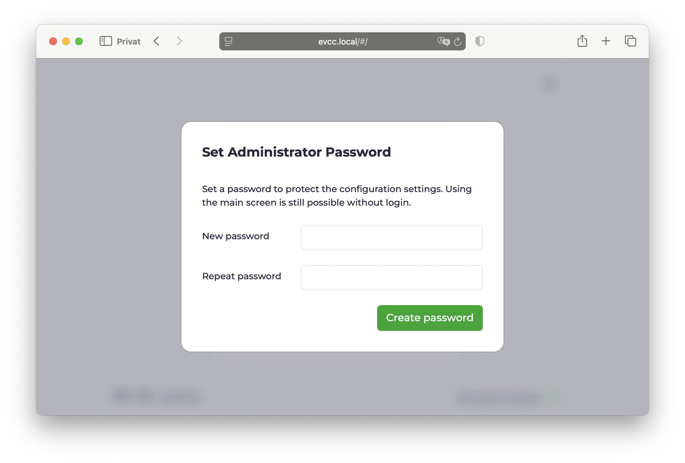
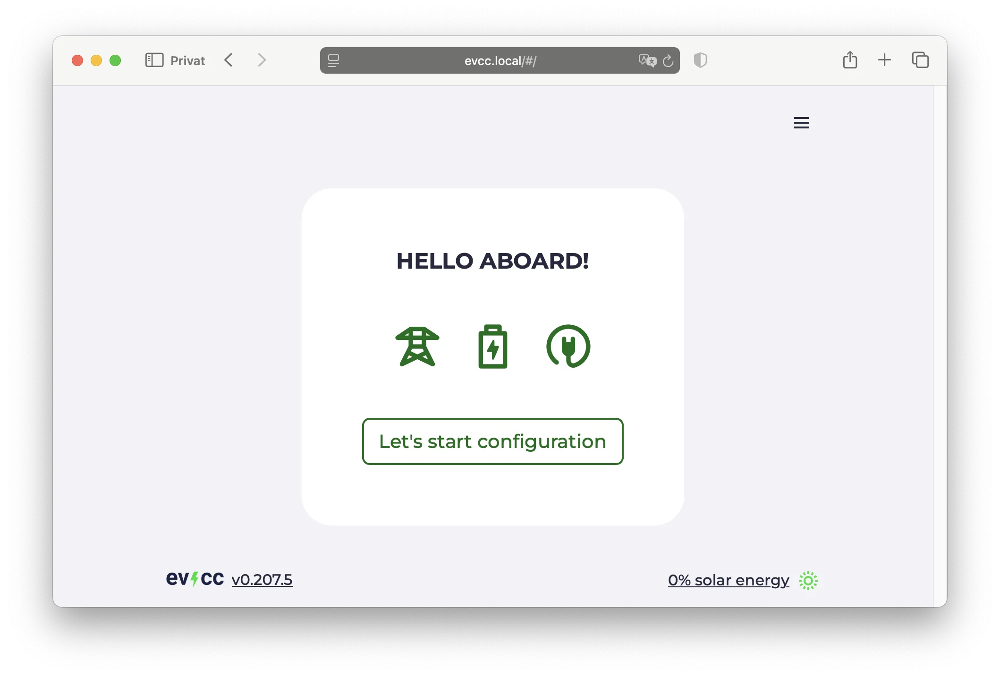
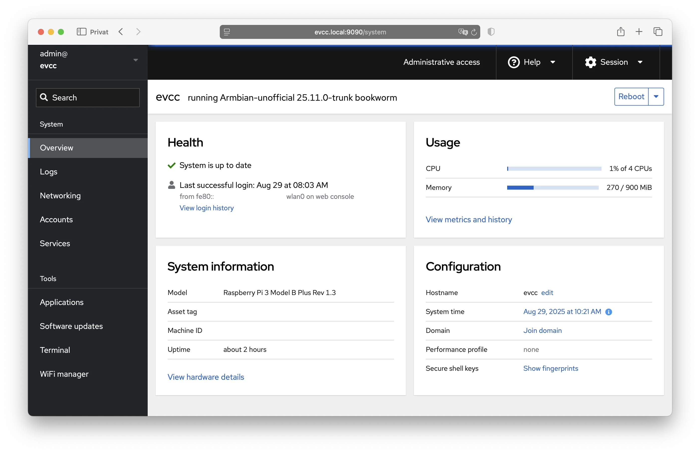

# Raspberry Pi & Co.

The easiest way to install evcc on a Raspberry Pi or similar single-board computers.
Pre-configured and ready to set up via the web UI!

## Quick Start

### Download File

Go to the **[evcc Linux Images](https://github.com/evcc-io/images/releases)** and download the latest version for Raspberry Pi (`armbian_evcc-{version}_rpi4b.img.zip`).

### Flash SD Card

If not already available: **[Download balenaEtcher](https://etcher.balena.io/)**

- Insert SD card into computer
- Open balenaEtcher
- **Flash from file** → select downloaded file
- **Select target** → select your SD card
- **Flash!** → wait until finished

:::tip Alternative
Instead of "Download File & Flash SD Card," you can also prepare the SD card by using the Raspberry Pi Imager (https://www.raspberrypi.com/software/).

The evcc image can be found under

- choose OS
- other specific-purpose OS
- home assistance and home automation
- evcc
  :::

### Start Raspberry Pi

- Insert SD card into Raspberry Pi
- Connect network cable (recommended) - alternatively [set up WiFi](#wifi)
- Connect power adapter
- Wait until started

### evcc Web UI

- Open browser
- Enter **[https://evcc.local/](https://evcc.local/)**
  - Certificate warning must be accepted (normal, connection is encrypted)
  - Alternatively via IP address, e.g., `https://192.168.1.123/` (determine IP in router)
- Set administrator password (on first start)
- Set up devices (wallbox, solar system, home battery, vehicles)
  - Note: At least one loadpoint must be created for evcc to run.

More details on setup can be found in the [configuration guide](./configuration).

**Done!** 🎉

System configuration and updates work via [Cockpit](#cockpit).
Log in there once to change the default Linux password.

## Set up WiFi {#wifi}

If no network cable is available, the Raspberry Pi creates a WiFi hotspot for initial setup.

- Search for WiFi **"evcc-setup"** on your smartphone
- Connect (no password required)
- Select your home WiFi network from the list
- Enter your home WiFi password
- Raspberry Pi ends the hotspot and connects to your home WiFi
- Continue with [evcc Web UI](#evcc-web-ui)

WiFi configuration can also be done later via [Cockpit](#cockpit).

## System Management via Cockpit {#cockpit}

Cockpit is a graphical system management interface for Linux.
Here you can configure your system, install updates, and change network settings.

- URL: [https://evcc.local:9090/](https://evcc.local:9090/)
- User: `admin`
- Password: `admin` (initial)

On first login, you'll be prompted to change the default password.
Choose a secure password for system management.
If you forget it, you'll need to flash the SD card again.
There is no "forgot password" function.

**Important Functions:**

- **System:** Overview of CPU, memory, and disk
- **Logs:** View system logs
- **Networking:** Configure network and WiFi
- **Terminal:** Access to command line
- **Software Updates:** Update system

:::note
The Linux user password and the evcc administrator password are different.
One is for Linux system management, the other for evcc.
:::

## Hardware Recommendations

evcc runs on various single-board computers and needs only few resources.
Even 1 GB RAM is completely sufficient.

**Supported Devices:**

- Raspberry Pi 3, 4, and 5 - all models work equally well
- Raspberry Pi Zero 2 W - works well
- NanoPi R3S - compact, affordable, and comes with case and integrated eMMC storage

**Storage:**
At least 16 GB SD card or eMMC.
For longer lifespan, we recommend eMMC instead of SD card (e.g., with NanoPi).
SD cards can wear out from frequent write operations.
See also [Armbian recommendations](https://docs.armbian.com/User-Guide_Getting-Started/#what-do-i-need).

**Power Supply:**
Use original power supply from respective manufacturer.

**Network:**
Wired connection is strongly recommended.
WiFi is possible but often less stable.

## About the evcc Linux Image

The evcc Linux image is based on [Armbian](https://www.armbian.com/) and offers some practical features:

**Updates:**

- Operating system: Security updates are automatically installed
- evcc: Updates can be performed via [Cockpit](#cockpit)

**SSH Access:**
You can connect via SSH with the `admin` user (same credentials as [Cockpit](#cockpit)).

**Alternative Access:**

- Encrypted: https://evcc.local/ (recommended)
- Unencrypted: http://evcc.local:7070/ (if certificate warning bothers you)

**OCPP Server:**
The OCPP server runs on `ws://evcc.local:8887/<station-id>` for connection with OCPP-capable wallboxes.

More technical details can be found in the [GitHub Repository](https://github.com/evcc-io/images).

## Next Steps

In the [Features](/docs/features/solar-charging) section, you can learn about all possibilities of evcc.
Also download the [iOS/Android app](/docs/features/app).
