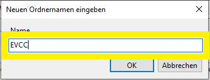
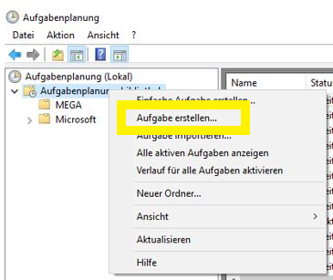
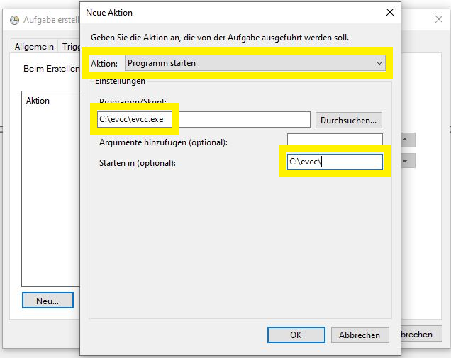
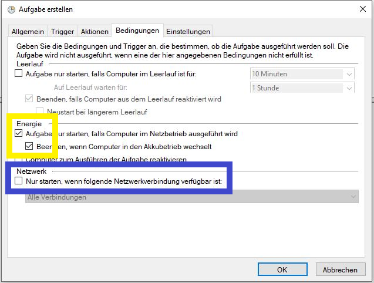

import Tabs from "@theme/Tabs";
import TabItem from "@theme/TabItem";

# Manual (incl. Windows)

Manual installation requires advanced experience, especially with the terminal.

## Installation

Download the [latest release](https://github.com/evcc-io/evcc/releases/latest).
Find the appropriate file for your system:

<Tabs groupId="manual">
  <TabItem value="linux" label="Linux" default>

    - 64-Bit Intel CPU: [evcc_X.XX_linux_amd64.tar.gz](https://github.com/evcc-io/evcc/releases/latest)
    - 64-Bit ARM CPU: [evcc_X.XX_linux_arm64.tar.gz](https://github.com/evcc-io/evcc/releases/latest)
    - 32-Bit ARM CPU (e.g. Raspberry Pi 32-Bit OS): [evcc_X.XX_linux_armv6.tar.gz](https://github.com/evcc-io/evcc/releases/latest)

  </TabItem>
  <TabItem value="macos" label="macOS" default>

    - 64-Bit ARM oder Intel CPU: [evcc_X.XX_macOS_all.tar.gz](https://github.com/evcc-io/evcc/releases/latest)

  </TabItem>
  <TabItem value="windows" label="Windows" default>

    - 64-Bit Intel CPU: [evcc_X.XX_windows_amd64.zip](https://github.com/evcc-io/evcc/releases/latest)

  </TabItem>
</Tabs>

- Extract the contents to a working directory - you'll now have a `evcc` directory to work from.
- Open a terminal and change directory to `evcc`.
- You can now start the configuration wizard - simply follow the prompts in your terminal!

```sh
evcc configure
```

Once all devices are configured, you can continue on.

:::note
Advanced users (those with evcc experience & some technical know-how) might want to use the advanced configurator:

```sh
evcc configure --advanced
```

This mode offers some further, more technically-involved options.
:::

## Upgrades / Downgrades

Simply download the appropriate older or newer release from our releases page, and replace the contents of your local `evcc` directory.

## Running as a Service

Once you've completed configuration, you can now complete your installation of evcc by creating a system service. This will ensure that evcc runs automatically when you start the system, and restarts automatically in case of an issue.

### Linux

:::note
This documentation presumes that your distribution uses `systemd`.
:::

- Create a new service file:

  ```sh
  sudo nano /etc/systemd/system/evcc.service
  ```

- ... and copy the following contents into it:

  ```
  [Unit]
  Description=evcc
  Requires=network-online.target
  After=syslog.target network.target network-online.target
  Wants=network-online.target
  StartLimitIntervalSec=10
  StartLimitBurst=10

  [Service]
  ExecStart=/usr/local/bin/evcc
  Restart=always
  RestartSec=5

  [Install]
  WantedBy=multi-user.target
  ```

  Set the appropriate path to your copy of `evcc` in `ExecStart`.
  This also presumes that your `evcc.yaml` is stored at `/etc/evcc.yaml`. If that's not the case, append `-c /path/to/your/evcc.yaml` to the `ExecStart` block.

- Load the new service, then test that it works:

  ```sh
  sudo systemctl daemon-reload
  sudo systemctl start evcc
  sudo systemctl status evcc
  ```

  If everything's working properly, the output should include the line `Active: active (running)`.

- Set the service to run when the system starts:

  ```sh
  sudo systemctl enable evcc.service
  ```

- You're done! 🎉

evcc will now run in the background as a system service. You can use the following commands to control it:

```sh
sudo systemctl status evcc # shows status
sudo systemctl start evcc # start the service, if it isn't already running
sudo systemctl stop evcc # stops the service
sudo systemctl restart evcc # restart the service
sudo systemctl enable evcc # sets the service to run at boot
sudo systemctl disable evcc # stops the service running at boot
```

:::warning
If you switch to an installation of evcc controlled by a package manager (such as apt), you **must** delete the manually added service before installing the package.
:::

### Windows 10

:::note
This documentation is very loosely translated - please feel free to contribute a better version!

Diese Dokumentation geht davon aus, dass evcc in `c:\evcc` liegt.
:::

- Open the start menu and search for "Task Scheduler", then right click it and choose "Run As Administrator".


- Once you've started Task Scheduler, you now need to choose whether to create the new service in your own folder, or in the general tasks folder.
  In this example, we create the `evcc` folder. To do this, select "New Folder..." from the right hand pane.



- Now select the new `evcc` folder and open the popup menu again, where we now select "create task".



- Give the task a name (probably "evcc") and a short description. Since we need to run as a system service, open user management via "Change User or Group", and enter "SYSTEM" in the box. Once you click "Check Names", the word "SYSTEM" should be underscored - you can now click OK to close this dialog.

 

- Select the "triggers" menu, and click "New...".
- Set the trigger to "At Startup", and check that the "activated" checkbox is ticked.


- Open the "actions" menu, and again, select "New".
- Make sure "Start a Program" is selected, then find your `evcc.exe` executable using the Browse option. We advise also setting the path in the "Start In..." box, to make sure that the configuration file is easily found by evcc.



- Open the "conditions" menu.
- These settings should be left as default, except in one scenario:
  :::info
  SMA Home Manager can sometimes have issues when used with WiFi - try enabling the "Network" condition and selecting the appropriate connection interface in the dropdown.
  :::



- Open the "settings" menu.
- Make sure to select "run task as soon as possible...".
- Also make sure "Stop the task if it runs longer than:" is **not** selected, unless you want a surprise in 3 days when evcc randomly stops running.


- You're done! 🎉

The task can now be started manually, or test with a reboot. To check it's working as expected, use a browser to navigate to the evcc interface `http://[ipaddress]:7070`.
