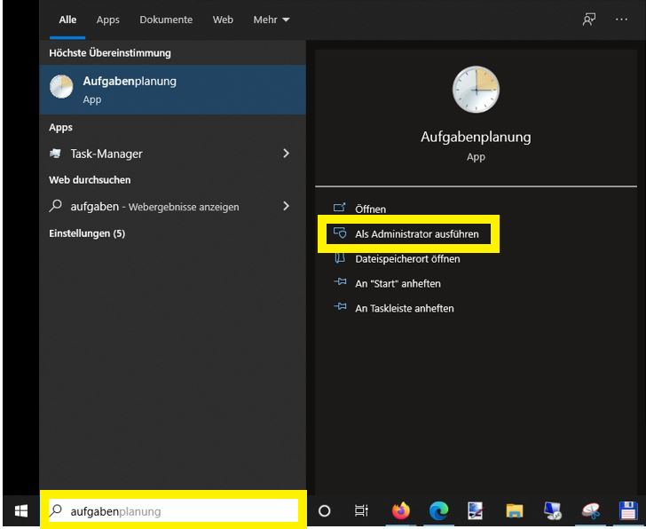
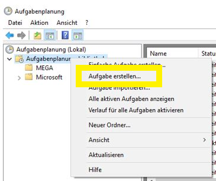
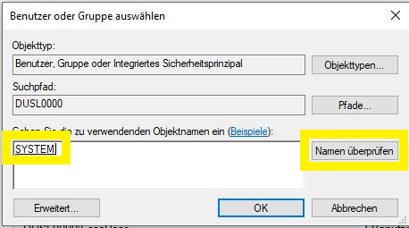
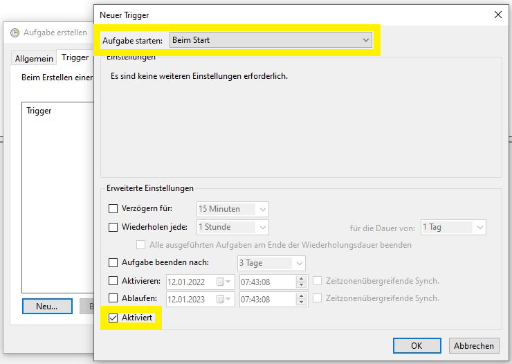
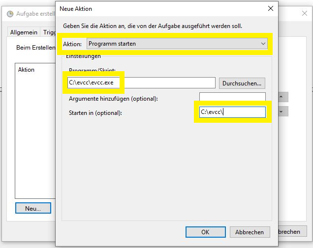
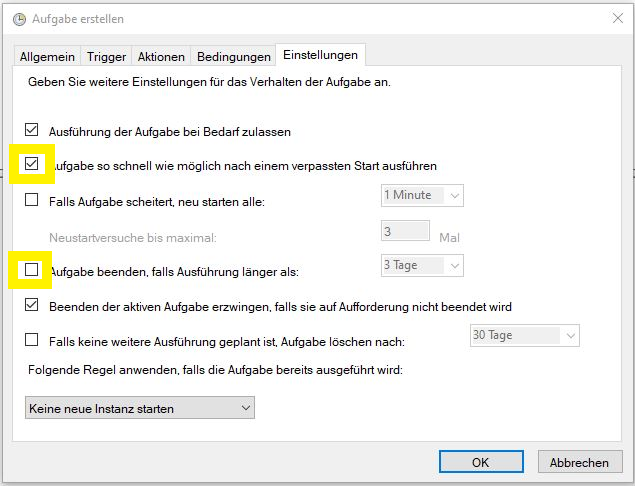
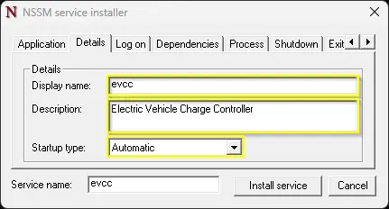
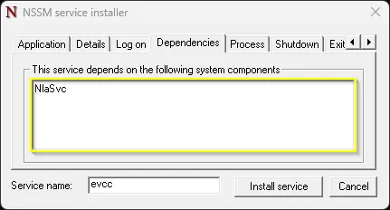
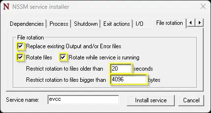
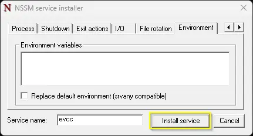

# Windows

Here you'll find instructions for manually installing evcc on Windows.

:::important
This manual installation requires advanced PC knowledge, especially when working with the Command Prompt or PowerShell.

Running evcc on Windows is possible.
However, evcc is typically used in a Linux environment (e.g., Raspberry Pi).
:::

## Installation

- Download the appropriate file for your system
  - 64-Bit Intel CPU: [evcc_X.XX_windows_amd64.zip](https://github.com/evcc-io/evcc/releases/latest)
- Extract the downloaded file (e.g., by double-clicking)
- You'll now have a new folder containing the `evcc` program
- Open Command Prompt and navigate to the folder containing the `evcc` program
- Test the installation with the following command:
  ```sh
  evcc -v
  ```
- You should see the current version of evcc (e.g., `evcc version 0.xxx.y`).

## Configuration

evcc can be configured in two ways:

### Web Interface (recommended)

Start evcc without any additional parameters:

```sh
./evcc
```

Then open your browser at [http://localhost:7070](http://localhost:7070):

- You'll be prompted to set an administrator password
- You can then configure your devices directly via the web interface
- Settings are automatically saved in the database

### Configuration File (traditional)

Alternatively, you can use an `evcc.yaml` configuration file.
See [Configuration](./configuration) for details on creating the configuration file.

Start evcc with:

```sh
./evcc -c evcc.yaml
```

## Update/Downgrade

Follow the steps above and replace the evcc program file with the new or previous version.
The configuration does not need to be redone.

## Background Service

### Task Scheduler {#task-scheduler}

:::note
This documentation assumes that evcc is located in `c:\evcc`.
These instructions were created using Windows 10.
:::

- Open the start menu and search for "Task Scheduler", then right-click it and choose "Run as administrator":



- Once you've started Task Scheduler, choose whether to create the new service in its own folder or in the general Task Scheduler Library.
  In this example, we create a dedicated `evcc` folder.
  Select "Task Scheduler Library", then right-click to open the context menu and choose "New Folder...":


- Now select the new `evcc` folder and open the context menu again.
  Choose "Create Task":



- Give the task a name (e.g. "evcc") and a short description.
  Since we need to run as a system service, open user management via "Change User or Group" and enter `SYSTEM` in the box.
  Click "Check Names" — the word "SYSTEM" should be underscored.
  Click OK to close the dialog:

 

- In the "Triggers" tab, click "New...".
  Set the trigger to "At Startup" and check that the "Enabled" checkbox is ticked:



- In the "Actions" tab, click "New".
  Make sure "Start a Program" is selected, then find your `evcc.exe` executable using the Browse option.
  It is recommended to also set the path in the "Start in" box so that the configuration file is found automatically:



- In the "Conditions" tab, the default settings can be left as-is.

  :::info
  SMA Home Manager can sometimes have issues when used with Wi-Fi — try enabling the "Network" condition and selecting the appropriate connection interface in the dropdown.
  :::


- In the "Settings" tab, make sure to select "Run task as soon as possible after a scheduled start is missed".
  Also make sure "Stop the task if it runs longer than:" is **not** selected — otherwise evcc will randomly stop running.



The task can now be started manually or tested with a reboot.
To check it's working, navigate to `http://localhost:7070` in your browser.

### NSSM {#windows-service}

:::note
This documentation assumes that evcc is located in `c:\Tools\evcc`.
These instructions were created using Windows 11.
:::

As an alternative to Task Scheduler, you can run evcc as a Windows service.
A service runs without user login and offers better control over restart behaviour and error handling.

Since evcc does not natively support the Windows service interface, [_nssm_](https://nssm.cc/download) (_Non-Sucking Service Manager_) can be used as a service wrapper.

- Download _nssm_ from [nssm.cc](https://nssm.cc/download) and extract the ZIP file to `C:\Tools\nssm\`.
- Open a command prompt (`cmd.exe`) and change to the `win64` folder:

  ```sh
  cd /D C:\Tools\nssm\nssm-2.24\win64
  ```

- Install the service:

  ```sh
  nssm install evcc
  ```

- Go through the tabs of the dialog.
  The following settings are recommendations.

  - **Application**:

    

    - _Path_: Path to `evcc.exe`.
    - _Start directory_: Working directory for evcc.
    - _Arguments_: Parameters for evcc, e.g. `-c evcc.yaml`.
      Optional: `--database evcc.db` to explicitly set the database path.
      Without this option, the database is stored in the executing account's user profile.
      Under the _System_ account, that would be `%SystemRoot%\system32\config\systemprofile\.evcc\evcc.db` — a different location than when starting interactively.
      With `--database` you ensure the same database is always used.
      This is relevant when [resetting the password](/docs/faq#password-reset).

  - **Details**:

    

    - _Display Name_: Name of the service in Windows Services (ideally the same as _Service Name_).
    - _Startup type_: _Automatic_ for auto-start on boot.

  - **Log on**:

    

    Default: service runs under the _System_ account.
    Details: [nssm documentation](https://nssm.cc/usage).

    :::important
    The account chosen here determines where evcc stores its database `evcc.db` (see _Arguments_ above).
    :::

  - **Dependencies**:

    

    Adding `NlaSvc` as a dependency ensures the network is ready before evcc starts.

  - **Process**:

    

    Keep defaults.

  - **Shutdown**:

    

    Keep defaults.
    nssm first tries `Ctrl`+`C`, then `WM_CLOSE`/`WM_QUIT`, and forcefully terminates the process after timeout.

  - **Exit actions**:

    

    Recommendation: _Restart application_ with 10 second delay, so evcc automatically restarts after a crash or restart via the web UI.

  - **I/O**:

    

    Optional: redirect `stdout` and `stderr` to log files.
    Keep evcc's log level low to avoid the files growing too quickly.

  - **File rotation**:

    

    Optional: enable log rotation to limit log file sizes.

  - **Environment**:

    

    Keep defaults.

Click _Install Service_ to set up the service.
The service can then be started and stopped via the Windows Services management console.
To verify, navigate to `http://localhost:7070` in your browser.
