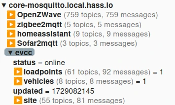
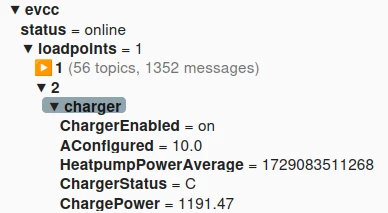

import Tabs from "@theme/Tabs";
import TabItem from "@theme/TabItem";

# Home Assistant

## Operation in Home Assistant

With the community-maintained [evcc Home Assistant Add-on](https://github.com/evcc-io/hassio-addon) you can operate evcc in a Home Assistant environment.
This means you do not need any separate hardware or installation environment.
evcc runs directly in Home Assistant.

You can find detailed installation instructions here
[Home Assistant Add-on Installation](../installation/home-assistant).

## Integration with ha-evcc

With the [ha-evcc](https://github.com/marq24/ha-evcc) from [marq24](https://github.com/marq24) you can easily integrate evcc data and functions into Home Assistant.
Regardless of whether you run evcc in Home Assistant or not.

The integration supports all necessary entities provided by evcc in MQTT or the API, including those for customising the
evcc settings, loadpoints and the corresponding vehicles.

## Integrate sensor data

If you want to integrate devices such as chargers, meters or vehicles into evcc that originate from devices that evcc does not
support (e.g. Zigbee smart plugs), you can do this via [MQTT](/docs/integrations/mqtt-api) or the
[REST API](/docs/integrations/rest-api). Both methods require a certain amount of learning for beginners to
be able to use them successfully. However, with the help of the following short instructions with linked tutorials, the task can be mastered.

:::note
Thanks to the two evcc interfaces, additional loadpoints can be realised for a variety of deferrable loads (consumers),
such as heaters, washing machines, dishwashers or electric two-wheelers.
:::

### Manual integration of sensor data via MQTT

MQTT is a simple communication protocol that was developed for the Internet of Things (IoT).
The way via MQTT is a little easier than via the API, but if you have never worked with MQTT before, there are a few points to consider.

An end device (in this case Home Assistant) sends a message to a so-called broker.
In Home Assistant, the broker is called Mosquitto and can be easily installed as an add-on. evcc can then read the data
 provided by the broker and process it.

If you have not yet installed the Mosquitto Broker in Home Assistant,
you can follow these [instructions](https://haprofs.com/setting-up-mqtt-mosquitto-broker-home-assistant/).

In short, it is about installing and configuring the necessary Home Assistant add-ons:

1. Install the ‘Mosquitto broker’ add-on
2. Set up a separate Home Assistant user for MQTT (without admin rights)
3. Install the ‘MQTT Explorer’ add-on (used to check the ‘topics’)
4. Install the MQTT integration

MQTT would now be set up in Home Assistant and the next step is to enter the access data for the broker in evcc.
To do this, you must enter the following configuration into the _evcc.yaml_.

```yaml
# mqtt message broker
mqtt:
broker: your-HA-IP-Address:1883
topic: evcc # root topic for publishing, set empty to disable
user: mosquitto # your username for the broker
password: yourpassword
```

After restarting the addon, evcc should be able to communicate with the broker and display the topics provided by evcc.
To check this, you need to start the addon ‘MQTT Explorer’ and open the WebUI. With the same access data
the explorer opens and shows something like the following picture.



If this works, you are now ready to define a first MQTT sensor in Home Assistant. There are in principle
different ways to do this, but we will limit ourselves here to the simplest one via automations.
If you copy the YAML code below and create an automation from it, you should then have the sensor
be displayed in the ‘MQTT Explorer’.
Of course you have to replace the entity sensor.shelly_em_channel_2_power with an existing sensor of yours.

:::note
The names of the topics can be freely chosen, here the corresponding loadpoint was selected as the root directory.

In MQTT, the topics must be republished regularly, otherwise evcc will generate a ‘sensor data outdated’ error.
:::

```yaml
alias: MQTT Heatpump Charger Power
description: sensor.shelly_em_channel_2_power -> actual Power Consumption
mode: single
triggers:
  - entity_id:
      - sensor.shelly_em_channel_2_power
    trigger: state
  - seconds: /15
    trigger: time_pattern
conditions: []
actions:
  - action: mqtt.publish
    metadata: {}
    data:
      evaluate_payload: false
      qos: 0
      retain: false
      payload: "{{ states('sensor.shelly_em_channel_2_power') }}"
      topic: evcc/loadpoints/2/charger/ChargePower
```

The ‘MQTT Explorer’ shows the following picture (without the 4 additional values).




#### MQTT templates for a heating loadpoint

To read the value in evcc you have to define a custom meter in _evcc.yaml_.

```yaml
  - name: heatpump-pw
    type: custom
    power: # Power (W)
        source: mqtt
        topic: evcc/loadpoints/2/charger/ChargePower
        timeout: 30s # don't accept values older than timeout
        scale: 1 # floating point factor applied to result, e.g. for converting Wh to kWh
```

In the example of a charger, three additional topics must be defined.
But the automations for this are basically structured in the same way as the example of the ChargePower,
which is not linked here, but in the loadpoint.

Link to [Custom Template Docs](../devices/chargers#custom)

Here is the additional charger section for the _evcc.yaml_ file (icon: features: are optional).

```yaml
  - name: Heatpump
    type: custom
    status: # charger status A..F
        source: mqtt
        topic: evcc/loadpoints/2/charger/ChargerStatus
        timeout: 10m
    enabled: # charger enabled state (true/false or 0/1)
        source: mqtt
        topic: evcc/loadpoints/2/charger/ChargerEnabled
        timeout: 10m
    enable: # set charger ⇒ enable (true/false or 0/1)
        source: mqtt
        topic: evcc/loadpoints/2/charger/ChargerEnabled
        payload: ${enable:%d}
        timeout: 10m
    maxcurrent: # set charger max current (A)
        source: mqtt
        topic: evcc/loadpoints/2/charger/AConfigured
        timeout: 10m
    icon: waterheater
    features:
      - integrateddevice
      - heating
```

Now you can add the required loadpoint for the heat pump to the _evcc.yaml_ file.

```yaml
  - title: Heatpump
    charger: Heatpump
    meter: heatpump-pw
    mode: ‘off’
    priority: 5 # relative priority for concurrent charging in PV mode with multiple loadpoints (higher values have higher priority)
    disable:
        threshold: 500 # maximum import power (W)
        delay: 5m
```

If you have created all automations for the four required topics, plus the load point, a heat pump should be available as a charge point after an evcc
restart, a heat pump should appear as a loadpoint.


:::note
Heat pumps are usually controlled via a thermostat and should not be switched on and off via other systems,
such as a simple heating element. However, you can use the target current ‘sensor.evcc_heatpump_charge_current’ of the loadpoint
to convert the current (A) into a percentage and thus influence the setpoint of the heat pump.

However, to explain this approach would overstretch the purpose of this quick guide.
:::

#### List of MQTT templates for devices

Under these links you will find the necessary information for defining additional devices that can communicate via MQTT.

- Meters/Site [meters](../devices/meters#custom)
- Chargers [chargers](../devices/chargers#custom)
- Vehicles [vehicles](../devices/vehicles#custom)
- Tariffs [tariffs](../devices/tariffs#custom-plugin)

### Manual integration of sensor data via REST API

The second option for reading in sensor data does not require an extra tool such as a broker, but does require some basic
knowledge about REST APIs.
The following instructions (also provided by [marq24](https://github.com/marq24)) explain in detail how to do this via the REST API.

[Instructions, evcc with Home Assistant sensor data](https://github.com/marq24/ha-evcc/blob/main/HA_AS_EVCC_SOURCE.md)

## Further resources (videos)

Please note!

The first video under these links reflects the solution before the release of the Home Assistant evcc integration.

The videos are in German.

- [smart home & more: evcc Basisinstallation und Konfiguration](https://youtu.be/aPq8k2MronY)
- [smart home & more: Schritt für Schritt - MQTT-Sensor mit Hilfe des MQTT-Explorer einrichten](https://youtu.be/0QQ3y8fgRVA)
- [smart home & more: Effizientes Energiedashboard für Home Assistant](https://youtu.be/V3p5-16U_oU)
