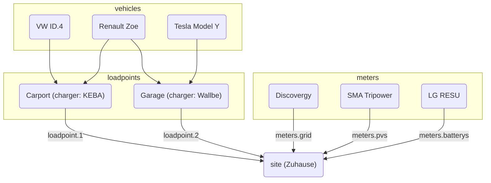

# Configuration

evcc can be configured in two ways:

**1. UI Configuration (recommended)**

Configuration is done via the web interface under **Configuration**.
Settings are saved automatically in the database.
For more information, see [Configuration](/docs/installation/configuration).

**2. File-based Configuration**

Configuration via the `evcc.yaml` file remains supported.
This section documents the YAML-based configuration.

:::info Parallel Usage
Both configuration methods can be used in parallel.
Devices (loadpoints, meters, PV systems, batteries, vehicles) are merged from both sources.
For other settings, UI configuration takes priority.
Details can be found in the [FAQ](/docs/faq#ui-migration).
:::

## File-based Configuration (evcc.yaml)

The configuration file is written in YAML format and is called `evcc.yaml` by default.
It is located either in the same directory as evcc itself, or on POSIX (e.g. Linux) systems in `/etc/evcc.yaml`.

Non-standard paths can be specified at startup: `evcc -c /path/to/evcc.yaml`

### Structure

The configuration file contains multiple sections.
To reference between sections, devices have a `name` parameter for identification.

An example file with many parameters can be found here:
https://github.com/evcc-io/evcc/blob/master/evcc.dist.yaml

Here is an overview of the relationship between the most important parts of the
configuration:

### How does evcc work? (A look into the innards)

In order for the system to function, an electricity meter is important. This
allows us to calculate at any point in time the surplus power. Measuring the
generated power is interesting, but has no effect on the function, with
[this exception](/docs/faq#configuration)

The surplus power is compared with the minimum power required to charge. If
this is sufficient, the charging process is started.

The minimum power required to charge is calculated from the values `minCurrent`
and `phases`, defined per `loadpoint` (a group of colocated chargers)
See [`loadpoints`](./configuration/loadpoints) for more
information.

For example: `phases: 1` und `minCurrent: 8`

1 (phases) x 8A (minCurrent) x 230V (mains voltage) = 1840W (minimum power required to charge)

#### Manipulation Options

Normally, the surplus power corresponds to the available charging power.
However, the available charging power can be individually adjusted using
several parameters. These are:

- Site: `residualpower`
- Site: `prioritySoc`
- Site: `bufferSoc`
- Site: `aux`
- Loadpoint: `enable: threshold`
- Loadpoint: `disable: threshold`

Please refer to the description of each respective parameter for the available
settings.

- [Site Configuration Parameters](./configuration/site)
- [Loadpoint Configuration Parameters](./configuration/loadpoints)

### Site

A [Site](./configuration/site) describes the location with the existing and required devices of
the home installation and is responsible for regulating the available power.

### Loadpoint

A [Loadpoint](./configuration/loadpoints) describes the charging infrastructure and combines
existing _Chargers_, _Vehicles_, and anything else a charging point needs.

### Chargers

[Chargers](./configuration/chargers) include a list of chargers and their properties, such as
how they are addressed.

### Meters

[Meters](./configuration/meters) are a list of devices that measure various power flows. These
include:

- Imported, Exported power
- PV-generated power
- Charging current of EV (if the charger does not support this directly)
- Power flow of house battery(ies)

### Vehicles

To limit the state of charge (SoC) of EVs to a specific level, you can specify
the existing [vehicles](./configuration/vehicles) and online access data here.

### HEMS

evcc can forward the charging points and their charging currents to another
[Home Energy Management System (HEMS)](./configuration/hems) so that it can use this
information, for example, to control the house battery.

### Messaging

In this section, you can define events for which you want to be informed. A
variety of different systems are supported for message delivery.

[More information](./configuration/messaging)
