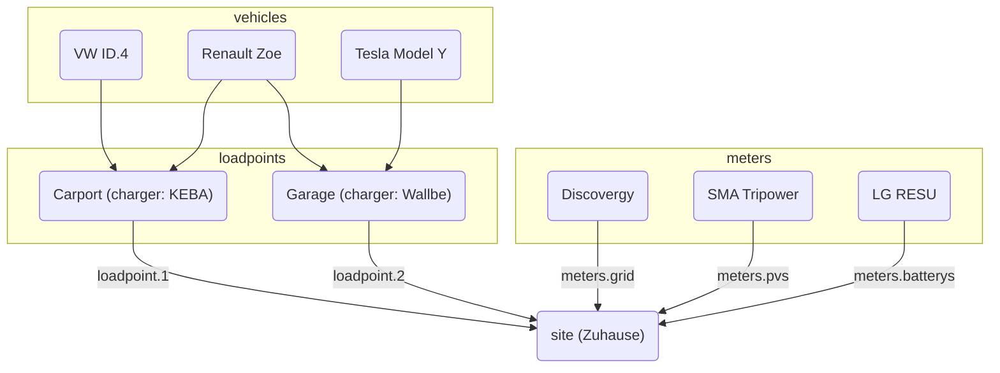

# evcc.yaml

evcc requires a configuration file to describe the system and cannot be used
without it. The file itself is written in
[YAML](https://en.wikipedia.org/wiki/YAML), which is a structured,
human-readable, plain text format.

To create or edit the configuration file, we recommend using a text editor that
understands YAML and thus helps with the formatting and shows any errors, e.g.
instance, [VS Code](https://code.visualstudio.com) with the
[YAML extension](https://marketplace.visualstudio.com/items?itemName=redhat.vscode-yaml).

The configuration file is called by default `evcc.yaml` and is either in the
same directory as evcc itself, or on POSIX (e.g. Linux) systems in
`/etc/evcc.yaml`.

For non-standard paths, the filename can be passed as a command line argument,
e.g. `evcc -c /home/evcc.yaml`

### Structure

evcc's configuration file contains multiple sections. In order to refer to
elements in a different section, each device has a `name` parameter, which is a
free text field and is used for identification.

An example file with many parameters can be found here:
https://github.com/evcc-io/evcc/blob/master/evcc.dist.yaml

Here is an overview of the relationship between the most important parts of the
configuration:

### How does evcc work? (A look into the innards)

In order for the system to function, an electricity meter is important. This
allows us to calculate at any point in time the surplus power. Measuring the
generated power is interesting, but has no effect on the function, with
[this exception](../../guides/meters#i-have-a-solar-installation-but-i-dont-have-a-readable-grid-connection-meter---can-i-still-use-evcc)

The surplus power is compared with the minimum power required to charge. If
this is sufficient, the charging process is started.

The minimum power required to charge is calculated from the values `minCurrent`
and `phases`, defined per `loadpoint` (a group of colocated chargers)
See [`loadpoints`](./loadpoints) for more
information.

For example: `phases: 1` und `minCurrent: 8`

1 (phases) x 8A (minCurrent) x 230V (mains voltage) = 1840W (minimum power required to charge)

#### Manipulation Options

Normally, the surplus power corresponds to the available charging power.
However, the available charging power can be individually adjusted using
several parameters. These are:

- Site: `residualpower`
- Site: `prioritySoc`
- Site: `bufferSoc`
- Site: `aux`
- Loadpoint: `enable: threshold`
- Loadpoint: `disable: threshold`

Please refer to the description of each respective parameter for the available
settings.

- [Site Configuration Parameters](./site)
- [Loadpoint Configuration Parameters](./loadpoints)

### Site

A [Site](site) describes the location with the existing and required devices of
the home installation and is responsible for regulating the available power.

### Loadpoint

A [Loadpoint](loadpoints) describes the charging infrastructure and combines
existing _Chargers_, _Vehicles_, and anything else a charging point needs.

### Chargers

[Chargers](chargers) include a list of chargers and their properties, such as
how they are addressed.

### Meters

[Meters](meters) are a list of devices that measure various power flows. These
include:

- Imported, Exported power
- PV-generated power
- Charging current of EV (if the charger does not support this directly)
- Power flow of house battery(ies)

### Vehicles

To limit the state of charge (SoC) of EVs to a specific level, you can specify
the existing [vehicles](vehicles) and online access data here.

### HEMS

evcc can forward the charging points and their charging currents to another
[Home Energy Management System (HEMS)](hems) so that it can use this
information, for example, to control the house battery.

### Messaging

In this section, you can define events for which you want to be informed. A
variety of different systems are supported for message delivery.

[More information](messaging)
