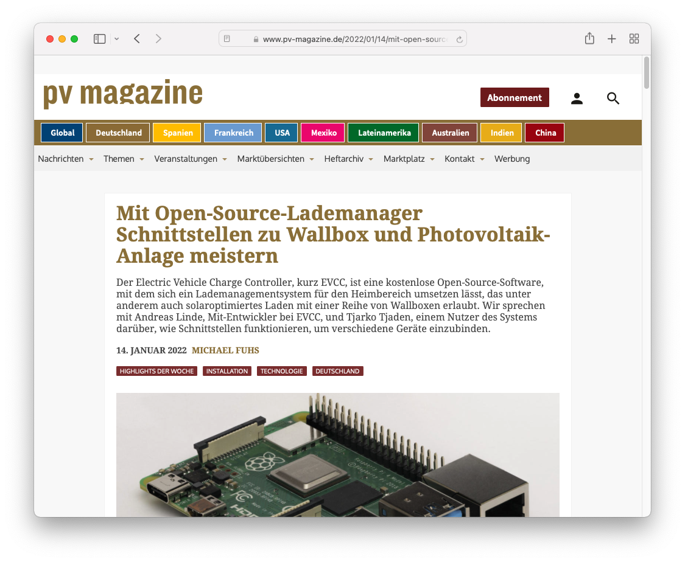

Unser Core Entwickler [Andreas Linde](https://twitter.com/DerAndereAndi) und unser Anwender [Tjarko Tjaden](https://twitter.com/TjarkoTjaden) haben dem pv magazin Deutschland ein Interview zum Thema [Open-Source-Lademanager Schnittstellen zu Wallbox und Photovoltaik-Anlage meistern](https://www.pv-magazine.de/2022/01/14/mit-open-source-lademanager-schnittstellen-zu-wallbox-und-photovoltaik-anlage-meistern/) gegeben.

<!-- excerpt -->
