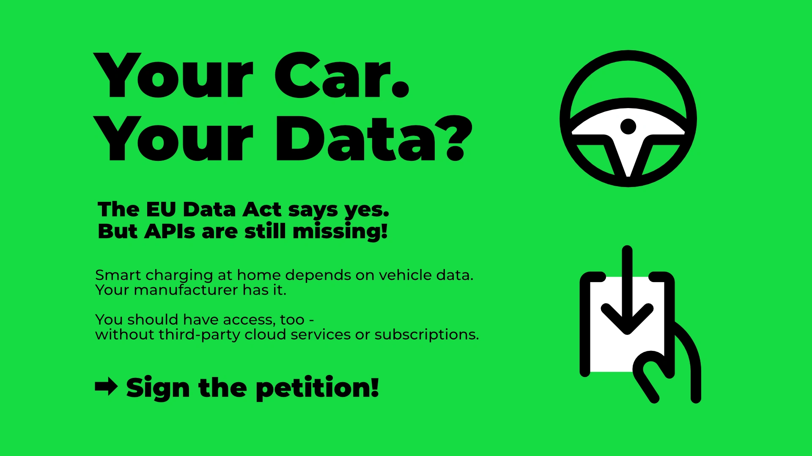

Dein Auto sammelt ständig Daten – aber du hast keinen Zugriff darauf.
Der EU Data Act, seit dem 12. September 2025 in Kraft, soll das ändern.
Die Realität sieht anders aus: Die meisten Autohersteller bieten keinen oder nur sehr eingeschränkten Zugang.

{/* excerpt */}

## Warum evcc Fahrzeugdaten braucht

evcc optimiert das Laden deines Elektroautos mit PV-Überschuss.
Dafür brauchen wir Echtzeitdaten aus deinem Fahrzeug: Ladestand, Reichweite, Ladezustand.
Aktuell sind wir oft auf reverse-engineerte APIs angewiesen.
Das funktioniert, ist aber keine nachhaltige Lösung.

Offizielle APIs würden ermöglichen:

- **Zuverlässiges Überschussladen** mit aktuellen Batterie- und Ladedaten
- **Besseres Batteriemanagement** durch präzise Steuerung
- **Energiekostenoptimierung** mit dynamischen Tarifen
- **Netzstabilität** durch intelligente Lastverteilung

## Warum das auch dich betrifft

„Bei mir läuft doch alles" – das hören wir oft.
Die Realität dahinter: Die meisten Fahrzeuganbindungen in evcc basieren auf inoffiziellen, undokumentierten APIs.
Entwickler analysieren in ihrer Freizeit, wie die Hersteller-Apps intern kommunizieren, und bauen darauf ihre Integrationen.

Das funktioniert – aber nur so lange, bis der Hersteller etwas an seinen Systemen ändert.
Dann bricht die Integration ohne Vorwarnung zusammen.
Das ist in der Vergangenheit immer wieder passiert und wird auch weiterhin passieren.

Das Problem betrifft nicht nur evcc.
Alle Open-Source-Lösungen wie Home Assistant stehen vor der gleichen Herausforderung.
Solange Hersteller keinen offiziellen Zugang bereitstellen, bleibt es ein ständiges Katz-und-Maus-Spiel mit ungewissem Ausgang.

Mit offiziellen Schnittstellen wäre das anders: dokumentiert, stabil, zuverlässig.
Du könntest dich darauf verlassen, dass deine Integration nicht plötzlich aufhört zu funktionieren.

## Elektromobilität und Energiewende

Offener Datenzugriff ist wichtig für die Energiewende.
Vehicle-to-Grid (V2G) braucht bidirektionalen Datenaustausch.
Smart-Home-Integration funktioniert nur mit Echtzeitdaten.
Optimiertes Laden senkt CO₂-Emissionen und Stromkosten.

## Die Realität: Eingeschränkter Zugang

Der EU Data Act ist Gesetz.
Die Umsetzung durch die Hersteller ist aber noch sehr unterschiedlich.

**BMW** und **Tesla** bieten API-Zugang an.

**Bei vielen anderen sieht es anders aus:**
Einige Hersteller stellen Daten auf Anfrage per E-Mail bereit.
Andere haben Webformulare, bei denen man 15 Minuten alte Daten als ZIP-Datei bekommt.
Das sind keine praktikablen Lösungen für Echtzeitanwendungen wie Smart Charging.

**Daten-APIs existieren bereits:**
Fahrzeugdaten sind bereits in guter Qualität und per API verfügbar.
Allerdings nur für Drittanbieter-Unternehmen, die für den Zugang bezahlen.
Datenzugang ist für Hersteller ein Geschäftsmodell im B2B-Bereich.
Für Fahrzeugbesitzer gibt es diesen direkten Zugriff oft nicht.

In unserer [GitHub-Diskussion](https://github.com/evcc-io/evcc/discussions/23684) sammeln wir den aktuellen Stand pro Hersteller.

## Was sagt die EU?

Die [EU-Kommission hat im September 2025 klare Richtlinien](https://digital-strategy.ec.europa.eu/en/library/guidance-vehicle-data-accompanying-data-act) veröffentlicht:

**Nutzer haben das Recht auf:**

- Roh- und vorverarbeitete Fahrzeugdaten
- Einfachen, kostenlosen Zugriff auf eigene Daten
- Daten in derselben Qualität, wie sie der Hersteller selbst nutzt
- Weitergabe an Dritte ihrer Wahl

**Hersteller müssen:**

- Daten einfach und direkt zugänglich machen
- Ohne zusätzliche Kosten für persönliche Nutzung
- In maschinenlesbarem Format
- Inklusive der Metadaten zur Interpretation

Die rechtliche Grundlage ist vorhanden.
An der praktischen Umsetzung hapert es noch.

## Die Petition

Maximilian Hauser aus der evcc Community hat eine [Petition gestartet](https://www.change.org/p/eu-data-act-durchsetzen-autohersteller-müssen-uns-zugang-zu-unseren-fahrzeugdaten-geben), um die Umsetzung des Data Act voranzutreiben.

**Gefordert wird:**

- Bundesnetzagentur soll den Data Act durchsetzen
- Klare technische Standards für APIs
- REST-API mit OAuth 2.0
- Mindestens 12 Anfragen pro Stunde pro Fahrzeug
- Öffentliche API-Dokumentation
- 99 % monatliche Verfügbarkeit

## Was du jetzt tun kannst

### 1. Petition unterschreiben

👉 **[Hier unterschreiben](https://www.change.org/p/eu-data-act-durchsetzen-autohersteller-müssen-uns-zugang-zu-unseren-fahrzeugdaten-geben)** 👈

### 2. Hersteller kontaktieren

Frag bei deinem Autohersteller nach API-Zugang gemäß EU Data Act.
Verweise auf die EU-Richtlinien.
Je mehr Anfragen eingehen, desto eher bewegt sich etwas.

### 3. Thema weiter tragen

Teile die Petition in deinem Umfeld: Foren, Discord-Server, Facebook-Gruppen, Freundeskreis und Familie.
Gib deinen Lieblings-YouTube-Kanälen, die sich mit E-Mobilität, Smart Home und erneuerbaren Energien beschäftigen, einen Hinweis.

---

Der Data Act ist da.
Die Umsetzung braucht Druck von Nutzerseite.
