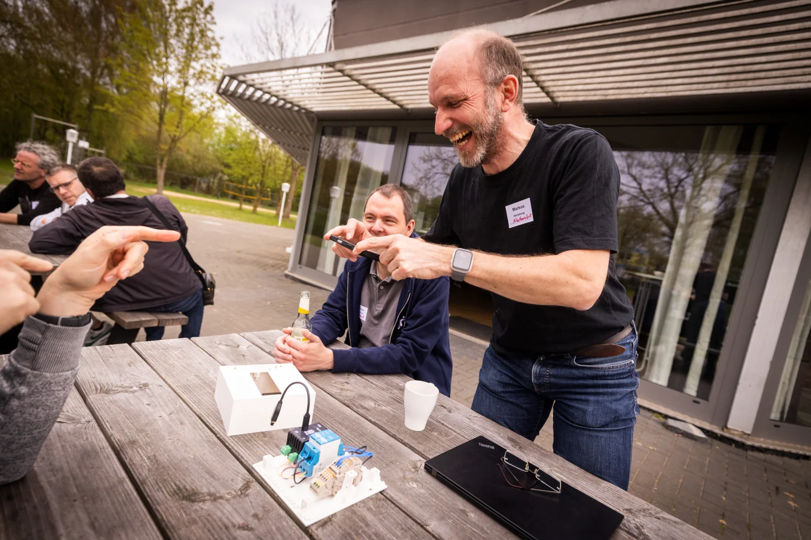
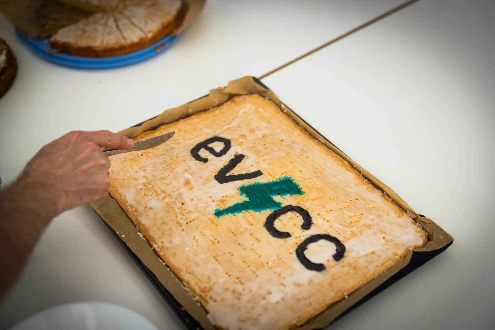

Am 18. April 2026 haben wir uns zum ersten evcc Community Treffen in den Räumen des [Osnabrücker Rudervereins](https://www.orv.de) getroffen. Rund 40 Teilnehmer waren vor Ort. Sie kamen aus Deutschland, Belgien und den Niederlanden, einige sogar aus Bayern und Baden-Württemberg.

{/* excerpt */}

## Barcamp-Nachmittag

Der Nachmittag lief im Barcamp-Stil: Teilnehmer bringen Themen mit, der Rest ergibt sich vor Ort. Drei große Runden haben sich herauskristallisiert:

- **Bidirektionales Laden**: Jan Luca und Marcel haben Einblicke gegeben, wie CUBOS bidirektionales Laden im Unternehmensumfeld umsetzt.
- **Erweiterte Optimierung**: Zusammenspiel mit [EOS](https://github.com/Akkudoktor-EOS/EOS) (Projekt vom [Akkudoktor](https://akkudoktor.net)), [OpenEMS](https://openems.io), [Victron ESS](https://www.victronenergy.com/live/ess:start), [Home Assistant](https://www.home-assistant.io), dem in Entwicklung befindlichen [evcc Optimizer](/de/features/optimizer) und Direktvermarktung.
- **Lastmanagement, §14a, §9 und EEbus**: aktuelle Regulierung und wie sich die Vorgaben in evcc praktisch abbilden lassen.

Daneben fanden sich viele kleinere Runden zusammen: KI-Nutzung in der evcc-Code-Basis, Wallbox-Empfehlungen, nächste Schritte im UI (Stichwort „Mini-Loadpoints") und einiges mehr.

## Professionelle evcc Hardware

Dominik hat sein [eHive](https://www.ehiv3.de) vorgestellt, eine Hutschienen-Hardware, die speziell für den Betrieb mit evcc optimiert ist. Zum Abschluss der Session wurde ein Gerät unter den Teilnehmern verlost. Wer das Gewicht der Hardware am genauesten schätzen konnte, durfte es mitnehmen.

## Führungen durch die Energietechnik

Markus und Michael vom Osnabrücker Ruderverein haben mehrere Führungen durch die Energietechnik und die Bootshallen angeboten. Mehr zum Setup des Vereins gibt es im [Community Portrait](/de/blog/2025/11/29/osnabruecker-ruderverein).

## Ausklang

Zum Ausklang gab es Grillen und Getränke. Gute Gespräche und neue Kontakte in die Community hinein.

Und es gab sogar einen evcc-Kuchen:

## Fotogalerie

[Detlef](https://hee.se) hat das Treffen fotografisch begleitet. Alle Bilder gibt es in seiner [Fotogalerie](https://hee.se/portfolio/evcc/).

## Danke

Großer Dank an den [Osnabrücker Ruderverein](https://www.orv.de) für die Gastfreundschaft, an Markus und Michael für die Führungen und an [Detlef](https://hee.se) für die Bilder. Und an alle, die mit ihren Themen und ihrer Zeit zum Gelingen beigetragen haben.

Bis zum nächsten Mal!
