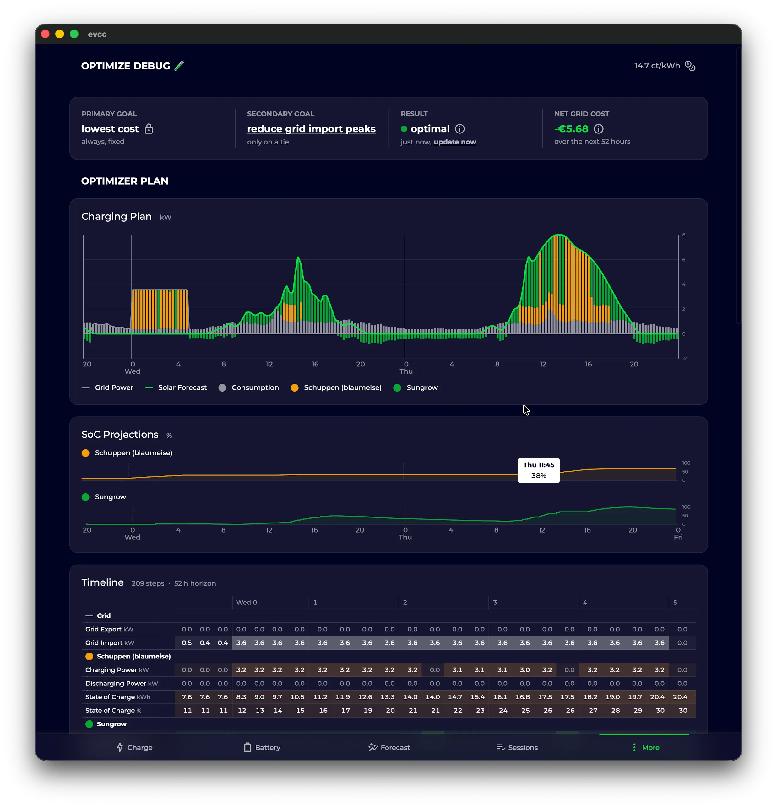
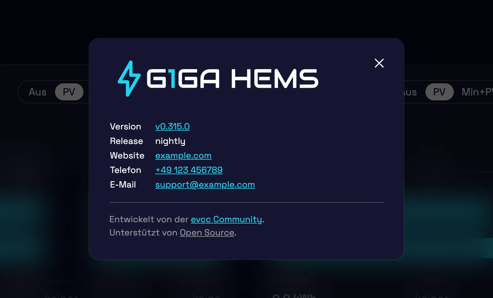

import Video from "@components/Video.astro";
import configUiVideo from "./config-ui-navigation.mp4";
import configUiPoster from "./config-ui-navigation.webp";

Nur vier Wochen nach dem [letzten Highlights-Post](/de/blog/2026/07/18/highlights-remote-access-widgets-optimizer) melden wir uns zurück.
Bisher lagen zwischen unseren Posts eher einige Monate.
Das wollen wir ändern.
In diesem Blogpost geben wir einen Überblick, was es Neues in evcc gibt: der neue Releaseprozess, Fortschritte beim Optimizer, Verbesserungen der Config-UI, Oberflächen-Customizing und mehr.

{/* excerpt */}

## Neuer Releaseprozess

Bisher haben wir in regelmäßigen Abständen Releases veröffentlicht.
Nach einem Release haben wir größere Änderungen und neue Funktionen erst einmal zurückgehalten, um abzuwarten, ob dringende Bugfixes oder Regressionen auftauchen.
Danach haben wir den größeren Änderungen etwas Zeit im Nightly gegeben, um Feedback einzusammeln.
Das hat Probleme gemacht, wenn wir schnell releasen mussten, z. B. weil ein Fahrzeughersteller seine API umgebaut hat.
Dann mussten wir noch unreife Funktionen entweder vorübergehend zurückbauen, oder sie gingen mit etwas weniger Reife als vorgesehen an euch raus 🙈.

Unser neues Modell löst das: Wir unterscheiden jetzt explizit zwischen Bugfixes, die schnell ausgerollt werden sollen, und größeren Funktionen, die ins nächste Funktionsrelease gehören.
Damit können wir [Semantic Versioning](https://semver.org/lang/de/) ordentlich umsetzen:

- **Funktionsreleases** wie <code>0.<u>314</u>.0</code> erscheinen alle zwei bis vier Wochen.
- **Bugfix-Releases** wie <code>0.314.<u>1</u></code> können wir dazwischen relativ einfach durchführen.
- Der **Nightly** wie <code>0.315.0<u>-dev.1787769000</u></code> enthält weiterhin immer den aktuellen Stand des `master`-Branches, also alle Funktionen und Bugfixes.

Die gesamte Entwicklung findet weiterhin im `master` statt.
Neu ist ein `/backport`-Kommando auf GitHub, mit dem einzelne Pull Requests für das nächste Bugfix-Release übernommen werden können.
Ein Claude-basierter Agent kümmert sich um den Prozess und die Auflösung von Konflikten.

## Optimizer-Optimierungen

Mit dem [Optimizer](/de/features/optimizer) arbeiten wir daran, das Verhalten des gesamten Energiesystems für die nächsten Tage zu optimieren, auf Basis von Verbrauchs- und Erzeugungsprognosen sowie der Strompreiskurve.
Wir haben ihn bereits im [letzten Highlights-Post](/de/blog/2026/07/18/highlights-remote-access-widgets-optimizer#optimizer) erwähnt.
Der Optimizer ist weiterhin experimentell.
Aktuell wird die berechnete Planung nur angezeigt: als Empfehlung am Ladepunkt, auf der Batterieseite und auf der [überarbeiteten Optimizer-Seite](https://github.com/evcc-io/evcc/pull/32837).
Der nächste Schritt ist, dass der Optimizer die Steuerung von Batterie und Ladepunkten wirklich übernimmt; der [Pull Request](https://github.com/evcc-io/evcc/pull/32881) dafür ist in Vorbereitung.

Neu ist: Der Optimizer berücksichtigt die Daten der Ladepläne und optimiert mehrere Ladepläne zusammen; bisher wurde jeder Plan nur für sich betrachtet.
Auch sonst hat sich einiges getan:

- Er meldet jetzt, [ob die berechnete Planung machbar ist](https://github.com/evcc-io/evcc/pull/32632), z. B. ob sich alle Ladeziele rechtzeitig erreichen lassen.
- Ein [statisches Einspeiselimit](https://github.com/evcc-io/evcc/pull/32541) kann konfiguriert werden und fließt in die Optimierung ein.
- Die Einstellung [Spätes Laden](https://github.com/evcc-io/evcc/pull/32872) (Vorkonditionierung) aus der Ladeplanung wird bei der Optimierung berücksichtigt.
- Er rechnet bei [Fahrzeugwechseln sowie beim An- und Abstecken](https://github.com/evcc-io/evcc/pull/32681) sofort neu.
- Ladepunkte ohne bekannte Fahrzeugkapazität (z. B. mit einem Gastfahrzeug) fließen jetzt mit ihrer [gemessenen Ladeleistung als Verbrauch](https://github.com/evcc-io/evcc/pull/32681) in die Planung ein; vorher fehlten sie dort komplett.
- Er [fordert keine Ladung mehr an](https://github.com/evcc-io/evcc/pull/32633), wenn das Fahrzeug voll ist.

Probier es gerne aus: Aktiviere die experimentellen Features unter **Konfiguration → Experimentell** und schalte anschließend den Optimizer ein.
Schau dir die Optimizer-Ansicht an und prüfe, ob der berechnete Plan für dich plausibel aussieht.
Wir freuen uns über dein Feedback.

## Config-UI Optimierung

Die Konfiguration im Browser wird immer runder:

- [Geräte lassen sich deaktivieren](https://github.com/evcc-io/evcc/pull/29455), ohne sie zu löschen, z. B. wenn ein Gerät vorübergehend offline ist oder du deine Anlage umbaust.
- Dialoge [warnen vor dem Schließen](https://github.com/evcc-io/evcc/pull/32826), wenn ungespeicherte Änderungen vorhanden sind.
- Energie- und Leistungswerte wählen automatisch eine [passende Einheit](https://github.com/evcc-io/evcc/pull/32754).
- Auf dem Smartphone hat die Konfigurationsseite eine richtige [Bereichsnavigation](https://github.com/evcc-io/evcc/pull/32810) statt einer langen Liste bekommen.

<Video
  src={configUiVideo}
  poster={configUiPoster}
  autoplay
  aspect="1 / 1"
  title="Bereichsnavigation der Konfiguration auf dem Smartphone"
/>

## Oberfläche customizen

Die Oberfläche lässt sich jetzt anpassen: Logo, Markenname, Website, Support-E-Mail und Telefonnummer.
Das ist z. B. für Elektriker und Installateure interessant, die evcc in Kundenprojekten einsetzen.
Mit einer eigenen Support-E-Mail gehen Problemberichte aus der Oberfläche an deine Support-Adresse statt an GitHub.
Die [White-Label-Seite](/de/reference/white-label) erklärt, welche Möglichkeiten vorgesehen sind und wie du den Style der Oberfläche durch eigenes CSS nach deinen Wünschen gestaltest.

## Breaking Changes und Integrationen

Wir haben das Format geändert, in dem Vorhersage- und Tarifdaten über die API und MQTT veröffentlicht werden.
Statt ausführlicher Objekte kommen die Daten jetzt als [kompakte Arrays mit Unix-Timestamps](https://github.com/evcc-io/evcc/pull/32391), und MQTT veröffentlicht [eine Nachricht pro Vorhersagetyp](https://github.com/evcc-io/evcc/pull/32716).
Das Ergebnis: deutlich kleinere Datenmengen, schnelleres Laden und weniger Bandbreite, was du vor allem in der App und bei langsamen Verbindungen merkst.

Das ist ein Breaking Change.
Ein riesiges Dankeschön an alle Maintainer von evcc-Integrationen, die ihre Projekte im Vorfeld des Releases angepasst haben: [marq24](https://github.com/marq24) und [mkshb](https://github.com/mkshb) ([Home Assistant](/de/smarthome/home-assistant)), [Newan](https://github.com/Newan) ([ioBroker](/de/smarthome/iobroker)), [rdvnit](https://github.com/rdvnit) ([Homey](/de/smarthome/homey)), [TheNinth7](https://github.com/TheNinth7) ([Garmin](/de/smarthome/garmin)) und das Team hinter dem [openHAB-Binding](/de/smarthome/openhab).
Das so aktive Ökosystem rund um evcc ist sehr schön zu sehen.

Wir haben in der Doku einen neuen Bereich **Smart Home** in die Navigation aufgenommen, der diese Integrationen vorstellt.
Auf der Seite [More Awesome Projects](/de/smarthome/awesome) sammeln wir außerdem kleinere Community-Projekte, von Grafana-Dashboards über eine E-Ink-Anzeige bis zur Menüleisten-App.
Wenn du ein kleines Tool, einen Helper oder eine Integration rund um evcc gebaut hast, schlage es gerne per Pull Request für die Aufnahme in die Liste vor, damit andere es finden können.

## Kleinere Verbesserungen

- **Neue Chart-Engine:** Der Umbau von [Chart.js](https://github.com/chartjs/Chart.js) auf [Apache ECharts](https://echarts.apache.org) ist abgeschlossen; die Chart.js-Entwicklung ist leider ins Stocken geraten.
  ECharts gibt uns ein solides Fundament für unsere großen Pläne rund um Datenvisualisierung (stay tuned) ...
- **Optimierung für Touch:** Mit einer [Wischgeste blätterst du zwischen den Zeiträumen](https://github.com/evcc-io/evcc/pull/32614), Tooltips [erscheinen und verschwinden sauber bei Berührung](https://github.com/evcc-io/evcc/pull/32613), und die History-Daten laden dank [Prefetching und Caching](https://github.com/evcc-io/evcc/pull/32699) spürbar schneller.
- **Ladeplanung:** Die Strategie-Einstellungen sind leichter zu entdecken; Optimierungsziel und Spätes Laden stehen jetzt direkt im [Ladeplan-Dialog](/de/features/plans).
- **Geladene Reichweite:** Wenn dein Fahrzeug seinen Ladestand meldet, erfasst jeder Ladevorgang die geladenen Prozente und die geschätzte Reichweite, sichtbar in den Details und der [Übersicht der Ladevorgänge](/de/features/sessions).
- **Remote Access:** Fehler bei der Tunnelverbindung sind jetzt in der Oberfläche sichtbar, und nach einem Start ohne Internet stellt deine Instanz die [Remote-Access-Verbindung](/de/features/remote-access) selbstständig wieder her.
- **API-State-Referenz:** Unsere State-Datenstruktur (`/api/state`) war bislang undokumentiert.
  Die neue [Referenzseite](/de/reference/state) ändert das: Sie wird direkt [aus den Typdefinitionen der Oberfläche generiert](https://github.com/evcc-io/evcc/pull/32431) und passt damit immer zur tatsächlichen API.

## Neue Geräteunterstützung

**Wallboxen:** NEcharge Pro (OCPP), Youliq One, dazu Verbesserungen für Atmoce und Voltie

**Zähler, Solar- & Batteriesysteme:** Socomec Countis E3x/E4x, Ferroamp, Fronius Argeno und Smart Meter IP, SunEnergyXT 500, Victron GX AC-Verbrauchszähler, Tesla Powerwall über die Fleet API sowie Batteriesteuerung für FoxESS H3 und Solplanet

**Abregelung (§ 9 EEG):** Goodwe, Fronius Gen24, Huawei EMMA und Huawei SmartLogger lassen sich jetzt abregeln

Natürlich gab es auch wieder viele Bugfixes und Verbesserungen an bestehenden Integrationen.
Details finden sich in den [Release Notes](https://github.com/evcc-io/evcc/releases/tag/0.314.0).

---

💚 Ein großes Dankeschön an alle, die das Projekt voranbringen: durch Code, Ideen, Tests, Diskussionen und finanzielle Unterstützung, ohne die das Projekt in dieser Form nicht möglich wäre.

Wir wünschen euch einen sonnigen Spätsommer.

**Viele Grüße** 
Das evcc Team 
Michael, Andi & Uli
