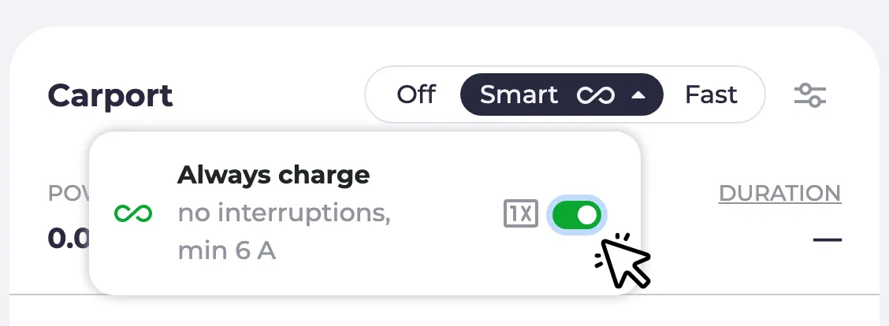
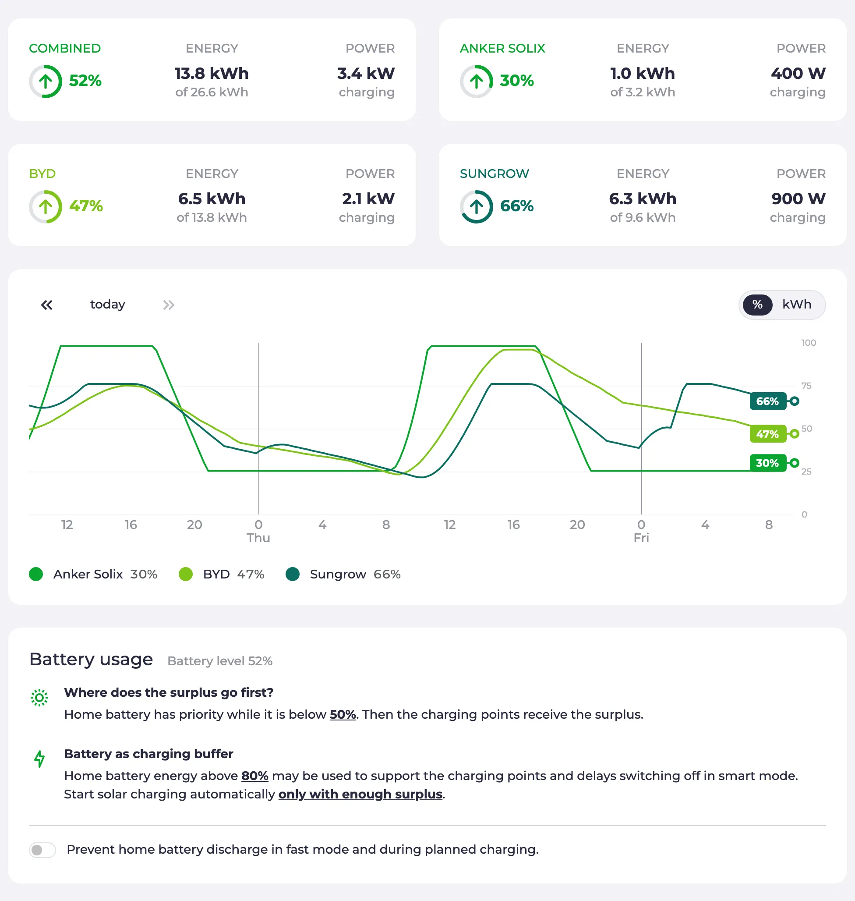

Seit dem [letzten Highlights-Post](/de/blog/2026/08/19/highlights-release-process-optimizer-customize) sind zwei Feature-Releases erschienen: [0.315](https://github.com/evcc-io/evcc/releases/tag/0.315.0) und [0.316](https://github.com/evcc-io/evcc/releases/tag/0.316.0).
Dieser Beitrag fasst beide zusammen.
Die großen Themen: Die Lademodi haben mit **Smart** und **Dauerhaft laden** eine neue Struktur bekommen, die Hausbatterie-Seite wurde überarbeitet, der neue Regler **Sonnenanteil** ersetzt die verwirrenden Watt-Schwellen, und der Optimizer macht einen weiteren Schritt in Richtung automatischer Steuerung.

{/* excerpt */}

:::note[Update]
**26.9.2026:** Der [Smart-Modus](#modes) ist jetzt genauer erklärt, und die neue [Seite zu den Modi](/de/features/modes) beschreibt alle Modi.
Im [Optimizer-Abschnitt](#optimizer) steht jetzt, dass der Optimizer ein Sponsortoken voraussetzt.
:::

## Neue Modi: Smart und Dauerhaft laden \{#modes\}

Die Modi **PV** und **Min+PV** stammen aus der Zeit, als es bei evcc nur um PV-Überschussladen ging.
Mit der Zeit kamen Funktionen dazu, die mit PV wenig zu tun haben: dynamische Tarife, Ladepläne, Wärmepumpen und schaltbare Geräte.
Viele nutzen evcc inzwischen ganz ohne PV-Anlage, und die Namen haben bei neuen Nutzern für Verwirrung gesorgt.

Mit [0.316](https://github.com/evcc-io/evcc/pull/32490) heißen die Modi nach dem, was sie tun, und nicht nach der Stromquelle.
Aus **PV** wird **Smart**.

**Aus** und **Schnell** sind einfache Schalter: Das Gerät bleibt aus oder läuft mit voller Leistung wie eine Wallbox ohne evcc.
Alles, was evcc selbst entscheidet, passiert im **Smart**-Modus:

- [PV-Überschussladen](/de/features/solar-charging)
- Günstiges oder grünes Netzladen mit [dynamischem Tarif](/de/features/dynamic-prices) oder [CO₂-Prognose](/de/features/co2)
- Prioritäten zwischen [Hausbatterie](/de/features/battery), Ladepunkten und Heizungen
- [Ladepläne](/de/features/plans)

**Smart** ist auch der Modus, in dem der kommende Optimizer arbeiten wird.

Der Modus **Min+PV** entfällt.
Sein Verhalten, wie der **PV**-Modus, nur ohne Pausen und immer mindestens mit Mindestleistung, ist wichtig für Fahrzeuge, die ständiges Starten und Stoppen nicht mögen, und für Anlagen mit wenig Überschuss.
Das ergibt aber nur beim Laden von Fahrzeugen Sinn, nicht bei Schaltern, Heizstäben oder Wärmepumpen.
Deshalb gibt es diese Funktion jetzt als Option **Dauerhaft laden** im Dropdown des **Smart**-Buttons an Fahrzeug-Ladepunkten und nicht mehr als eigenen Modus.
Du kannst sie dauerhaft einschalten oder mit dem **1x**-Button nur für den aktuellen Ladevorgang.
In den Fahrzeugeinstellungen kannst du pro Fahrzeug einen Standard festlegen.

Die Beschriftung der Modi passt sich dem Gerät an: Eine Wallbox zeigt **Aus / Smart / Schnell**, ein schaltbares Gerät **Aus / Smart / Ein**, eine Wärmepumpe **Normal / Smart / Boost**.
Die neue [Seite zu den Modi](/de/features/modes) erklärt alle Modi und [Dauerhaft laden](/de/features/modes#always-charge) im Detail.

Für Integrationen ist das ein Breaking Change.
API, MQTT und Websocket melden jetzt `smart` statt `pv`, und `minpv` wird gar nicht mehr ausgegeben.
Setzen kannst du die alten Werte weiterhin: `pv` schaltet auf **Smart**, `minpv` auf **Smart** mit eingeschaltetem **Dauerhaft laden**, bestehende Automationen verhalten sich also wie bisher.
Wenn deine Automation auf `pv` oder `minpv` prüft, solltest du sie anpassen.
Die großen Integrationen waren schon vor dem Release bereit.
Danke an alle Maintainer, die ihre Projekte angepasst haben 🙌

## Hausbatterie-Seite \{#battery\}

Die **Batterie**-Seite war bisher eine reine Einstellungsseite.
Jetzt zeigt sie zuerst den Status: eine Kachel mit Ladestand, gespeicherter Energie und aktueller Leistung.
Bei mehreren Batterien gibt es eine Kachel pro Batterie und eine für alle zusammen, und das Diagramm darunter zeigt den Ladestand jeder Batterie über die letzten Tage.
Ist der [Optimizer](#optimizer) aktiviert, zeigt die Seite außerdem seine Vorschläge: was er gerade mit der Batterie tun würde, z. B. Entladen verhindern oder aus dem Netz laden, und wie sich der Ladestand entwickeln würde.
Dazu weiter unten mehr.
Die Einstellungen zu Priorität, Ladepuffer und automatischem Start gibt es weiterhin, jetzt als leicht verständliche Sätze statt als Formular.

Wer experimentelle Funktionen aktiviert hatte, kennt diese Seite schon.
Mit [0.316](https://github.com/evcc-io/evcc/pull/33434) ist sie der Standard für alle.

**Steuerungsmodi der Batterie:** Die Batteriesteuerung ist jetzt feiner abgestuft.
Jede Batterie meldet, welche der Modi sie unterstützt: normaler Betrieb, Entladen verhindern, aus dem Netz laden, Laden verhindern und Einspeisung ins Netz.
evcc bietet nur an, was ein Gerät auch kann.
Was die einzelnen Modi bedeuten, steht in der [Modus-Tabelle](/de/user-defined-devices#battery-modes) der Dokumentation, und externe Systeme können einen Modus über die [REST-API](/integrations/rest-api/operations/setexternalbatterymode) setzen.
Auch die Liste der steuerbaren Batterien ist gewachsen: Huawei SUN2000, Kostal Plenticore, Sungrow, Zendure Solarflow, Anker Solarbank, Atmoce, EcoFlow Stream, Marstek und Home-Assistant-Batterien haben zusätzliche Modi bekommen.
Welche Batteriesysteme aktive Steuerung unterstützen, zeigt die [Geräteliste](/de/meters?f=battery-control), und was du damit machen kannst, erklärt die [Hausbatterie-Seite](/de/features/battery).

## Sonnenanteil \{#solar-share\}

Dieser Wunsch ist schon etwas älter.
Standardmäßig startet das Laden im **Smart**-Modus erst, wenn der Überschuss die komplette minimale Ladeleistung des Fahrzeugs abdeckt.
Bei einer kleinen PV-Anlage oder tief stehender Wintersonne kommt dieser Moment vielleicht nie.
Bisher konntest du die Hürde mit Watt-Schwellen in der Ladepunkt-Konfiguration senken (Neustart erforderlich).
Diese Schwellen haben über die Jahre viele Neulinge verwirrt, und ehrlich gesagt auch so manchen alten Hasen 😅.

Der neue Regler [**Sonnenanteil**](https://github.com/evcc-io/evcc/pull/32104) in den Ladepunkt-Einstellungen ist einfacher: Du stellst ein, wie viel der minimalen Ladeleistung aus Solarstrom kommen muss.
Bei 100% wartet das Laden auf vollen Überschuss.
Bei 50% darf die Hälfte aus dem Netz kommen.
Bei 0% startet das Laden, sobald überhaupt Überschuss da ist.
Kein Neustart, keine Watt, nur ein Regler.
Für spezielle Setups funktionieren die alten Schwellen weiterhin.
Solange sie gesetzt sind, ist der Regler deaktiviert und zeigt einen entsprechenden Hinweis.

Mehr Details findest du auf der [Seite zum PV-Überschussladen](/de/features/solar-charging#not-enough-surplus).

## Fortschritte beim Optimizer \{#optimizer\}

Der [Optimizer](/de/features/optimizer) berechnet einen Plan für dein ganzes Zuhause über die nächsten Tage: Batterie, Ladepunkte und Heizung, auf Basis von Prognosen und Preisen.
Er ist noch experimentell und macht bisher nur Vorschläge: Er zeigt, was er tun würde, greift aber nicht ein.
In den letzten beiden Releases ist viel passiert:

- Der Planungszeitraum umfasst jetzt [48 Stunden plus den Rest des Tages](https://github.com/evcc-io/evcc/pull/32893), und im Diagramm sind die Tagesgrenzen mit Wochentag markiert.
- Der Haushaltsverbrauch wird [in einzelne Profile aufgeschlüsselt](https://github.com/evcc-io/evcc/pull/33749): Grundlast, Heizung und Ladepunkte ohne bekannte Fahrzeugkapazität werden getrennt dargestellt.
- Die Vorhersage des Haushaltsverbrauchs ist besser geworden, z. B. für [Heizungs-Ladepunkte](https://github.com/evcc-io/evcc/pull/28232) und für Haushalte, in denen ein paar stromhungrige Nachmittage bisher die [Grundlast verzerrt](https://github.com/evcc-io/evcc/pull/33700) haben.
- Die Optimizer-Seite ist [auch ohne erstes Ergebnis nutzbar, hat einen Menüeintrag, sobald der Optimizer aktiviert ist, und einen Feedback-Link](https://github.com/evcc-io/evcc/pull/33750) zum Melden unplausibler Pläne.
- Pläne werden [sofort neu berechnet](https://github.com/evcc-io/evcc/pull/33467), wenn sich ein Ladeplan fahrzeugseitig ändert, und das Ladeziel des Plans [landet im richtigen Zeitfenster](https://github.com/evcc-io/evcc/pull/33832).
- Netzladen und Netzentladen werden nur für Batterien geplant, die [den Modus tatsächlich unterstützen](https://github.com/evcc-io/evcc/pull/33860).

Falls du ihn noch nicht ausprobiert hast: Aktiviere experimentelle Funktionen unter **Konfiguration → Experimentell**, schalte den Optimizer ein und prüfe, ob der Plan für dein Zuhause plausibel aussieht.
Der Optimizer setzt ein [Sponsortoken](/de/sponsorship) voraus.
Die Berechnung läuft auf einem zustandslosen Cloud-Dienst, den wir betreiben und der keine Daten speichert.
Du kannst den Dienst auch selbst betreiben, siehe [technischer Hintergrund](/de/features/optimizer#technical).
Wir freuen uns über jedes Feedback.

Der nächste große Schritt ist der **Automatikmodus**: Der Optimizer schlägt nicht mehr nur vor, sondern entscheidet, wann die Batterie lädt oder hält und wann Ladepunkte im **Smart**-Modus starten und stoppen.
Der [Pull Request](https://github.com/evcc-io/evcc/pull/32881) ist in Vorbereitung, und wir haben schon viel Feedback bekommen.
Wenn du experimentierfreudig bist: In den Kommentaren des Pull Requests gibt es Test-Builds.
Probier sie aus und erzähl uns, wie es läuft.
Es gibt noch einiges zu tun, aber wir freuen uns darauf, ihn ins Nightly zu bringen.

## Kleinere Verbesserungen

- **Remote Access:** [Nicht mehr experimentell](/de/features/remote-access). Die Kachel ist jetzt für alle unter **Konfiguration** sichtbar, und über eine neue Option kannst du Konfiguration und Zugangsdaten zurücksetzen. Vorgestellt haben wir Remote Access in den [Juli-Highlights](/de/blog/2026/07/18/highlights-remote-access-widgets-optimizer).
- **Einspeisebegrenzer:** Wenn der Netzbetreiber weniger Einspeisung verlangt (§ 9 EEG), drosselt evcc normalerweise jeden PV-Wechselrichter direkt. In manchen Anlagen muss der Befehl stattdessen an eine zentrale Steuerung gehen, z. B. den SMA Sunny Home Manager 2.0 oder SolarEdge Export Control. Diese haben jetzt eine eigene [Geräteklasse](https://github.com/evcc-io/evcc/pull/32416), die neben dem Netzzähler konfiguriert wird, und müssen sich nicht mehr als Zähler ausgeben. Siehe [Externe Steuerung](/de/external-limit#curtailment-devices).
- **Datumsformat:** Das Datumsformat richtete sich bisher nach der gewählten Sprache. Das passt nicht immer, z. B. bei Englisch in Europa. In den [Einstellungen der Benutzeroberfläche](https://github.com/evcc-io/evcc/pull/29321) kannst du jetzt Tag zuerst, Monat zuerst oder ISO-Reihenfolge wählen. Danke an [webalexeu](https://github.com/webalexeu).
- **Phasenanzeige:** Die Darstellung der Phasen am Ladepunkt hat sich geändert. Bisher gab es einen Balken pro aktiver Phase, inaktive Phasen wurden einfach ausgeblendet. Jetzt zeigt eine dreiphasige Wallbox [immer drei Segmente](https://github.com/evcc-io/evcc/pull/33173), aktive Phasen sind hervorgehoben, sodass du auf einen Blick siehst, ob ein- oder dreiphasig geladen wird.
- **Polestar:** Statt der per Reverse Engineering gebauten Anbindung nutzt evcc jetzt die [offizielle Polestar Data Portal API](https://github.com/evcc-io/evcc/pull/33814). Danke an [loebse](https://github.com/loebse).
- **Nissan:** Der Login nutzt jetzt [MyNISSAN OneID](https://github.com/evcc-io/evcc/pull/33316), nachdem Nissan die alten NissanConnect-Zugangsdaten abgeschaltet hat. Danke an [alex-irrgang](https://github.com/alex-irrgang).
- **Škoda:** Die neue offizielle MyŠkoda-API wird unterstützt, siehe den [eigenen Blogpost](/de/blog/2026/08/27/skoda-vehicle-api).
- **Home Assistant:** Die evcc-App [erkennt die Home-Assistant-Instanz und das Token automatisch](https://github.com/evcc-io/evcc/pull/33000), sodass Home-Assistant-Geräte ohne manuelle Einrichtung als gefundene Geräte auftauchen, danke an [wlcrs](https://github.com/wlcrs). Home-Assistant-Batterien haben die Modi [Laden verhindern und Entladen](https://github.com/evcc-io/evcc/pull/33841) bekommen, danke an [igotsoul](https://github.com/igotsoul). Zwei Breaking Changes: Die Milliampere-Stromsteuerung an der [Home-Assistant-Wallbox](https://github.com/evcc-io/evcc/pull/33858) ist jetzt optional, und das [Preset für minsoc/maxsoc der Batterie](https://github.com/evcc-io/evcc/pull/33707) entfällt.

## Neue Geräteunterstützung

**Wallboxen:** Steca, Sonoff-Schaltsteckdosen, dazu Zählerfunktion für Spelsberg und Verbesserungen für go-e, OpenEVSE, NRGkick, Keba, Voltie und Zaptec

**Zähler, PV- & Batteriesysteme:** CHINT ECH10K, Solplanet Hybrid, SENEC.Connect Cloud-API, Afore Hybrid über RS485, Deye-Mikrowechselrichter über Solarman und HTTP-Logger, Zendure SolarFlow 800 Pro, my-PV HEA THOR 3.5 und 9.0, Strombegrenzung für Solax X1/X3-HAC, Einspeiseenergie für Youless, openWB Pro und Sungrow

**Fahrzeuge:** Polestar über die offizielle Data Portal API, neue offizielle MyŠkoda-API, Nissan-OneID-Login, LiveWire-S2-Motorräder, geladene Energie für Tesla BLE

**Wärmepumpen & Heizung:** Weishaupt (Modbus TCP), 1SINQ OneKey (SG Ready über MQTT), Leistung und Temperatur für Viessmann dank [ickeundso](https://github.com/ickeundso)

**Tarife:** EPEX-Spotpreise für Belgien, spotovaelektrina.cz für Tschechien, zusätzliche Regionen, Währungen und API-Key für Energy Price Forecast

**Einspeisemanagement (§ 9 EEG):** SMA Sunny Home Manager 2.0, SolarEdge, Sungrow

Natürlich gab es auch wieder viele Bugfixes und Verbesserungen an bestehenden Integrationen.
Details stehen in den Release Notes zu [0.315](https://github.com/evcc-io/evcc/releases/tag/0.315.0) und [0.316](https://github.com/evcc-io/evcc/releases/tag/0.316.0).

---

💚 Ein großes Dankeschön an alle, die das Projekt voranbringen: durch Code, Ideen, Tests, Diskussionen und finanzielle Unterstützung, ohne die das Projekt in dieser Form nicht möglich wäre.

Die Tage werden kürzer.
Nutzt die Sonne weise. 😉
Viel Spaß beim Laden!

**Viele Grüße** 
Das evcc Team 
Michael, Andi & Uli
