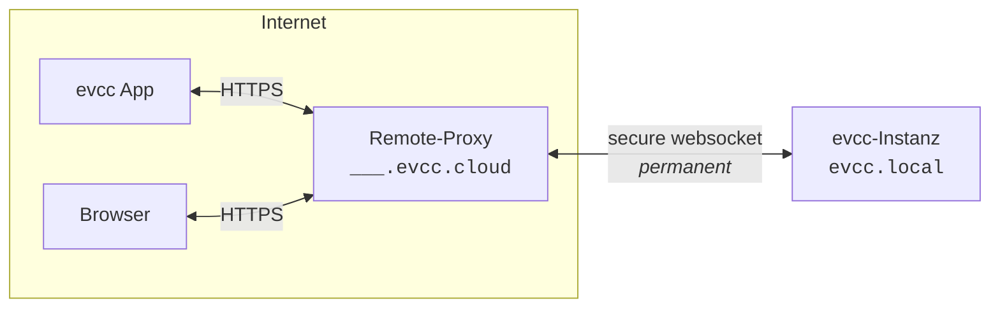

import { Steps } from "@astrojs/starlight/components";
import statusImg from "@assets/features/remote-access/status.png";
import clientsImg from "@assets/features/remote-access/clients.png";
import clientCreatedImg from "@assets/features/remote-access/client-created.png";

:::caution[Experimentell]
Remote Access befindet sich in einer frühen Entwicklungsphase und ist aktuell nur per Umgebungsvariable freischaltbar.
Funktionsweise und Konfiguration können sich noch ändern.
:::

Mit Remote Access erreichst du deine lokale evcc-Instanz von unterwegs.
Jede Instanz bekommt dafür ihre eigene Domain auf `evcc.cloud`.
Du brauchst weder DynDNS noch eine Portfreigabe in deinem Router.



## Wie funktioniert das?

Deine App oder dein Browser verbindet sich mit deiner persönlichen Domain unter `evcc.cloud`.
Der Remote-Proxy leitet die Anfragen durch einen WebSocket-Tunnel an deine lokale evcc-Instanz weiter.
Den Tunnel baut deine evcc-Instanz selbst nach außen auf, daher ist kein offener Port in deinem Netzwerk nötig.

## Einrichtung

Remote Access setzt ein aktives [Sponsoring](/de/sponsorship) voraus.

<Steps>

1. Setze auf dem Host, auf dem evcc läuft, die Umgebungsvariable:

   ```
   EVCC_REMOTE_ACCESS=api.evcc.cloud
   ```

   Wie du Umgebungsvariablen dauerhaft setzt, hängt von deiner Installation ab.
   Unter Linux geschieht das über ein systemd-Drop-in mit `systemctl edit evcc`, siehe [Umgebungsvariablen & CLI-Optionen](/de/installation/linux#environment).

   Starte evcc anschließend neu.

2. Aktiviere die Funktion in der Oberfläche:
   - **Konfiguration → Experimentell** → aktivieren
   - **Konfiguration → Remote Access 🧪** → aktivieren

   

3. Deine evcc-Instanz registriert sich beim Remote-Proxy und erhält eine eigene Domain, z. B. `swift-dark-crow.evcc.cloud`.

   

4. Lege für jedes Gerät, das Zugriff bekommen soll, einen eigenen Client an.
   Du bekommst Benutzername, Passwort und einen QR-Code mit beiden Daten.
   - **App:** Scanne den QR-Code mit der Kamera deines Smartphones.
     Die [evcc-App](/de/features/app) öffnet sich und ist sofort verbunden.
   - **Browser:** Öffne deine persönliche Domain und melde dich mit Benutzername und Passwort an (Basic Auth über HTTPS).
   - **API-Clients:** Greife mit Benutzername und Passwort programmatisch auf die API zu.

     ```bash title="curl example"
     curl --user Macbook:7IIGKZGP-MV0PJKSE "https://swift-dark-crow.evcc.cloud/api/state?jq=.pvPower"
     ```

   

5. In derselben Ansicht siehst du, welche Clients zuletzt aktiv waren, und kannst einzelne Geräte jederzeit wieder entfernen.
   Optional kannst du den Zugriff auch zeitlich befristen.

</Steps>

## Sicherheit

**Transport.**
Der Zugriff auf deine Domain läuft über HTTPS mit dem Wildcard-Zertifikat von `*.evcc.cloud`.
Die Verbindung zwischen Remote-Proxy und deiner lokalen Instanz läuft über einen WebSocket-Tunnel.

**Was der Remote-Proxy sieht.**
Der Remote-Proxy reicht Anfragen nur durch.
Inhalte werden weder gespeichert noch ausgewertet.
Pro Registrierung werden lediglich die Domain, ein Hash des Verbindungstokens, der zugehörige Sponsor sowie Zeitstempel hinterlegt, damit der Tunnel beim Neuverbinden wieder zugeordnet werden kann.

**Lokale Autorisierung.**
Du legst für jedes Gerät eigene Zugangsdaten an.
Diese werden ausschließlich auf deiner evcc-Instanz gespeichert und geprüft.
Auf dem Remote-Proxy werden keine Zugangsdaten gespeichert.
Das Passwort wird nur einmal beim Anlegen angezeigt.
Wird ein Gerät entfernt, verliert nur dieses Gerät den Zugriff.
Alle anderen bleiben verbunden.
Wiederholte Fehlversuche bei der Anmeldung werden automatisch ausgebremst.

**Umfang des Zugriffs.**
Die Remote-Access-Zugangsdaten bestehen parallel zu den Sicherheitsmechanismen in evcc selbst.
Sie gewähren ausschließlich Netzwerkzugang zu deiner Instanz, vergleichbar mit dem Zugriff aus deinem lokalen Netzwerk.
Für Änderungen an der Konfiguration, Backups, Logs oder einen Neustart ist weiterhin das Administrator-Passwort erforderlich.

**Bindung an den Sponsor-Token.**
Die Registrierung wird gegen `sponsor.evcc.io` geprüft.
Jeder Sponsor erhält genau eine Domain, die fest mit ihm verknüpft bleibt und nicht erneut vergeben wird.

## Technischer Hintergrund

Beim ersten Aktivieren registriert sich die lokale evcc-Instanz beim Remote-Proxy.
Im Tausch gegen den Sponsor-Token erhält sie ein Verbindungstoken und eine zufällig vergebene Domain.
Beide werden lokal gespeichert und beim nächsten Start wiederverwendet, um den Tunnel ohne neue Registrierung wieder aufzubauen.

Beim Start öffnet die lokale evcc-Instanz dann eine dauerhafte, TLS-verschlüsselte WebSocket-Verbindung (WSS) zum Remote-Proxy.
Diese Verbindung dient als Tunnel für alle nachfolgenden Zugriffe und wird ausgehend aufgebaut, deswegen ist keine Portfreigabe nötig.

Auf dieser Verbindung läuft [hashicorp/yamux](https://github.com/hashicorp/yamux) als Multiplexer.
Jeder eingehende HTTP-Request am Remote-Proxy wird zu einem eigenen yamux-Stream auf der bestehenden WebSocket-Verbindung.
So laufen mehrere parallele Anfragen über eine einzige Verbindung, ohne für jeden Request einen neuen TCP- oder TLS-Handshake auszuhandeln.

WebSocket-Upgrades über den Tunnel funktionieren ebenfalls.
Das ist wichtig, weil die evcc-Oberfläche Echtzeitdaten selbst über WebSocket bezieht.

Bricht der Tunnel ab, verbindet sich die lokale Instanz automatisch neu.
Solange die Verbindung steht, ist die Domain erreichbar, sonst antwortet der Remote-Proxy mit einem Fehler.

Der Quellcode des Remote-Proxys wird zu einem späteren Zeitpunkt veröffentlicht.
Details zum Datenschutz findest du in unserer [Datenschutzerklärung](https://evcc.io/datenschutz/).
