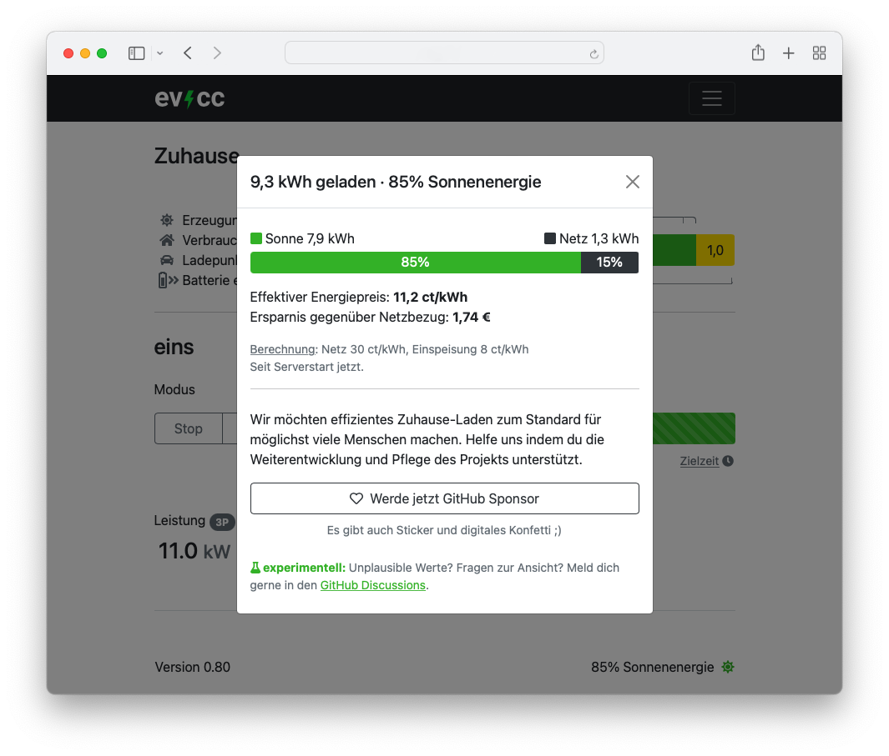

Auch dieses Jahr geht es weiter mit weiteren Aktualisierungen :) Zusätzlich zu den kleineren Updates mit 0.78 und 0.79, gibt es nun auch ein paar größere Änderungen mit der Version 0.80.

<!-- excerpt -->

## `evcc configure` Verbesserungen

Wenn man eine Konfiguration mit `evcc configure` erstellt, wird zuerst nach dem eigenen Know How gefragt. So können fortgeschrittene Anwender die Konfiguration in technischen Bereichen etwas genauer einstellen. Dieser Modus ist weiterhin auch über `evcc configure --advanced` direkt verfügbar. Einsteiger empfehlen wir diesen Modus jedoch nicht, da mehr Know-How erforderlich ist.

Zustätzlich gibt es weitere Geräte Templates, Korrekturen an bisherigen Templates und weitere Einstellmöglichkeiten.

## Sonnenenergieanteil und Ersparnis

Das neue Ersparnisfeature zeigt dir an wie viel deines Ladestroms durch selbsproduzierte Sonnenenergie gedeckt werden konnte.
Der Prozentwert wird unten rechts in der Ecke angezeigt.
Beim Klick darauf bekommst du weitere Details in einem Dialog angezeigt.
Dort siehst du neben der Energiemenge auch deinen effektiven Energiepreis und die Gesamtersparnis gegenüber reinem Netzbezug.
Hier findest du mehr Informationen zur [Berechnung und Preiskonfiguration](/en/faq#savings-calculation).

[Sponsoren](/en/sponsorship) finden in dem neuen Dialog unter dem Dankeschön-Konfetti-Button einen, _\*drumroll\*_, Link um unsere neuen evcc Sticker zu bekommen.
Ihr seid die Besten. Danke für euren Support! 💚🥳

## Docker

Wer Docker verwendet, kann nun über die Tags `latest` jeweils die aktuelle Version verwenden. Mit dem Tag `nightly` gibt es dann täglich neue Builds, die aber noch nicht so gut getestet sein können. Weitere Informationen zur Docker Installation sind hier zu finden: [Docker, Synology](/en/installation/docker)

## Fehlerkorrekturen

Diese Version enthält natürlich wieder eine Reihe von Fehlerkorrekturen und vielen kleinen Verbesserungen. Schaut euch gerne über den Changelog Link unten eine detaillierte Auflistung an.

## Download & Installation

- [Debian, Ubuntu, Raspberry Pi](/en/installation/linux)
- [macOS Homebrew](/en/installation/macos)
- [Docker](/en/installation/docker)
- [Windows](/en/installation/windows)

## Changelog

### Version 0.80

- [Detaillierte Liste der Änderungen](https://github.com/evcc-io/evcc/releases/tag/0.80)

### Version 0.79

- [Detaillierte Liste der Änderungen](https://github.com/evcc-io/evcc/releases/tag/0.79)

### Version 0.78

- [Detaillierte Liste der Änderungen](https://github.com/evcc-io/evcc/releases/tag/0.78)
