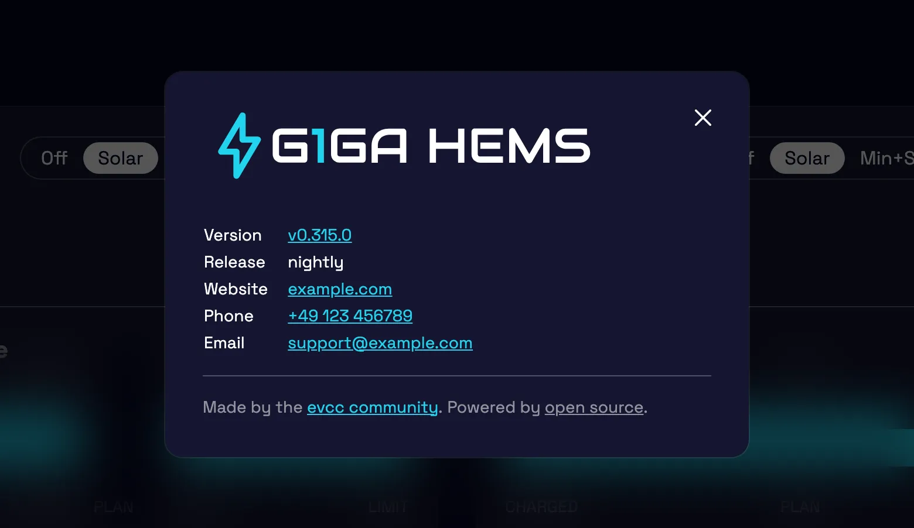

import Video from "@components/Video.astro";
import configUiVideo from "./config-ui-navigation.mp4";
import configUiPoster from "./config-ui-navigation.webp";

Just four weeks after the [last highlights post](/en/blog/2026/07/18/highlights-remote-access-widgets-optimizer) we are back.
In the past, our posts were usually several months apart.
We are planning to change this.
In this blog post, we give an overview of what is new in evcc: the new release process, optimizer progress, config UI improvements, interface customisation and more.

{/* excerpt */}

## New Release Process

Until now, we published releases at regular intervals.
After each release, we held back bigger changes and new features for a while to see whether urgent bugfixes or regressions would come up.
Then we gave the bigger changes some time in the nightly to collect feedback.
That caused problems whenever we had to release quickly, e.g. because a vehicle manufacturer had reworked its API.
Then we either had to temporarily revert unfinished features, or they went out to you with a little less maturity than intended 🙈.

Our new model solves this: we now explicitly distinguish between bugfixes that should roll out quickly and bigger features that go into the next feature release.
This lets us properly implement [semantic versioning](https://semver.org):

- **Feature releases** like <code>0.<u>314</u>.0</code> arrive every two to four weeks.
- **Bugfix releases** like <code>0.314.<u>1</u></code> are easy for us to ship in between.
- The **nightly** like <code>0.315.0<u>-dev+4cc75b1a4</u></code> still always contains the current state of the `master` branch, i.e. all features and bugfixes.

All development still happens on `master`.
New is a `/backport` command on GitHub that picks individual pull requests for the next bugfix release.
A Claude-based agent takes care of the process and resolves any conflicts.

## Optimizer Optimisations

With the [optimizer](/en/features/optimizer), we are working on optimising the behaviour of your entire energy system for the next days, based on consumption and production forecasts as well as the electricity price curve.
We already mentioned it in the [last highlights post](/en/blog/2026/07/18/highlights-remote-access-widgets-optimizer#optimizer).
The optimizer is still experimental.
Right now, the calculated plan is only displayed: as a recommendation on the loadpoint, on the battery page and on the [reworked optimizer page](https://github.com/evcc-io/evcc/pull/32837).
The next step is for the optimizer to actually take over control of battery and loadpoints; the [pull request](https://github.com/evcc-io/evcc/pull/32881) for this is in preparation.

New in this release: the optimizer takes the charging plans' data into account and optimises multiple charging plans together; until now, each plan was only considered on its own.
Beyond that, a lot has happened:

- It now reports [whether the calculated plan is feasible](https://github.com/evcc-io/evcc/pull/32632), e.g. whether all charging goals can be reached in time.
- A [static grid export limit](https://github.com/evcc-io/evcc/pull/32541) can be configured and is considered in the optimisation.
- The charging plan's [late charging setting](https://github.com/evcc-io/evcc/pull/32872) (precondition) is taken into account in the optimisation.
- It re-runs immediately on [vehicle changes and on plugging in or unplugging](https://github.com/evcc-io/evcc/pull/32681).
- Loadpoints without a known vehicle capacity (e.g. with a guest vehicle) now contribute their [measured charge power as consumption](https://github.com/evcc-io/evcc/pull/32681); before, they were missing from the optimisation entirely.
- It [stops demanding charge](https://github.com/evcc-io/evcc/pull/32633) once the vehicle is full.

Give it a try: enable experimental features under **Configuration → Experimental** and then switch on the optimizer.
Check the optimizer view and see if the resulting plan looks plausible to you.
We would love to hear your feedback.

## Config UI Optimisation

Browser-based configuration keeps getting more polished:

- [Devices can be disabled](https://github.com/evcc-io/evcc/pull/29455) without deleting them, e.g. when a device is temporarily offline or you are restructuring your setup.
- Modals [warn before closing](https://github.com/evcc-io/evcc/pull/32826) when there are unsaved changes.
- Energy and power values automatically pick a [fitting unit](https://github.com/evcc-io/evcc/pull/32754).
- On mobile, the configuration page got a proper [section navigation](https://github.com/evcc-io/evcc/pull/32810) instead of one long list.

<Video
  src={configUiVideo}
  poster={configUiPoster}
  autoplay
  aspect="1 / 1"
  title="Configuration section navigation on mobile"
/>

## Customise the Interface

The interface can now be customised: logo, brand name, website, support email and phone number.
This is interesting e.g. for electricians and installers who deploy evcc in customer projects.
With a custom support email configured, problem reports from the UI are sent to your support address instead of GitHub.
The [white label page](/en/reference/white-label) explains which options are available and how to style the interface to your liking with your own CSS.

## Breaking Changes and Integrations

We have changed the format in which forecast and tariff data is published via the API and MQTT.
Instead of verbose objects, the data now comes as [compact arrays with unix timestamps](https://github.com/evcc-io/evcc/pull/32391), and MQTT publishes [one message per forecast type](https://github.com/evcc-io/evcc/pull/32716).
The result: much smaller payloads, faster loading and less bandwidth, which you especially notice in the app and on slow connections.

This is a breaking change.
A huge thank you to all maintainers of evcc integrations who adapted their projects ahead of the release: [marq24](https://github.com/marq24) and [mkshb](https://github.com/mkshb) ([Home Assistant](/en/smarthome/home-assistant)), [Newan](https://github.com/Newan) ([ioBroker](/en/smarthome/iobroker)), [rdvnit](https://github.com/rdvnit) ([Homey](/en/smarthome/homey)), [TheNinth7](https://github.com/TheNinth7) ([Garmin](/en/smarthome/garmin)) and the team behind the [openHAB binding](/en/smarthome/openhab).
Seeing such an active ecosystem around evcc is wonderful.

We have added a new **Smart Home** section to the documentation navigation that covers these integrations.
On the [More Awesome Projects](/en/smarthome/awesome) page, we also collect smaller community projects, from Grafana dashboards to an e-ink display and a menu bar app.
If you have built a small tool, helper or integration around evcc, feel free to propose it for the list via pull request so others can find it.

## Smaller Improvements

- **New chart engine:** The migration from [Chart.js](https://github.com/chartjs/Chart.js) to [Apache ECharts](https://echarts.apache.org) is complete; Chart.js development has sadly stalled.
  ECharts gives us a solid foundation for our big plans around data visualisation (stay tuned) ...
- **Touch optimisation:** [Swipe to flip between time ranges](https://github.com/evcc-io/evcc/pull/32614), tooltips [appear and disappear properly on touch](https://github.com/evcc-io/evcc/pull/32613), and the history data loads noticeably faster thanks to [prefetching and caching](https://github.com/evcc-io/evcc/pull/32699).
- **Charging plan:** The strategy settings are easier to discover; optimisation goal and late charging now live directly in the [charging plan dialog](/en/features/plans).
- **Added charge & range:** If your vehicle reports its state of charge, each charging session records the charge gained and the estimated added range, visible in the session details and the [sessions overview](/en/features/sessions).
- **Remote access:** Tunnel connection errors are now visible in the UI, and after booting without internet your instance recovers the [remote access connection](/en/features/remote-access) on its own.
- **API state reference:** Our state data structure (`/api/state`) used to be undocumented.
  The new [reference page](/en/reference/state) changes that: it is [generated directly from the UI type definitions](https://github.com/evcc-io/evcc/pull/32431), so it always matches the actual API.

## New Device Support

**Wallboxes:** NEcharge Pro (OCPP), Youliq One, plus improvements for Atmoce and Voltie

**Meters, Solar & Battery Systems:** Socomec Countis E3x/E4x, Ferroamp, Fronius Argeno and Smart Meter IP, SunEnergyXT 500, Victron GX AC load meter, Tesla Powerwall via Fleet API, and battery control for FoxESS H3 and Solplanet

**Curtailment (§ 9 EEG):** Goodwe, Fronius Gen24, Huawei EMMA and Huawei SmartLogger can now be curtailed

Of course, there have also been many bugfixes and improvements to existing integrations.
Details can be found in the [release notes](https://github.com/evcc-io/evcc/releases/tag/0.314.0).

---

💚 Big thank you to everyone who moves the project forward: through code, ideas, testing, discussions and financial support, without which the project would not be possible in this form.

We wish you a sunny late summer.

**Best regards** 
The evcc Team 
Michael, Andi & Uli
