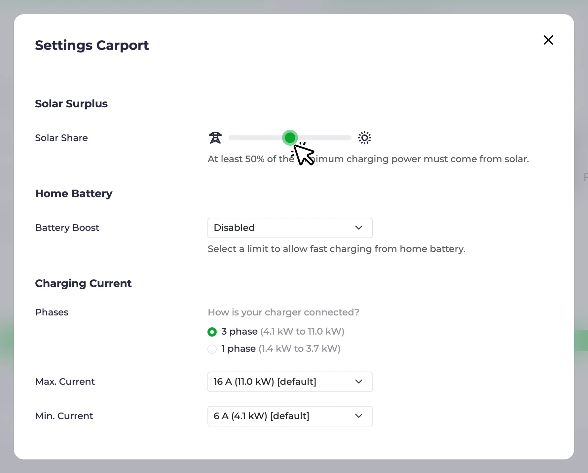

Since the [last highlights post](/en/blog/2026/08/19/highlights-release-process-optimizer-customize) two feature releases have gone out: [0.315](https://github.com/evcc-io/evcc/releases/tag/0.315.0) and [0.316](https://github.com/evcc-io/evcc/releases/tag/0.316.0).
This post covers both.
The big topics: the charging modes got a new structure with **Smart** and **Always charge**, the home battery page has been reworked, the new **Solar share** slider replaces the confusing watt thresholds, and the optimizer keeps getting closer to taking over control.

{/* excerpt */}

## New Modes: Smart and Always Charge

The modes **Solar** and **Min+Solar** date back to when evcc was purely about solar surplus charging.
Over time we added features that have little to do with solar: dynamic tariffs, charging plans, heat pumps and switchable devices.
Many people now run evcc without a solar system at all, and the names created confusion among new users.

With [0.316](https://github.com/evcc-io/evcc/pull/32490) the modes are named after what they do, not how the power is produced.
**Solar** becomes **Smart**.
It covers solar surplus, dynamic tariffs and charging plans, and it is the mode the upcoming optimizer will work in.

The **Min+Solar** mode is removed.
Its purpose, behaving like **Solar** mode but always providing at least minimum power, is an important feature for vehicles that do not like being started and stopped, or for installations with little solar surplus.
But this concept only makes sense for vehicle charging, not for switches, heaters or heat pumps.
That is why it is now the **Always charge** option in the dropdown of the **Smart** button for vehicle charging points instead of a mode of its own.
It can be switched on permanently or, with the **1x** button, for the current charging session only.
In the vehicle settings you can set a default per vehicle.

The mode labels adapt to the device: a charger shows **Off / Smart / Fast**, a switchable device **Off / Smart / On**, a heat pump **Normal / Smart / Boost**.
The [solar charging page](/en/features/solar-charging#always-charge) explains the details.

This is a breaking change for integrations.
The API, MQTT and websocket now report `smart` instead of `pv`, and `minpv` no longer appears on the read side.
Writing the old values still works: setting `pv` switches to **Smart**, setting `minpv` switches to **Smart** with **Always charge** on, so existing automations keep their behaviour.
If your integration compares against `pv` or `minpv`, it is time to update.
The major integrations were updated ahead of the release.
Thank you to all the maintainers who updated their projects 🙌

## Home Battery Page \{#battery\}

The **Battery** page used to be a pure settings page.
Now it gives you an overview first: a status card with charge level, stored energy and current power.
With several batteries you get a breakdown: one card per battery plus a combined one, and the chart below shows the charge level of each battery over the past days.
When the [optimizer](#optimizer) is enabled, the page also shows its suggestions: what it would do with the battery right now, e.g. hold or charge from grid, and how the charge level would continue.
More on that further down.
The usage settings, priority, charging buffer and automatic start, are still there, now as easier to understand sentences instead of a form.

If you had experimental features enabled, you already know this page.
With [0.316](https://github.com/evcc-io/evcc/pull/33434) it is the default for everyone.

**Battery control modes:** Battery control is now more fine-grained.
Each battery reports which of the modes it supports: normal operation, prevent discharging, charge from grid, prevent charging and discharge to grid.
evcc only offers what a device can actually do.
What each mode does is explained in the [mode table](/en/user-defined-devices#battery-modes) in the docs, and external systems can set a mode via the [REST API](/integrations/rest-api/operations/setexternalbatterymode).
Support for active battery control has grown in this cycle: Huawei SUN2000, Kostal Plenticore, Sungrow, Zendure Solarflow, Anker Solarbank, Atmoce, EcoFlow Stream, Marstek and Home Assistant batteries gained additional modes.
The [device list](/en/meters?f=battery-control) shows which battery systems support active control, and the [home battery page](/en/features/battery) explains what you can do with it.

## Solar Share \{#solar-share\}

This one is a very old feature request.
By default, charging in **Smart** mode only starts once the surplus covers the full minimum charging power of the vehicle.
If your solar system is small or the sun is low in winter, that moment might never come.
So far you could lower the bar with watt thresholds in the charging point configuration (restart required).
Those thresholds have confused new users for years, and, honestly, quite a few long-time users too 😅.

The new [**Solar share**](https://github.com/evcc-io/evcc/pull/32104) slider in the charging point settings is simpler: you set how much of the minimum charging power has to be solar.
100% means charging waits for full surplus.
50% means half of it may come from the grid.
0% means charging starts as soon as there is any surplus at all.
No restart, no watts, just a slider.
The old thresholds still work for advanced setups.
While they are set, the slider is disabled and tells you why.

The [solar charging page](/en/features/solar-charging#not-enough-surplus) has the details.

## Optimizer Progress \{#optimizer\}

The [optimizer](/en/features/optimizer) calculates a plan for your whole home over the next days: battery, charging points and heating, based on forecasts and prices.
It is still experimental and still advisory, i.e. it shows what it would do, but does not act yet.
A lot has happened in the last two releases:

- The horizon now spans [48 hours plus the rest of the day](https://github.com/evcc-io/evcc/pull/32893), and the chart marks day boundaries with the weekday.
- Household demand is [broken down into individual profiles](https://github.com/evcc-io/evcc/pull/33749): base load, heating and charging points without a known vehicle capacity are shown separately.
- The household demand prediction got better, e.g. for [heating loadpoints](https://github.com/evcc-io/evcc/pull/28232) and for homes where a few heavy afternoons used to [skew the base load](https://github.com/evcc-io/evcc/pull/33700).
- The optimize page has an [empty state, a menu entry as soon as the optimizer is enabled, and a feedback link](https://github.com/evcc-io/evcc/pull/33750) for reporting implausible plans.
- Plans are [recalculated immediately](https://github.com/evcc-io/evcc/pull/33467) when a charging plan changes on the vehicle side, and the plan SoC goal [lands in the right slot](https://github.com/evcc-io/evcc/pull/33832).
- Grid charging and discharging are only planned for batteries that [actually support the mode](https://github.com/evcc-io/evcc/pull/33860).

If you have not tried it yet: enable experimental features under **Configuration → Experimental**, switch on the optimizer and check whether the plan looks plausible for your home.
We are grateful for every piece of feedback.

The next big step is **automatic mode**: the optimizer no longer just suggests, it decides when the battery charges or holds and when charging points in **Smart** mode start and stop.
The [pull request](https://github.com/evcc-io/evcc/pull/32881) is in preparation, and we have already received lots of feedback.
If you are adventurous, grab one of the test builds from the pull request comments, try it and tell us how it goes.
There is still work to do, but we are looking forward to getting it into the nightly.

## Smaller Improvements

- **Remote access:** [No longer experimental](/en/features/remote-access). The card is visible under **Configuration** without the flag, and a reset option removes the configuration and credentials. We introduced remote access in the [July highlights](/en/blog/2026/07/18/highlights-remote-access-widgets-optimizer).
- **Curtailment devices:** When the grid operator asks for less feed-in (§ 9 EEG), evcc normally tells each solar inverter directly to reduce its power. In some setups that command has to go to a central unit instead, e.g. the SMA Sunny Home Manager 2.0 or SolarEdge export control. These now have their own [device class](https://github.com/evcc-io/evcc/pull/32416), configured next to the grid meter, instead of posing as a meter. See the [external limit page](/en/external-limit#curtailment-devices).
- **Date format:** The date format used to follow the selected language, which does not cover regional differences, e.g. English in Europe. You can now pick day-first, month-first or ISO ordering in the [user interface settings](https://github.com/evcc-io/evcc/pull/29321). Thanks to [webalexeu](https://github.com/webalexeu).
- **Phase indicator:** The phase visualisation on the charging point has changed. Before, there was one bar per active phase and inactive phases were simply hidden. Now a three-phase charger [always shows three segments](https://github.com/evcc-io/evcc/pull/33173), with the active ones highlighted, so you can see at a glance whether it is charging on one or three phases.
- **Polestar:** The reverse-engineered integration is replaced by the [official Polestar Data Portal API](https://github.com/evcc-io/evcc/pull/33814). Thanks to [loebse](https://github.com/loebse).
- **Nissan:** The login now uses [MyNISSAN OneID](https://github.com/evcc-io/evcc/pull/33316), after Nissan retired the old NissanConnect credentials. Thanks to [alex-irrgang](https://github.com/alex-irrgang).
- **Škoda:** The new official MyŠkoda API is supported, see the [separate blog post](/en/blog/2026/08/27/skoda-vehicle-api).
- **Home Assistant:** The evcc app [auto-detects the Home Assistant instance and token](https://github.com/evcc-io/evcc/pull/33000), so Home Assistant devices appear as discovered devices without any manual setup, thanks to [wlcrs](https://github.com/wlcrs). Home Assistant batteries gained [holdcharge and discharge modes](https://github.com/evcc-io/evcc/pull/33841), thanks to [igotsoul](https://github.com/igotsoul). Two breaking changes: milliamp current control on the [Home Assistant charger](https://github.com/evcc-io/evcc/pull/33858) is optional now, and the [battery minsoc/maxsoc preset](https://github.com/evcc-io/evcc/pull/33707) is gone.

## New Device Support

**Wallboxes:** Steca, Sonoff switch sockets, plus meter capability for Spelsberg and improvements for go-e, OpenEVSE, NRGkick, Keba, Voltie and Zaptec

**Meters, Solar & Battery Systems:** CHINT ECH10K, Solplanet hybrid, SENEC.Connect cloud API, Afore hybrid via RS485, Deye micro inverters via Solarman and HTTP logger, Zendure SolarFlow 800 Pro, my-PV HEA THOR 3.5 and 9.0, Solax X1/X3-HAC current limiter, return energy for Youless, openWB Pro and Sungrow

**Vehicles:** Polestar via the official Data Portal API, new official MyŠkoda API, Nissan OneID login, LiveWire S2 motorcycles, charged energy for Tesla BLE

**Heat Pumps & Heating:** Weishaupt (Modbus TCP), 1SINQ OneKey (SG Ready via MQTT), power and temperature for Viessmann thanks to [ickeundso](https://github.com/ickeundso)

**Tariffs:** EPEX spot prices for Belgium, spotovaelektrina.cz for Czechia, additional regions, currencies and API key for Energy Price Forecast

**Curtailment (§ 9 EEG):** SMA Sunny Home Manager 2.0, SolarEdge, Sungrow

Of course, there have also been many bugfixes and improvements to existing integrations.
Details can be found in the release notes for [0.315](https://github.com/evcc-io/evcc/releases/tag/0.315.0) and [0.316](https://github.com/evcc-io/evcc/releases/tag/0.316.0).

---

💚 Big thank you to everyone who moves the project forward: through code, ideas, testing, discussions and financial support, without which the project would not be possible in this form.

The days are getting shorter.
Use the sun wisely. 😉
Happy charging!

**Best regards** 
The evcc Team 
Michael, Andi & Uli
